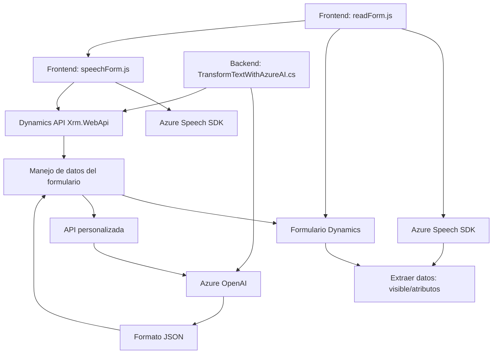

### **Breve resumen técnico**
El repositorio está compuesto por tres archivos principales: 
- Dos para el procesamiento y la integración de herramientas basadas en voz y texto en el frontend (`readForm.js` y `speechForm.js`) usando el Azure Speech SDK y el API de Dynamics 365.  
- Un plugin para Dynamics CRM (`TransformTextWithAzureAI.cs`) que realiza transformaciones de texto con Azure OpenAI y complementa la funcionalidad de los formularios con integraciones más avanzadas de inteligencia artificial.

---

### **Descripción de arquitectura**
El sistema implementa una **arquitectura de capas** con un enfoque híbrido cliente-servidor.  
1. **Cliente (frontend)**: Maneja la interacción del usuario desde el navegador. Implementa reconocimiento de voz para convertir palabras habladas en texto, aplica una lógica para mapear los datos transcritos a formularios web compatibles con Dynamics 365 y utiliza API externas como Azure Speech SDK.  
2. **Servidor (backend)**: Extiende Dynamics 365 mediante un plugin que, a través de la API de Azure OpenAI, transforma texto a formato JSON estructurado bajo reglas específicas antes de aplicarlo al contexto de CRM.

---

### **Tecnologías usadas**
#### **Frontend**:
1. **Azure Speech SDK**:
   - Reconocimiento y síntesis de voz.
   - Cargado dinámicamente desde un CDN.  
2. **JavaScript**:
   - Modularidad y enfoque funcional para procesar datos del formulario, aplicar transcripciones y manipular el DOM.

#### **Backend / Plugin**:
1. **Dynamics 365 CRM**:
   - Sistema CRM en el que el plugin interactúa directamente con data y entidades.  
2. **C# .NET**:
   - Backend del plugin construido sobre .NET Framework y la API de Dynamics.
3. **Azure OpenAI**:
   - Consume endpoints de OpenAI para procesar texto y convertirlo al formato JSON estructurado.

---

### **Diagrama Mermaid (válido para GitHub Markdown)**

---

### **Conclusión final**
Este proyecto está diseñado para facilitar la interacción basada en voz y texto con formularios web de Dynamics CRM utilizando Azure Speech SDK y Azure OpenAI. La solución sigue una arquitectura de capas híbrida, combinando capacidades de cliente dinámico (con JavaScript) y procesamiento avanzado en el servidor (con plugins de Dynamics CRM).  

El diseño modular y la integración con servicios externos permiten una funcionalidad expandible, como reconocimiento de voz, síntesis y transformación de texto en JSON. Esta configuración es aplicable para sistemas CRM que requieren entrada de datos más accesibles y automatizados, así como integración con inteligencia artificial avanzada.