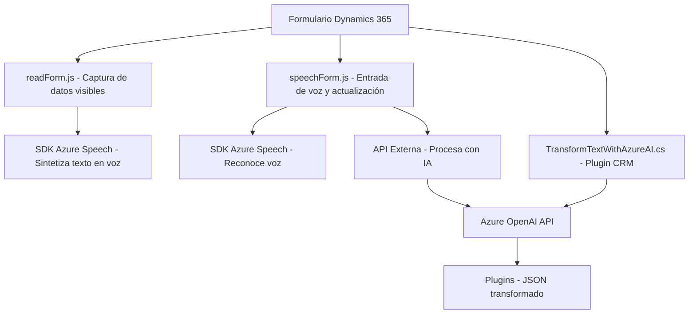

### Breve resumen técnico

El repositorio contiene tres archivos con diferentes propósitos, todos enfocados en integrar tecnologías de Azure (Azure Speech SDK y Azure OpenAI) dentro del ecosistema de Dynamics 365 CRM. Están orientados a mejorar la interacción con formularios mediante funcionalidades de entrada de voz, síntesis de voz y procesamiento de textos con inteligencia artificial. La modularidad, la integración de servicios externos, y el uso de patrones como **Plugin** para Dynamics CRM ofrecen una solución versátil.

---

### Descripción de la arquitectura

La arquitectura sigue un diseño modular y orientado a componentes:
1. **FRONTEND/JS/readForm.js**  
   Este archivo actúa como un módulo para capturar datos de formularios y sintetizar texto en voz utilizando Azure Speech SDK. Su arquitectura es lineal pero incorpora principios de modularidad.
   
2. **FRONTEND/JS/speechForm.js**  
   Este archivo es el controlador principal para el reconocimiento de voz, utilizando Azure Speech SDK y llamando a una API externa para procesamiento de texto. Combina patrones como **MVC** y **integración de servicios** en un flujo lógico. La modularidad y la separación de funciones son evidentes, especialmente para la entrada y procesamiento de datos del formulario.

3. **Plugins/TransformTextWithAzureAI.cs**  
   Este archivo sigue el **Plugin Pattern** propio de Dynamics CRM, encapsulando la lógica de transformación y comunicación con la API Azure OpenAI dentro de una clase `IPlugin`. Es un diseño orientado a eventos donde Dynamics CRM dispara la ejecución del plugin.

#### Arquitectura notable:
- **Frontend**:
  1. Modularidad: Separación clara de responsabilidades (sintetización de voz y reconocimiento de voz).
  2. Integración asíncrona: Uso de promesas y callbacks para cargar el Azure SDK.
  3. MVC simplificado: El formulario es la vista, y las funciones procesan y controlan datos.
  
- **Backend**:
  1. Plugin Pattern de Dynamics CRM: Gestión de lógica empresarial mediante una clase que implementa `IPlugin`.
  2. Integración de servicios AI: Uso del API Azure OpenAI para transformar texto.

#### Tipo de arquitectura general:
- **N-capas**: Lógica separada entre las capas de frontend (interacción con datos de formularios), backend (plugin en Dynamics CRM) y servicios externos (Azure Speech SDK, Azure OpenAI).
- **Integración basada en servicios**: Dependencias significativas de servicios externos como el SDK de Azure y Azure AI API.

---

### Tecnologías, frameworks y patrones usados

1. **Frontend (JavaScript)**:
   - **Azure Speech SDK**: Para sintetizar y reconocer voz.
   - **DOM Manipulation**: Para interactuar dinámicamente con el formulario y cargar archivos.
   - **Asynchronous Programming**: Uso de `Promise` y `callback` para manejar eventos.

2. **Backend (C#)**:
   - **Microsoft Dynamics CRM SDK**: Framework para crear plugins y gestionar datos dentro de Dynamics CRM.
   - **Azure OpenAI API**: Para transformar texto según datos y normas.
   - **Newtonsoft.JSON**: Manipulación de JSON.

3. **Patrones**:
   - **Modularidad** en funciones independientes.
   - **Plugin Pattern** para extensibilidad en CRM.
   - **Integración de servicios** con APIs externas (Azure Speech y OpenAI).
   - **MVC simplificado** en los scripts de JavaScript.

---

### Diagrama Mermaid válido para GitHub

---

### Conclusión final

El repositorio implementa una solución integradora que proporciona funcionalidad avanzada a los formularios de Dynamics 365. Con el uso de Azure Speech SDK y Azure OpenAI, el sistema permite entrada de datos basada en voz, síntesis de texto a sonido, y procesamiento inteligente con IA. La arquitectura modular y basada en servicios asegura un diseño extensible y escalable, mientras que los patrones como Plugin para CRM y MVC simplificado son ideales para gestionar dinámicamente formularios con datos complejos.