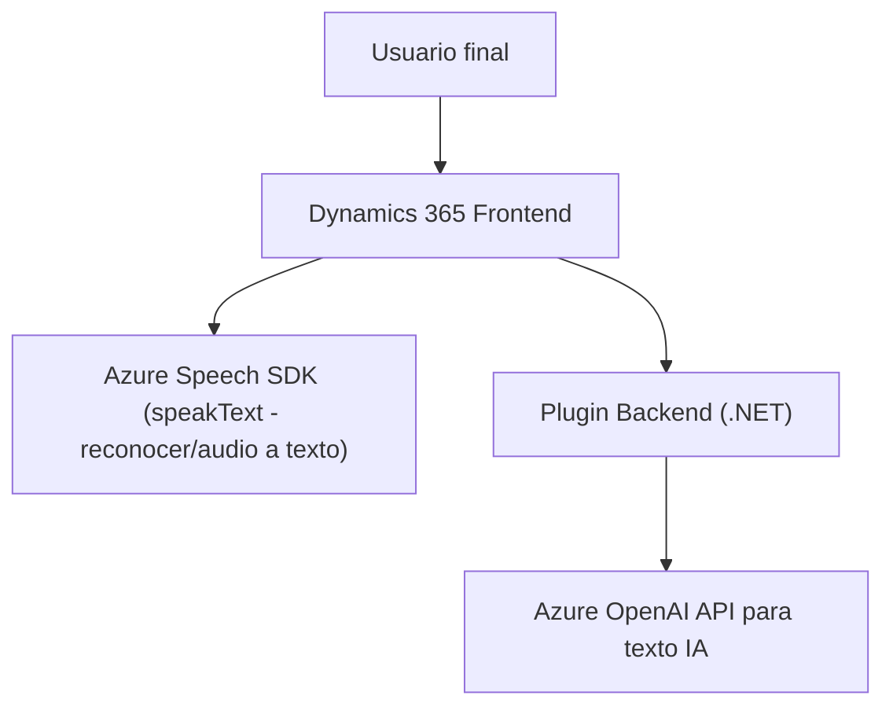

### Breve resumen técnico
En el repositorio presentado se implementa una solución de reconocimiento y síntesis de voz combinada con gestión de formularios dinámicos en Microsoft Dynamics 365 y procesamiento avanzado con Azure OpenAI. La funcionalidad se divide en tres partes principales:
1. **Frontend JavaScript:** Interacción directa con Azure Speech SDK para reconocimiento y síntesis de voz sobre formularios.
2. **Plugin .NET:** Extensión en Dynamics CRM que llama a Azure OpenAI para transformar texto según ciertas reglas y lo regresa en JSON estructurado.
3. **Dependencias Externas:** Integración de SDK y APIs externas (Azure Speech SDK y Azure OpenAI).

---

### Descripción de arquitectura
La arquitectura del sistema tiene dos capas principales:
1. **Capa frontend (Dynamics 365 + Azure Speech SDK):**
   - Se encarga de la interacción directa con formularios dinámicos de Dynamics 365.
   - Maneja reconocimiento de voz y síntesis, integrando Azure Speech SDK en el navegador.
   - Utiliza funciones como `ensureSpeechSDKLoaded`, `leerFormulario`, y `processTranscriptIA` para la sincronización entre audio/texto y el formulario.
   
2. **Capa backend (Plugin con Azure OpenAI):**
   - Trabaja a través de un *plugin* para Dynamics CRM estructurado con la interfaz `IPlugin`.
   - Utiliza servicios de Azure OpenAI para transformar texto según reglas específicas.
   - Implementa el patrón *backend-for-frontend* (BFF), donde una única API gestiona solicitudes específicas del cliente y delega procesamiento al servicio de IA.

Patrón arquitectónico: Es una solución con estilo **n-capas** (Frontend + Backend) que combina módulos desacoplados y servicios externos. El frontend actúa como controlador dinámico, mientras que el backend se conecta con APIs y SDKs para tareas pesadas.

---

### Tecnologías usadas
1. **Frontend:**
   - **Azure Speech SDK:** Reconocimiento y síntesis de voz desde el navegador (`https://aka.ms/csspeech/jsbrowserpackageraw`).
   - **HTML + JS form modules:** Para manipulación dinámica de formularios en Dynamics 365.
   
2. **Backend:**
   - **Microsoft Dynamics CRM SDK:** Para extensibilidad con *plugins* en .NET.
   - **Azure OpenAI:** Lógica de procesamiento de texto con modelos GPT.
   - **Librerías .NET:** `System.Text.Json`, `Newtonsoft.Json`, y `System.Net.Http`.

3. **Patrones usados:**
   - **Carga dinámica de librerías:** En frontend (`ensureSpeechSDKLoaded`).
   - **Integración de servicios externos:** Azure Speech SDK y OpenAI.
   - **Modularización en funciones:** Cada función tiene una responsabilidad específica.
   - **Backend-for-Frontend:** Plugin delega lógica a Azure OpenAI.
   - **MVC en el frontend:** Model (formularios), Controller (procesamiento de voz y texto), View (UI en Dynamics).

---

### Diagrama Mermaid

---

### Conclusión final
El repositorio combina cloud computing, inteligencia artificial y extensibilidad en Dynamics 365 para ofrecer una solución avanzada de voz y texto. La arquitectura, basada en un enfoque **n-capas**, facilita la interacción entre usuario, formularios dinámicos y servicios externos como Azure Speech SDK y Azure OpenAI. Es versátil, escalable y modular, ideal para enriquecer aplicaciones empresariales con capacidades de reconocimiento y síntesis de voz, además de transformación inteligente de texto.