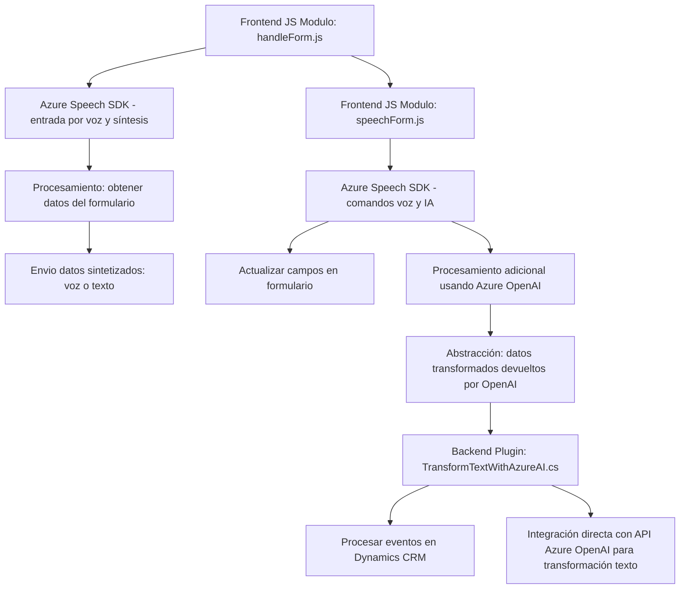

### Breve resumen técnico
Los archivos del repositorio describen una solución híbrida que integra **módulos frontend, eventos backend y procesamiento mediante servicios externos (Azure Speech SDK, Azure OpenAI)**. El frontend maneja interacción del usuario a través de formularios y comandos de voz, mientras que el backend utiliza un **plugin** de Dynamics CRM para aplicar transformaciones basadas en reglas predefinidas conectadas a Azure OpenAI.

---

### Descripción de arquitectura
La arquitectura general empleada parece girar en torno a un **Modelo de Cliente-Servidor** con especial énfasis en:
- **Frontend modular**: Dividido en diferentes archivos para manejo de funciones independientes como entrada de voz, síntesis de texto y manipulación de formularios.
- **Backend orientado a eventos**: Basado en plugins ajustados a Dynamics CRM que utilizan la arquitectura de Plugins/Common Data Service.
- **Servicios externos**: Aprovisionados en Azure (API para inteligencia artificial y reconocimiento/síntesis de voz).

La solución se puede clasificar como **una arquitectura de servicios integrados**, donde cada parte interactúa mediante componentes desacoplados y utiliza **patrones como el event-driven**.

---

### Tecnologías usadas
1. **Lenguajes y frameworks**:
   - **JavaScript** para frontend.
   - **C#** para el backend (Plugins de Dynamics CRM).
   
2. **Servicios externos**:
   - **Azure Speech SDK** para reconocimiento y síntesis de voz.
   - **Azure OpenAI** para transformar texto utilizando IA avanzada.
     
3. **Entornos de trabajo**:
   - **Dynamics CRM** para el registro de eventos y datos del sistema.
   - APIs RESTful para integraciones externas con Azure.

4. **Patrones utilizados**:
   - **Modularidad**: Funciones separadas por responsabilidades.
   - **Facade**: En integraciones SDK.
   - **Repository**: En manejo de datos CRM.
   - **Event-driven**: Tanto en SDK como en plugins backend.

---

### Diagrama Mermaid válido

---

### Conclusión final
Este repositorio integra una **solución modular de cliente-servidor**, donde el frontend está dedicado a la entrada y síntesis de comandos de voz, mientras el backend está diseñado para procesar los datos mediante plugins en Dynamics CRM. Los **servicios de Azure** juegan un rol crítico, actuando como un backend externo para IA (Azure OpenAI) y capacidades vocales (Azure Speech SDK).

La arquitectura está escalada hacia la **interoperabilidad**, y su diseño modular permite desacoplar los componentes, preparándolo para integraciones futuras o extensiones funcionales. Sin embargo, necesita especial cuidado con la gestión de dependencias externas (SDK y APIs Azure) para garantizar disponibilidad y rendimiento.