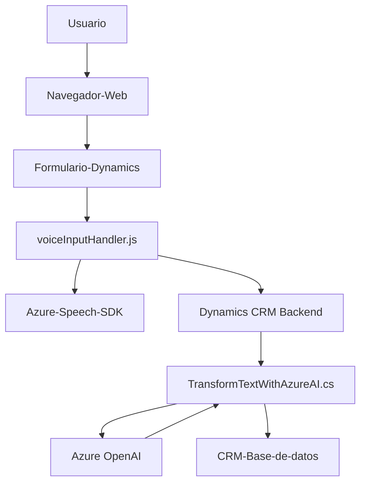

### Resumen técnico
El repositorio presenta una solución mezclada que procesa formularios y comandos de voz mediante tecnologías como Azure Speech SDK y Dynamics 365. Además, incluye integración con Azure OpenAI, lo que indica capacidades de IA avanzada para reconocimiento y transformación de texto. La solución está orientada hacia usuarios finales, posiblemente para interfaces CRM dinámicas.

### Descripción de arquitectura
La solución presenta un enfoque híbrido:
1. **Arquitectura multinivel (n capas)**: Hay separación entre presentación (JavaScript en el navegador), lógica de negocio (Dynamics Plugins) y servicios externos (Azure Speech SDK, Azure OpenAI). Esto sugiere una distribución lógica entre cliente y backend.
   
2. **Uso orientado a microservicios**: Aunque no es estrictamente una arquitectura basada en microservicios, algunos componentes (voiceInputHandler.js y TransformTextWithAzureAI.cs) pueden considerarse servicios autónomos con objetivos específicos.

3. **Integración en el ecosistema CRM**: Los archivos se ajustan a la arquitectura de Dynamics 365, donde los JS modulan la interfaz de usuario y los plugins gestionan la lógica de negocio en el servidor.

### Tecnologías usadas
1. **Frontend**:
   - **JavaScript**: Scripts ejecutados en el navegador para interacción con formularios y SDK de voz.
   - **Azure Speech SDK**: Para captura de voz, síntesis texto-voz y transcripción.
   - **Dynamics API (`Xrm.WebApi`)**: Para interacción con formularios de CRM.

2. **Backend**:
   - **Microsoft Dynamics Plugins**: En C# (interfaz `IPlugin`) para manejar lógica detrás de las operaciones CRM.
   - **Azure OpenAI**: Para transformar texto utilizando GPT.
   - **System.Text.Json** y **Newtonsoft.Json.Linq**: Para manejo de estructuras JSON.

3. **Integraciones/Dependencias externas**:
   - `https://aka.ms/csspeech/jsbrowserpackageraw`: SDK de voz de Azure.
   - `https://openai-netcore.openai.azure.com`: Endpoint dedicado a GPT en Azure OpenAI.

### Diagrama Mermaid

### Conclusión final
La solución es una implementación robusta basada en un modelo cliente-servidor, centrada en integrar inteligencia artificial, reconocimiento de voz, y CRM para mejorar la experiencia de usuario. Usa tecnologías modernas como Azure Speech SDK y OpenAI para habilitar funcionalidades avanzadas. Esta estructura modular es adecuada para personalización en CRM y puede ser extendida fácilmente para adaptar nuevas funcionalidades. Sin embargo, sería fundamental garantizar una gestión segura de credenciales y un manejo de errores sólido en los servicios externos.