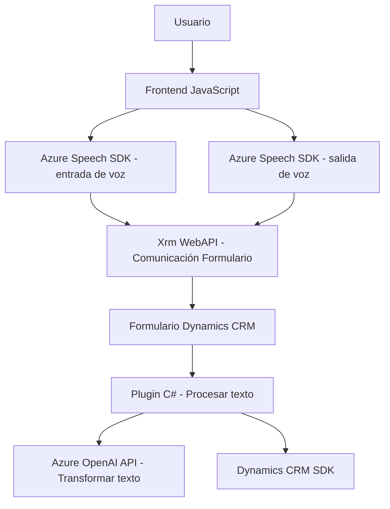

# Análisis técnico del repositorio

## Breve resumen técnico
El repositorio contiene una solución basada en interacción con voz (entrada y salida) para formularios en Dynamics CRM, además de un _plugin_ para procesamiento de texto mediante Azure OpenAI. Esto indica que el proyecto combina diversos componentes: un _frontend_ escrito en JavaScript, integración directa con Dynamics CRM y métodos avanzados de inteligencia artificial mediante Azure SDKs y APIs.

## Descripción de arquitectura
- **Componentes principales:**
  - **Frontend**: Scripts en JavaScript alojados en el cliente que interactúan con formularios en tiempo real.
  - **Plugins backend**: Lógica personalizada en C# que extiende Dynamics CRM, procesando datos enviados desde el cliente y realizando cálculos avanzados.
  - **Servicios externos**: Integración profunda con Azure Speech SDK (para entrada/salida de voz) y Azure OpenAI (GPT-4) para transformaciones de texto.

- **Tipo de arquitectura**:  
  La solución es una arquitectura **extendida de n capas**, adaptada para el entorno de Dynamics CRM:
  - **Cliente / presentación**: Scripts JavaScript ejecutados en el navegador del usuario.
  - **Interfase intermedia**: Formulario dentro de Dynamics CRM que conecta usuario con lógica _backend_.
  - **API (microservicios externos)**: Llamados externos a Azure Speech SDK y Azure OpenAI para procesamiento de voz y texto.
  - **Backend en Dynamics CRM**: Lógica ejecutada mediante plugins C#.

## Tecnologías usadas
1. **Frontend (JavaScript)**: 
   - Azure Speech SDK para reconocimiento y síntesis de voz.
   - Métodos de Dynamics CRM (`Xrm.WebApi`) para interactuar con datos del formulario.
   - Modularidad en scripts para dividir responsabilidades.

2. **Backend (C#)**:
   - Microsoft Dynamics CRM SDK (`IPlugin`, `IOrganizationServiceFactory`, etc.).
   - Azure OpenAI API (GPT-4) para procesamiento avanzado de texto.  
   - Librerías estándar de .NET y JSON (`Newtonsoft.Json`, `System.Text.Json`).
  
3. **Servicios externos**:
   - Azure Speech SDK: Reconocimiento y síntesis de voz.
   - Azure OpenAI API: Transformación de texto a JSON con reglas específicas.

## Dependencias o componentes externos
- **Azure Speech SDK**: Para entrada y salida de voz.
- **Azure OpenAI API**: Comunicación REST para transformaciones avanzadas de texto.
- **Dynamics CRM SDK**: Extensión del sistema base mediante _plugins_ personalizados.
- **Xrm.WebApi**: Llamados CRUD automáticos al sistema backend de Dynamics CRM.

---

## Diagrama Mermaid

---

## Conclusión final
El repositorio implementa una solución **semi-microservicios** que conecta módulos frontend y backend utilizando Dynamics CRM como núcleo operativo. Utiliza **Azure Speech SDK** para características avanzadas de interacción de voz y **Azure OpenAI** para procesamiento de texto. La arquitectura extendida permite modularidad y una clara separación entre cliente, servicios externos y backend. Esto lo hace adecuado para aplicaciones empresariales que requieren procesamiento de datos dinámico y natural.