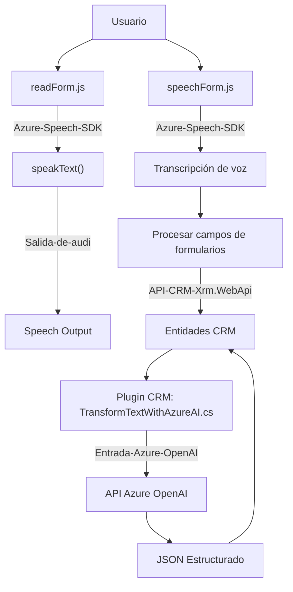

### **Breve resumen técnico**
El repositorio analiza tres piezas distintas del sistema:
1. **readForm.js**: Captura el contenido visual del formulario en la interfaz y lo sintetiza a través del Azure Speech SDK.
2. **speechForm.js**: Procesa transcripciones de voz provenientes del usuario, actualiza automáticamente los campos del formulario en un sistema CRM y realiza operaciones con APIs.
3. **TransformTextWithAzureAI.cs**: Plugin de Dynamics CRM que integra Azure OpenAI para transformar texto en JSON estructurado bajo reglas predefinidas.

### **Descripción de arquitectura**
La solución implementa una arquitectura **orientada a servicios (SOA)** con componentes que interactúan con sistemas externos, como **Azure Speech SDK** y **Azure OpenAI API**, y un entorno CRM. Además, las distintas funcionalidades están divididas en módulos que se comunican mediante invocaciones asíncronas de servicios.

#### Componentes observados:
1. **Frontend**: Interacción con formularios a través de análisis y síntesis de voz, desarrollada en JavaScript, utilizando el patrón de modularización por funciones específicas.
2. **Backend (CRM Plugin)**: Extensión personalizada que integra la API de Dynamics CRM con Azure OpenAI para realizar actualizaciones centralizadas en objetos CRM a partir de datos textuales.
   
La arquitectura es **n-capas**, donde cada nivel organiza lógicamente las funcionalidades: la capa de presentación (interfaz del usuario), la capa de lógica de negocio (procesadores de voz) y el backend (plugin del CRM para integración externa).

### **Tecnologías usadas**
1. **Frontend (JavaScript)**:
   - **Azure Speech SDK**: Manejo de síntesis de texto a voz y transcripción de voz.
   - Interacciones con el DOM y formularios web.

2. **Backend (c#)**:
   - **Microsoft Dynamics CRM**: Para trabajar con entidades, datos, plugins y APIs asociadas.
   - **Azure OpenAI API**: Procesamiento avanzado de texto en formato JSON.
   - Frameworks y librerías de C#:
     - `System.Net.Http`: Gestión de solicitudes HTTP.
     - `Newtonsoft.Json.Linq` y `System.Text.Json`: Manipulación JSON.

3. **Patrones usados**:
   - **Plugin Architecture**: En el backend, extensiones de CRM mediante plugins con `IPlugin`.
   - **Callback Pattern**: Cargar dependencias dinámicamente y ejecutar lógica cuando estén disponibles.
   - **Abstracción lógica**: Modularización por funcionalidad, como lectura, procesamiento, y síntesis.

---

### **Diagrama Mermaid válido para GitHub**

---

### **Conclusión final**
El repositorio presenta una solución **SOA** orientada a la integración entre servicios mediante componentes modulares que accionan, analizan y manipulan datos. Combina tecnologías de front-end y back-end, con una clara separación de responsabilidades en cada archivo.

#### **Fuerzas destacadas**:
1. **Modularidad**: Cada archivo tiene funciones bien definidas para su propósito; los procesos complejos están desglosados en tareas específicas.
2. **Escalabilidad**: La solución utiliza APIs (Azure Speech SDK y OpenAI), lo que permite extender las capacidades sin modificar el núcleo del código.
3. **Integración dinámica**: El componente backend con plugins CRM refuerza la flexibilidad en la manipulación de datos con servicios vinculados.

La arquitectura muestra solidez y adecuación para escenarios empresariales que requieren interacción avanzada en tiempo real entre usuarios, datos y sistemas externos como CRM.