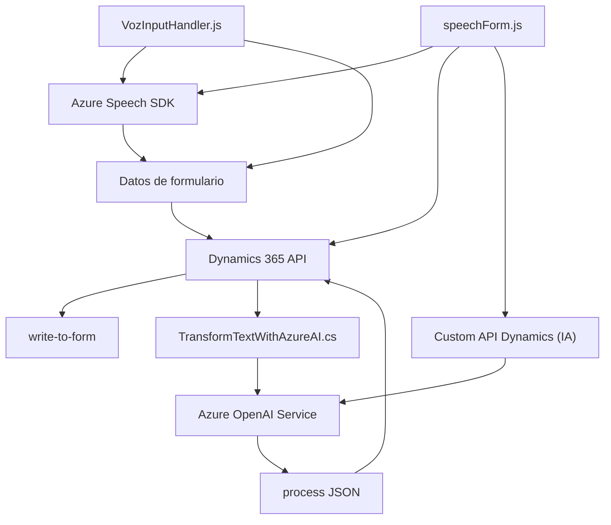

## Breve resumen técnico

Este código es parte de una solución con componentes frontend y backend diseñados para integrar Microsoft Dynamics 365 con el Azure Speech SDK y Azure OpenAI Service. Ofrece funciones que se encargan de la entrada de voz, lectura y síntesis de datos, transcripción de texto, y manipulación automática de formularios en el CRM. También incluye un plugin para Dynamics 365 que consume el Azure OpenAI Service para transformar texto en JSON estructurado.

---

## Descripción de arquitectura

**Arquitectura principal:**
- La solución sigue una arquitectura **multicapa**, donde el frontend realiza funciones de interacción con el usuario y servicios externos, como Azure Speech SDK, y el backend complementa las funcionalidades mediante plugins que se integran con Dynamics CRM y hacen uso del Azure OpenAI Service. Las capas son:
  1. **Frontend**:
      - Enfocado en la interacción del usuario y la síntesis de voz a partir de datos en formularios.
      - Funciona mediante JavaScript ejecutado en Dynamics 365 para recuperar y enviar datos, usando el SDK del CRM.
  2. **Backend (Plugins)**:
      - Implementado como un plugin para Dynamics CRM que ejecuta lógica de negocio avanzada (por ejemplo, procesar texto con normas y producir un objeto JSON usando Azure OpenAI).
      - Total dependencia de la interfaz `IPlugin`, que define la interacción dentro del modelo de Dynamics CRM.
  3. **Infraestructura y Servicios Externos**:
      - Llamadas a servicios externos como API Azure Speech SDK y Azure OpenAI.

**Patrones de diseño:**
1. **Modularidad funcional**:
   Cada archivo tiene funciones encapsuladas dedicadas a tareas como voz a texto, obtención de datos, actualización de campos específicos en formularios, transcripción manual y automática, y llamadas API.
2. **Callback y asincronía**:
   En el frontend, se utiliza la asincronía para la carga dinámica del Azure Speech SDK y para garantizar la ejecución de procesos secuenciales.
3. **Event-driven architecture**:
   En los plugins del backend se observa un diseño basado en eventos de Dynamics CRM que desencadenan la ejecución de lógica al activar un plugin.

---
## Tecnologías usadas

- **Frontend** (VozInputHandler.js y speechForm.js):
  - **Lenguaje y librerías**: JavaScript, código cliente desarrollado para integrarse específicamente con Dynamics 365.
  - **Azure Speech SDK**: SDK para reconocimiento de voz y síntesis de texto a voz, usado vía URLs dinámicas de Microsoft CDN.
  - **Dynamics 365 Client APIs**: Para recuperación y manipulación de datos en formularios CRM.

- **Backend Plugin** (TransformTextWithAzureAI.cs):
  - **Lenguaje**: C#, .NET Framework (implementando Microsoft Dynamics CRM).
  - **Integración externa**: Azure OpenAI Service.
  - **Bibliotecas**: Newtonsoft.Json, System.Text.Json, System.Net.Http para manejo de JSON y solicitudes HTTP.

---

## Diagrama Mermaid válido para GitHub Markdown

---

## Conclusión Final

La solución abarca un ecosistema más amplio que combina herramientas de integración de voz, reconocimiento de texto y uso de inteligencia artificial mediante servicios de Azure. La arquitectura es predominantemente **multicapa**, con integración directa entre frontend y backend de Dynamics 365, complementadas por servicios externos (Azure Speech SDK y Azure OpenAI). Es adecuada para mejorar la experiencia de usuario en plataformas CRM mediante el uso de comandos de voz y procesamiento automático de texto.