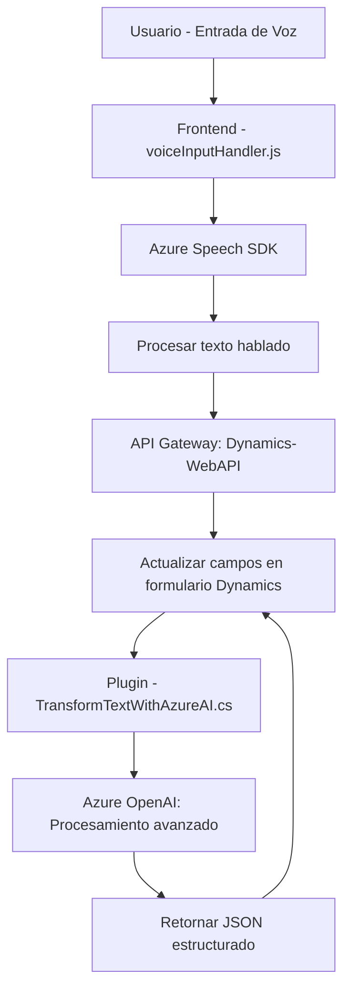

# Resumen y Análisis Técnico

## Breve Resumen Técnico
El repositorio contiene archivos que implementan funcionalidades relacionadas con entrada de voz, reconocimiento y procesamiento de comandos, generación de voz, y transformación asistida por inteligencia artificial. Específicamente:
- **Frontend**: Manejo de la entrada/salida de voz y manipulación dinámica del formulario.
- **Plugin**: Complemento para Dynamics 365 que transforma texto utilizando Azure OpenAI.

Los componentes externos como Azure Speech SDK y OpenAI juegan un papel crucial en las operaciones del sistema.

---

## Descripción de Arquitectura
La arquitectura utilizada puede clasificarse como **modular con integración de servicios externos**. Cada componente está bien encapsulado y se especializa en un área de funcionalidad:
- El frontend implementa lógica de interacción con el usuario y consume servicios como Speech SDK y Dynamics Web API.
- El plugin utiliza lógica empresarial para interactuar directamente con Dynamics 365, integrándose con Azure OpenAI.

El diseño sigue patrones como **API Gateway**, **Encapsulación Modular**, y **Pipeline de procesamiento de datos**. Si bien la estructura general no está completamente distribuida como microservicios, sí tiene componentes modulares independientes.

---

## Tecnologías y Frameworks Usados
1. **Frontend**:
   - **JavaScript**: Lenguaje principal para manipulación del DOM y llamada a APIs externas.
   - **Azure Speech SDK**: Procesamiento de reconocimiento y síntesis de voz.
   
2. **Backend (Plugin en Dynamics)**:
   - **Dynamics 365 SDK**: Para extensión y manipulación del CRM mediante plugins.
   - **Azure OpenAI**: Utilizado para procesamiento e interpretación avanzada de texto.
   - **System.Net.Http / JSON Libraries**: Para consumir APIs REST y manejar datos JSON.
   
3. **Patrones Detectados**:
   - API Gateway: Conexión entre Dynamics 365, Azure OpenAI, y el Frontend.
   - Adaptador: Convertir texto hablado u generado en estructuras compatibles con formularios CRM.
   - Pipeline: Procesos secuenciales para reconocimiento, transformación y ejecución en los formularios.

---

## Diagrama Mermaid
A continuación se describe la interacción de componentes usando un diagrama en **Mermaid**:

---

## Conclusión Final
La solución presentada es una **integración de servicios con modularidad**, orientada hacia una arquitectura de sistema distribuido híbrida. Ideal para mejorar la accesibilidad y procesamiento de datos vinculados a formularios de Dynamics 365, con capacidades avanzadas basadas en IA. Cada módulo está bien aislado y sigue patrones probados en la industria, lo que facilita la extensibilidad y el mantenimiento del código.

Recomendaciones:
1. **Documentación detallada** para cada funcionalidad y sus dependencias externas.
2. **Autenticación robusta** en comunicaciones con Azure OpenAI y Speech SDK.
3. **Optimización de rendimiento** en procesamiento de datos en tiempo real.