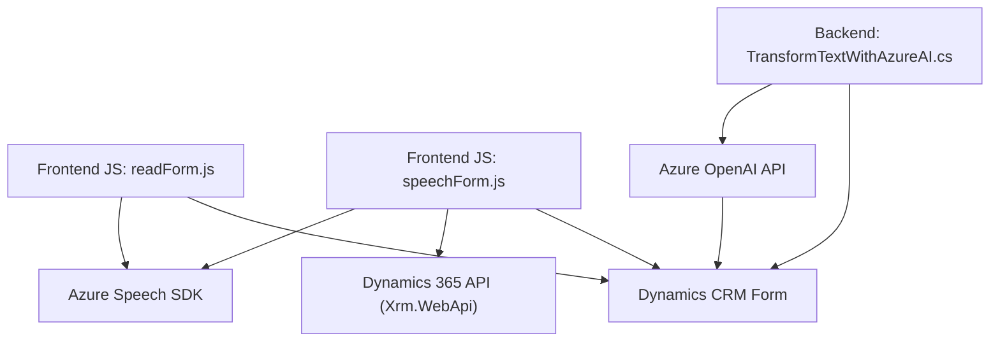

### Breve resumen técnico
El repositorio contiene tres archivos principales que trabajan en conjunto para implementar funcionalidades de síntesis y reconocimiento de voz, así como transformación de texto utilizando Azure Speech SDK y la API de Azure OpenAI. Estas funcionalidades están integradas en un contexto de Microsoft Dynamics 365 CRM, llevando a cabo tareas relacionadas con la manipulación de formularios y procesamiento de datos mediante APIs externas.

---

### Descripción de la arquitectura
La solución presenta un diseño modular, basado en:
1. **Componentes en capas**, donde los archivos de frontend tienen una capa de interacción de usuario, lógica y conexión con servicios externos (Azure Speech SDK) mientras que el backend (plugin de Dynamics) aplica lógica de negocio transformando la entrada.
2. **Integración con SDK y API externas**, como Azure Speech SDK y Azure OpenAI, permitiendo procesamiento de voz y texto.
3. **Event-driven**, activando acciones a través de eventos en el frontend y en Dynamics CRM.
4. **Orientación a microservicios en parte del backend**, desacoplando operaciones complejas mediante Azure OpenAI API.

---

### Tecnologías usadas
- **Frontend**:
  - **JavaScript** como lenguaje principal para la interacción en el navegador.
  - **Azure Speech SDK** para síntesis y reconocimiento de voz.
  - **Dynamics 365 API** (`Xrm.WebApi`) para manipulación de datos del formulario.
- **Backend**:
  - **C#** como lenguaje (archivo `.cs`) para la ejecución de plugins en Dynamics.
  - **Microsoft Dynamics CRM SDK** para desarrollar plugins.
  - **Azure OpenAI API** para transformación de texto.
  - **JSON** como formato de comunicación entre componentes.
- **Infraestructura y comunicación**:
  - **CDN** para cargar librerías de Azure Speech SDK.
  - **HTTP** para comunicación con servicios externos de Azure.

---

### Diagrama Mermaid (compatible con GitHub Markdown)

---

### Conclusión final
La solución representa una arquitectura híbrida, combinando características de una arquitectura en capas (frontend y backend) con la integración de servicios externos en forma de microservicios (Azure Speech SDK y Azure OpenAI). Su diseño modular y el uso de SDKs y APIs externas la hacen escalable, reutilizable y preparada para la interacción con servicios avanzados de procesamiento de voz e inteligencia artificial.