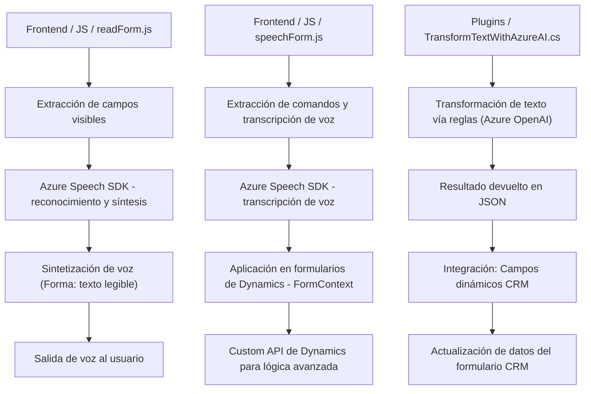

### Análisis Completo del Repositorio

#### **Breve Resumen Técnico**
El repositorio contiene tres componentes principales, todos enfocados en la habilitación de capacidades avanzadas de voz, inteligencia artificial y manipulación de formularios dentro de un ecosistema Dynamics CRM. Los archivos combinan tecnologías cliente (JavaScript) y servidor (.NET), apoyándose fuertemente en los servicios de Microsoft Azure, específicamente Azure Speech SDK y Azure OpenAI API, para el reconocimiento de voz, síntesis de voz y generación de texto procesado.

#### **Descripción de Arquitectura**
La arquitectura general sigue un enfoque **n-capas** integradas:
1. **Capa de Presentación (Frontend)**:
   - Implementada con JavaScript, interactúa directamente con formularios de Dynamics CRM.
   - Proporciona entrada/salida de voz y manipulación dinámica de datos de formularios.
2. **Capa de Servicios Externos**:
   - Uso de Azure Speech SDK (en frontend) y Azure OpenAI API (en servidor) para funciones avanzadas de IA.
3. **Capa Intermedia (Backend)**:
   - Plugins diseñados en .NET (Dynamics CRM) actúan como puntos de procesamiento de datos para transformar texto mediante reglas.
4. **Capa de Datos**:
   - La interacción directa con Dynamics CRM y la manipulación de objetos relacionados en tiempo real sugiere el uso extendido de entidades del sistema.
   
Patrones identificados:
- **Event-Driven Programming:** Gestión de eventos como "carga dinámica de dependencias" y transcripciones procesadas.
- **Integración de Servicios** vía APIs de Azure (Azure Speech y OpenAI) y Dynamics CRM WebApi.
- **Plugin como extensión**: Implementación clave para extender funcionalidades en Dynamics CRM.

### **Tecnologías, Frameworks y Patrones Usados**
#### **1. Lenguajes y Frameworks:**
- **JavaScript:** Usado para la lógica de frontend y manipulación del DOM.
- **C#/.NET Framework:** Utilizado para la creación de plugins de Dynamics CRM.
#### **2. Servicios Externos:**
- **Azure Speech SDK:** Sintetización y reconocimiento de voz.
- **Azure OpenAI API:** Procesamiento de texto y transformación en JSON.
#### **3. Herramientas y Librerías:**
- **Newtonsoft.Json/JObject:** Para manipulación de objetos JSON en el backend.
- **Dynamics 365 SDK (`Microsoft.Xrm.Sdk`, `Xrm.WebApi`)**: Acceso y extensión del CRM.
#### **4. Patrones de Diseño:**
- **Event-Driven Architecture:** Utiliza callbacks y eventos como acciones al reconocimiento de voz o carga de dependencias.
- **Load-on-demand:** Carga dinámica del SDK de Speech para optimizar recursos.
- **Mapeo dinámico:** Relación entre etiquetas visibles y los campos del formulario usando `getFieldMap`.

### **Dependencias y Componentes Externos**
#### **Principales Dependencias Detectadas:**
- Azure Speech SDK [https://aka.ms/csspeech/jsbrowserpackageraw]: Sintetización y reconocimiento de voz.
- Dynamics 365 CRM SDK (`Microsoft.Xrm.Sdk`, `Xrm.WebApi`): Interacción con el sistema CRM y Custom APIs.
- Azure OpenAI API [https://openai-netcore.openai.azure.com]: Procesamiento avanzado de texto estructurado como JSON.
- Bibliotecas estándar de C#: Newtonsoft.Json.Linq (para manejo JSON), System.Net.Http (solicitudes HTTP).

---

### **Diagrama Mermaid**

---

#### **Conclusión Final**
Este repositorio presenta una solución de **arquitectura n-capas**, altamente integrada con servicios de Microsoft Azure y Dynamics CRM. Los componentes de frontend y backend trabajan en conjunto para ofrecer capacidades avanzadas como la síntesis de voz, el reconocimiento y la interacción con inteligencia artificial, todo orquestado dentro de un flujo dinámico que permite mejorar la experiencia del usuario en la gestión de datos de formularios. La arquitectura es modular y altamente escalable, utilizando patrones standard como la carga dinámica de dependencias y la integración de servicios externos.