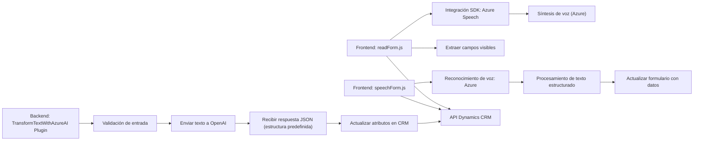

### Breve Resumen Técnico

El repositorio incluye varias implementaciones que interactúan con formularios de Dynamics 365 y servicios de Azure, principalmente empleando reconocimiento y síntesis de voz. Además, contiene un plugin que utiliza **Azure OpenAI** para transformar texto de forma personalizada. Las soluciones están orientadas a la integración con servicios de terceros (Azure) y la manipulación dinámica de formularios en un navegador.

---

### Descripción de Arquitectura

La arquitectura es **modular** con características de varios niveles:
1. **Frontend**:
   - Maneja **integraciones cliente-servidor** en tiempo real mediante el contexto de formularios (Dynamics 365).
   - Utiliza SDKs cargados dinámicamente para funciones como síntesis y reconocimiento de voz.
   - Presenta un enfoque basado en eventos y modularidad, manteniendo un grado de separación de responsabilidades.
2. **Backend** (Plugins):
   - Implementa **arquitectura basada en plugins** para Microsoft Dynamics.
   - Utiliza un enfoque de **servicio externo** hacia Azure OpenAI mediante HTTP para transformación de textos.
   - Sigue un patrón de **interacción síncrona** con diseños típicos de Dynamics CRM.

En conjunto, la arquitectura parece una implementación **híbrida distribuida** con integración de **servicios externos** (Azure Speech y OpenAI) y una plataforma CRM monolítica dinámica en el backend.

---

### Tecnologías Usadas

1. **Frontend**:
   - **JavaScript**:
     - Implemente lógica en tiempo real en el navegador.
   - **Azure Speech SDK**:
     - Para síntesis y reconocimiento de voz, cargado de manera dinámica.
   - **Microsoft Dynamics CRM**:
     - Para formularios y contexto de ejecución (manipulación de atributos y formularios).

2. **Backend**:
   - **C#**:
     - Implementación de plugins bajo la arquitectura estándar de Dynamics CRM.
   - **Azure OpenAI (GPT)**:
     - API para la manipulación de texto basado en IA.
   - **System.Text.Json** y **Newtonsoft.Json**:
     - Para la construcción y procesamiento de JSON.
   - **Microsoft XRM SDK**:
     - Para integración directa con el backend de Dynamics CRM.

3. **Patrones**:
   - Modularidad en el frontend (funciones independientes).
   - **Plugin-based architecture** en el backend.
   - **Service-Oriented** para la integración con APIs externas (Azure Speech/OpenAI).
   - **Dynamic Module Loading** para garantizar disponibilidad antes de ejecución.

---

### Diagrama Mermaid

---

### Conclusión Final

La solución utiliza un conjunto integrado de tecnologías para resolver problemáticas de reconocimiento, síntesis y procesado de voz junto a transformaciones dinámicas de texto mediante IA. Su enfoque modular en el frontend y sus plugins para el backend crean una solución bien diseñada para entornos corporativos basados en Dynamics CRM. Sin embargo, podría beneficiarse de una arquitectura más asincrónica en el backend y una mejor gestión de dependencias en la carga dinámica del SDK del frontend.