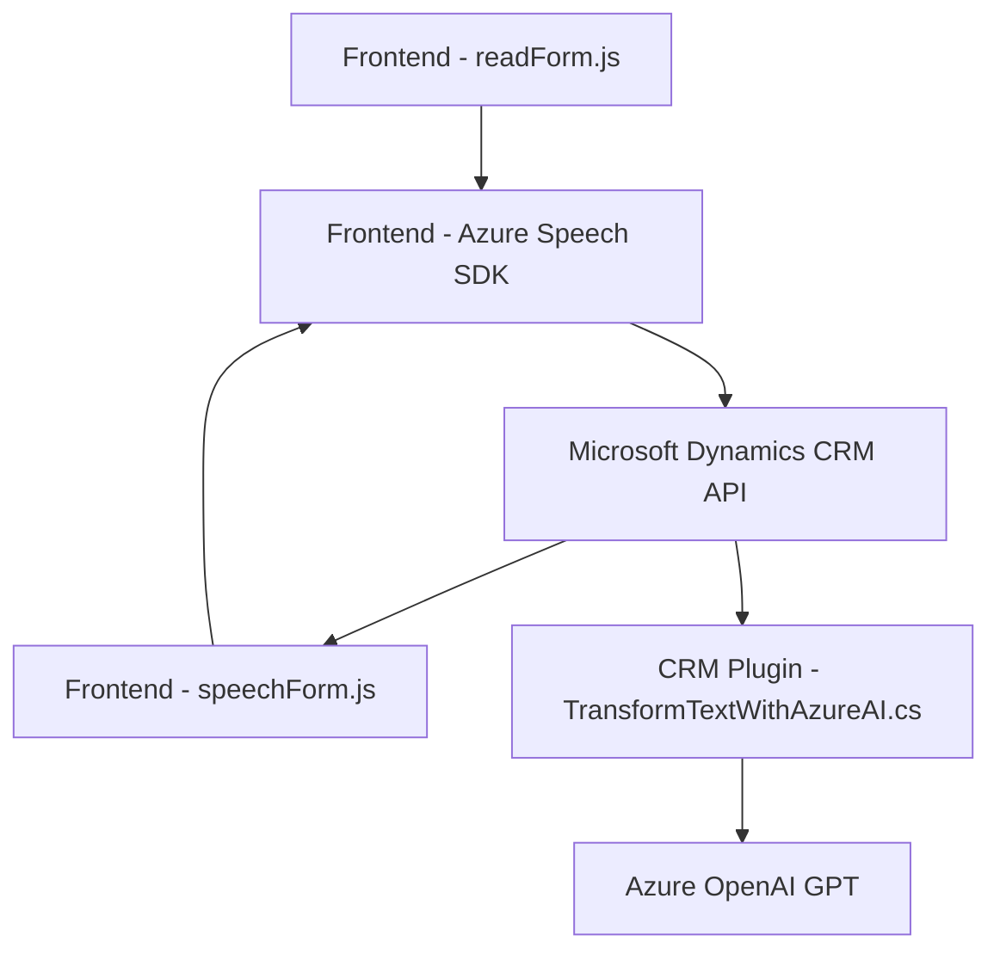

# Resumen técnico

El repositorio analizado contiene múltiples archivos distribuidos de manera modular, cada uno con una funcionalidad específica. A continuación, se identifican:

- **Solución:** Integración entre un sistema CRM basado en Microsoft Dynamics, un frontend gestionando interacción por voz, y extensiones para manejo de IA.
- **Tecnologías principales:** Azure Speech SDK, Azure OpenAI GPT, Microsoft Dynamics CRM SDK, APIs REST.
- **Arquitectura:** Componentes modulares reutilizables que se integran dentro de una arquitectura **mixta** orientada a microservicios, eventos, y APIs externas.

---

## Descripción de la Arquitectura

### Componentes principales:

1. **Frontend Voice Interaction:** El sistema gestiona la conexión entre la interfaz de usuario y los servicios cognitivos de Azure para realizar acciones basadas en comandos de voz. Los archivos relacionados (`readForm.js`, `speechForm.js`) definen interacciones como reconocimiento de voz y síntesis de texto en voz.
2. **CRM Plugin:** El archivo `TransformTextWithAzureAI.cs` implementa un plugin que extiende la funcionalidad del sistema CRM, realizando procesamiento avanzado con IA.
3. **Integraciones externas:** Uso de Azure Speech SDK para reconocimiento/síntesis de voz y procesamiento de datos en tiempo real por Azure OpenAI GPT.

### Arquitectura general:
- **Microservicios:** Cada archivo encapsula funcionalidades específicas y desacopla dependencias externas como los SDK/servicios de Azure.
- **Patrones orientados a eventos:** En los archivos frontend, todo fluye a partir de eventos disparados por el SDK de Azure Speech.
- **Integración modular:** La funcionalidad distribuida se integra de manera dinámica en tiempo de ejecución, especialmente los SDK cargados desde fuentes remotas.

---

## Tecnologías usadas

### Frontend
- JavaScript como base para la interacción dinámica.
- **Azure Speech SDK:** Reconocimiento de comandos y síntesis de voz (incluyendo carga dinámica).
- API REST de Dynamics CRM: Manipulación de atributos y datos proporcionados por el formulario CRM.

### Backend (Plugin)
- **SDK de Dynamics CRM:** Organización de parámetros y ciclo de ejecución en el contexto.
- Azure OpenAI GPT: Procesamiento avanzado de texto en la nube.
- **Librerías C#:** `HttpClient` para manejo de peticiones y APIs de JSON (`System.Text.Json` y `Newtonsoft.Json.Linq`).

### Arquitectura y comunicación
- Desacoplamiento mediante **API Wrapper** sobre SDKs y APIs REST.
- Modularidad para fácil reutilización e integración en escenario CRM/Dynamics.
- Integración externalizada a servicios en la nube como Azure GPT y Speech SDK.

---

## Diagrama Mermaid válido para GitHub

---

## Conclusión

Este repositorio parece formar parte de una solución extendida que integra inteligencia artificial y la interacción por voz en escenarios corporativos centrados en el uso de formularios y automatización de datos del sistema CRM. Cuenta con un diseño modular y arquitectura orientada al desacoplamiento basado en microservicios y APIs externas. Las tecnologías elegidas (Azure Speech SDK, OpenAI GPT) son consistentes con las necesidades de escalabilidad, interactividad avanzada y transformación de datos en tiempo real en entornos empresariales.