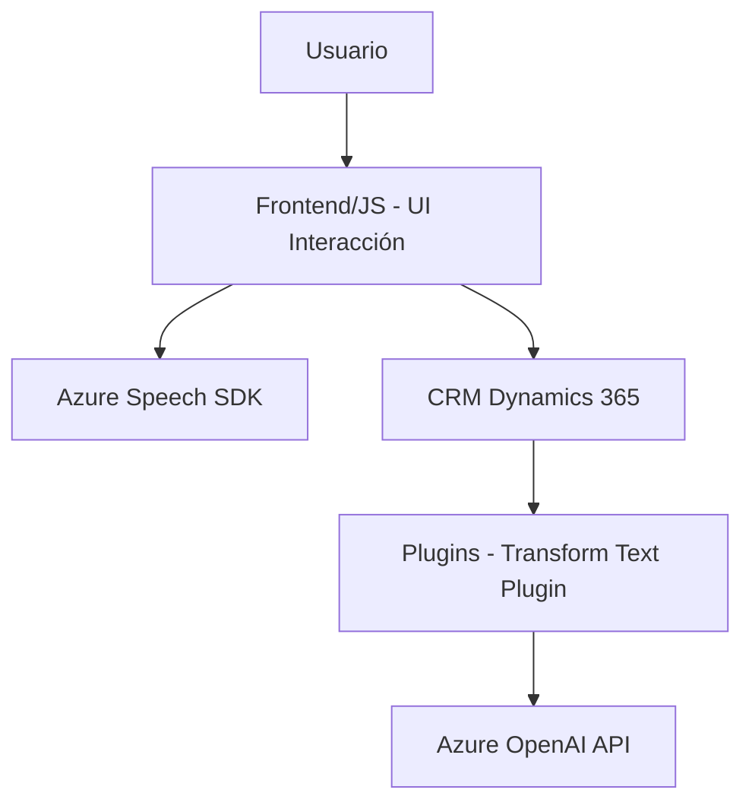

### Breve Resumen Técnico
El repositorio parece contener funcionalidades orientadas a la interacción entre formularios dinámicos en un sistema CRM (Dynamics 365) y servicios externos para reconocimiento de voz y procesamiento avanzado de texto usando Azure AI. Es un sistema híbrido que combina componentes frontend, funcionalidades integradas en CRM (como plugins) y servicios externos de Azure.

---

### Descripción de Arquitectura
La arquitectura del repositorio tiene las siguientes características:
1. **Componentes Frontend:** El directorio `FRONTEND/JS` aloja scripts destinados a manipular la interfaz de usuario, interactuando dinámicamente con formularios y servicios externos como el Azure Speech SDK.
2. **Integración de Servicios Externos:** Los componentes de frontend integran SDKs y APIs como Azure Speech y OpenAI a través de solicitudes REST. Esto agrega capacidades de síntesis de voz, reconocimiento de voz y procesamiento de IA al sistema.
3. **Plugins CRM:** En el directorio `Plugins`, se implementan capacidades más avanzadas a través de la plataforma Dynamics CRM. Estos plugins tienen la responsabilidad de procesar datos y transformar texto con Azure AI.
4. **Arquitectura General:** Aunque no se puede confirmar una arquitectura completa solo desde los archivos, parece ser una solución **n-capas híbrida**:
   - **Frontend:** Scripts destinados a manipular la UI.
   - **Backend Integrado (CRM):** Plugins procesan lógica, validación e invocan servicios externos.
   - **Servicios Externos:** Azure Speech SDK y OpenAI proporcionan características avanzadas de reconocimiento y transformación de texto.

---

### Tecnologías Usadas
- **Frontend:**
  - Lenguaje: **JavaScript**.
  - Frameworks: Aunque no hay una referencia directa, podría estar conectado con interfaces de CRM como Dynamics 365.
  - SDK: Microsoft Azure Speech SDK.

- **Backend (Dynamics 365 Plugin):**
  - Lenguaje: **C#**.
  - Framework: Dynamics 365 SDK (`Microsoft.Xrm.Sdk`, `Microsoft.Xrm.Sdk.Query`).
  
- **Servicios Externos:**
  - **Azure Speech SDK:** Para reconocimiento de voz y síntesis de texto.
  - **Azure OpenAI:** Usado para transformación de texto con GPT (probablemente GPT-4).
  - **REST APIs:** Arquitectura desacoplada para comunicarse con servicios externos mediante HTTP.

- **Utilidades:**
  - **Newtonsoft.Json.Linq**: Procesamiento de JSON.
  - **System.Text.Json**: Serialización y deserialización.

---

### Dependencias y Componentes Externos
1. **Dependencias del Frontend:**
   - `Microsoft Azure Speech SDK`: Para procesamiento de voz directamente en el navegador.
   - HTTP API del entorno CRM o Dynamics 365.
   
2. **Dependencias del Backend:**
   - `Microsoft.Xrm.Sdk`: SDK de Dynamics CRM.
   - `System.Net.Http`: Para solicitudes hacia el servicio Azure OpenAI.
   - `Newtonsoft.Json.Linq` y `System.Text.Json`: Procesamiento de datos JSON.
   - **Azure OpenAI API:** Proporciona procesamiento con IA.
   
3. **Integración Externa:**
   - Speech SDK y APIs REST como servicios desacoplados.

---

### Diagrama **Mermaid** 100 % Compatible con GitHub Markdown

---

### Conclusión Final
El sistema del repositorio auténticamente es una integración híbrida entre frontend dinámico, lógica integrada (a través de plugins en CRM), y servicios inteligentes proporcionados por Azure AI. Este tipo de arquitectura está bien pensado para sistemas empresariales que necesitan capacidades avanzadas como procesamiento de voz y texto basado en IA.

La solución cumple con **modularidad y escalabilidad**, lo que la hace apta para adaptarse a nuevas funcionalidades a través de servicios externos o cambios en la plataforma CRM. Aunque hay componentes no detallados (e.g. el diseño de la interfaz), la documentación y el código apuntan hacia una implementación estable y orientada a servicios desacoplados.