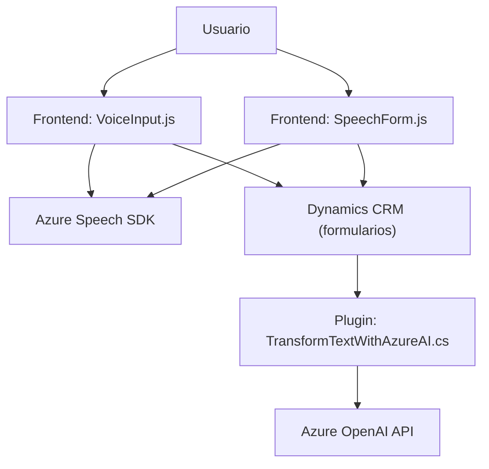

### Breve resumen técnico:
El repositorio contiene tres componentes principales que interactúan entre sí para ofrecer funcionalidades avanzadas de reconocimiento, procesamiento y síntesis de voz mediante **Azure Speech SDK**, **Dynamics 365** y **Azure OpenAI**. Está diseñado para integrarse con formularios en un entorno CRM, probablemente Dynamics 365, y utiliza plugins personalizados para procesar texto con capacidades de IA.

---

### Descripción de arquitectura:
La solución parece ser una arquitectura **n capas**, donde cada componente desempeña un rol específico:
1. **Frontend**:
   - Archivos en JavaScript: gestionan la interacción con el usuario mediante reconocimiento y síntesis de voz en el navegador.
   - Dependen de servicios externos como **Azure Speech SDK** y dinámicas del formulario.
2. **Backend/Servicios**:
   - Los plugins en C#: actúan como middleware que extiende la funcionalidad de Dynamics 365 y se comunica con **Azure OpenAI** para transformar datos.
   - Implementan el patrón **Plugin Pattern** y actúan como adaptadores entre la API del CRM y servicios externos.
3. **Externo**:
   - APIs de Azure: **Azure Speech SDK** para voz y **Azure OpenAI** para procesamiento avanzado de texto.

La separación clara de responsabilidades y la interacción vía APIs permiten un diseño modular que puede escalar fácilmente.

---

### Tecnologías usadas:
1. **Frontend**:
   - **JavaScript/ES6**: Lenguaje de programación principal, incluido en los archivos `VoiceInput.js` y `SpeechForm.js`.
   - **Azure Speech SDK**: Para sintetizar y reconocer voz.
   - **API Web del Navegador**: Uso de micrófono, manejo de audio y carga de scripts dinámicos.
   - Contexto de **Dynamics 365** (Xrm API): Interacción con formularios web en CRM.

2. **Backend**:
   - **C#/.NET**: Lenguaje y framework principal para plugins como `TransformTextWithAzureAI.cs`.
   - **Azure OpenAI API**: Procesamiento de texto utilizando GPT (con reglas específicas).
   - **Newtonsoft.Json** / **System.Text.Json**: Operaciones con JSON.

---

### Diagrama **Mermaid** válido para GitHub:

---

### Conclusión final:
La solución se basa en una arquitectura **n capas**, optimizada para sistemas CRM como Dynamics 365, combinada con potentes herramientas de **procesamiento de voz** e **inteligencia artificial**. El enfoque modular la hace robusta y escalable, mientras que el uso de **Azure SDKs** y servicios externos introduce una alta dependencia de la infraestructura en la nube. Esta integración de voz y IA permite automatizar y enriquecer la interacción asincrónica con datos dentro de formularios CRM.