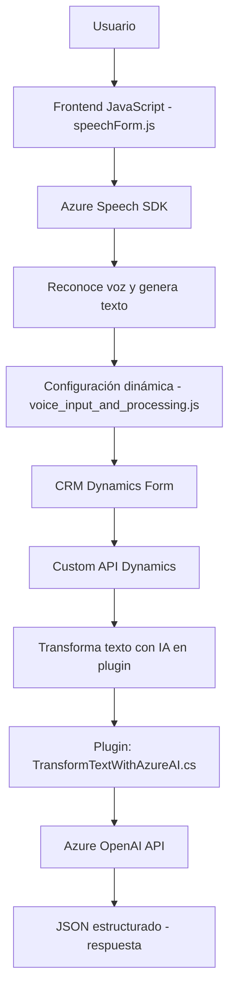

# Análisis técnico del repositorio

## Breve resumen técnico
Este repositorio contiene varios archivos relacionados con la integración de un sistema CRM basado en Dynamics, Azure Speech SDK y Azure OpenAI. Está diseñado para proporcionar funcionalidades avanzadas de reconocimiento y síntesis de voz, tanto para la entrada de datos como para la conversión de texto en audio. Además, incluye un plugin para transformar texto mediante reglas proporcionadas y retornar un JSON estructurado usando Azure OpenAI.

---

## Descripción de arquitectura
La arquitectura está gobernada por los siguientes principios:
1. **Cliente y servidor con integración API externa:** El frontend maneja la comunicación directa con el usuario (entrada y salida de voz) mediante el navegador. El backend (plugin en C#) se integra con Azure OpenAI para la transformación de texto en el contexto de Dynamics CRM, lo que sugiere una aplicación que combina las capacidades de un sistema monolítico (Dynamics CRM) con integración remota de microservicios externos.
2. **Patrón de arquitectura de plugins:** Dynamics CRM utiliza un modelo de arquitectura extensible basado en plugins, lo que permite agregar funcionalidades específicas sin modificar el core del sistema.
3. **N-capas:** Aunque Dynamics CRM utiliza un backend extensible, el código está estructurado siguiendo el modelo de n capas:
   - **Capa presentación:** Archivos frontend (JavaScript) que interactúan con Azure Speech SDK y el CRM.
   - **Capa lógica:** Plugin C# ejecuta reglas y transforma el texto con Azure OpenAI.
   - **Capa de integración:** Llamadas a APIs externas (Azure Speech SDK y OpenAI).

---

## Tecnologías usadas
### Frontend:
1. **Framework Dynamics CRM (`Xrm`):** Interactúa con el modelo de datos y APIs disponibles en el sistema CRM.
2. **Azure Speech SDK:** Responsable de reconocimiento y síntesis de voz mediante un CDN.
3. **JavaScript:** Usado para la lógica dinámica en el frontend.
4. **DOM APIs:** Para manipular elementos HTML y manejo del SDK cargado.

### Backend:
1. **Dynamics CRM Plugin System:** Implementa la interfaz `IPlugin` para ejecutar transformaciones específicas en el contexto CRM.
2. **Azure OpenAI:** Utiliza la API REST para el procesamiento de datos con reglas definidas.
3. **Microsoft.NET Framework:** Para el desarrollo en C#.

### Patrones de diseño:
1. **Patrón de Plugin:** Interacción modular y extensible mediante intervención en eventos específicos del CRM.
2. **Flujo orientado a eventos:** El reconocimiento de voz y proceso de texto se desencadenan desde eventos del usuario.
3. **Mapeo de datos:** Entre campos visibles / atributos en el CRM y las entradas de voz reconocidas.
4. **Manejo de dependencias externas:** `ensureSpeechSDKLoaded` garantiza la disponibilidad de dependencias como el Azure Speech SDK desde un CDN.

---

## Dependencias o componentes externos
1. **Azure Speech SDK:** Utilizado para reconocimiento de voz y síntesis en el frontend del sistema.
2. **Azure OpenAI:** Utilizado desde el backend (plugin en C#) para transformar texto.
3. **Dynamics CRM Core:** Base del sistema sobre el cual se ejecuta el plugin y donde reside la lógica del formulario.
4. **Custom API en Dynamics CRM:** Llamada desde el frontend para procesar datos mediante IA.
5. **CDN del Azure Speech SDK:** Se carga dinámicamente para garantizar su disponibilidad en el navegador.

---

## Diagrama Mermaid válido para GitHub

---

## Conclusión Final
Este sistema está diseñado para implementar entrada y salida de datos mediante reconocimiento y síntesis de voz en el contexto de Dynamics CRM. Está estructurado como una solución multi-nivel con integración directa a APIs externas, como Azure Speech SDK y Azure OpenAI. La combinación entre modularidad en el frontend, extensibilidad mediante plugins en el backend y comunicación fluida con microservicios externos, le otorga una arquitectura flexible ideal para aplicaciones CRM avanzadas que dependen de procesamiento de datos en tiempo real.