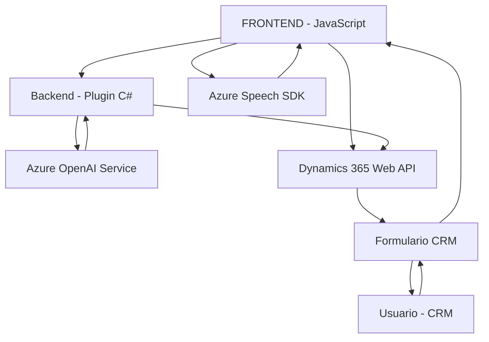

## Análisis técnico detallado:

### **Breve resumen técnico:**
Este repositorio contiene tres archivos que apuntan hacia una solución orientada a la integración de servicios cognitivamente inteligentes, como la lectura y entrada de voz, hacia el entorno de formularios dinámicos de CRM en Dynamics 365, complementado por un plugin para transformar texto con AI. Utiliza el **Azure Speech SDK** y **Azure OpenAI**, integrados en una arquitectura que facilita el procesamiento dinámico mediante servicios externos.

---

### **1. Qué tipo de solución es:**
La solución combina varios aspectos:
- **Frontend**: Con archivos JavaScript orientados a la interacción con formularios en Dynamics 365. Administran la lectura y entrada de voz.
- **Plugin de backend**: Desarrollado en C#, extiende las capacidades del CRM para transformar texto con reglas específicas mediante Azure OpenAI.
- **Integración API & servicios externos**: Utiliza el Azure Speech SDK para síntesis y reconocimiento de voz, y Azure OpenAI para procesos de NLP (Natural Language Processing).

---

### **2. Tecnologías, frameworks y patrones usados:**
**Tecnologías**:
- **JavaScript**: Para la capa de interacción con los formularios y la integración del SDK de voz.
- **C# (.NET Framework)**: Para el desarrollo del plugin en Dynamics 365.
- **Azure Speech SDK**: Para la síntesis y el reconocimiento de voz.
- **Azure OpenAI**: Como servicio de IA para transformación avanzada de datos.
- **Microsoft Dynamics 365 Web API**: Acceso a datos y entidades CRM.
- **HTTP Requests**: Utilizado para la interacción entre el plugin y los servicios de Azure.

**Patrones de diseño y arquitectura observados**:
- **Delegación Modular**: En el código JavaScript, cada funcionalidad está separada en métodos dedicados que gestionan operaciones específicas.
- **Plugin Architecture**: El archivo de C# utiliza el patrón orientado a plugins dinámicos.
- **SOA (Service-Oriented Architecture)**: El plugin y los scripts dependen fuertemente de servicios externos (Azure Speech y Azure OpenAI).
- **Callback y Promesas**: Manejo de operaciones asíncronas en la capa de frontend y SDKs de Azure.

---

### **3. Qué tipo de arquitectura tiene:**
La arquitectura es **híbrida**, combinando elementos del frontend con una integración directa de servicios:
- **Capa de Presentación**: Scripts de JavaScript trabajan con formularios en Dynamics 365 y gestionan síntesis/entrada de voz mediante Azure Speech.
- **Capa de Lógica Empresarial**: El plugin implementado en C# gestiona operaciones de transformación de texto y lógica avanzada en Dynamics 365.
- **Capa de Servicios Externos**:
  - Azure Speech SDK: Sintetización y reconocimiento de voz.
  - Azure OpenAI: Procesamiento de IA para transformación textual.
- Esta estructura sugiere una integración entre un cliente frontend orientado a usuarios, conectado a la API de Dynamics y respaldado por servicios en la nube.

---

### **4. Dependencias o componentes externos posibles:**
#### **Frontend**
- **Azure Speech SDK**:
  - URL de SDK dinámico: `https://aka.ms/csspeech/jsbrowserpackageraw`.
  - Requiere `api-key` y configuración regional.
- **Dynamics 365 Web API**:
  - Para acceder a datos y manipular formularios internos en Dynamics.
#### **Backend**
- **Azure OpenAI Service**:
  - Se usa para transformar texto mediante el modelo GPT-4.
  - URL: `https://openai-netcore.openai.azure.com/`.
- **Bibliotecas C# externas**:
  - `Newtonsoft.Json.Linq`: Para operaciones JSON.
  - `System.Net.Http`: Realiza solicitudes HTTP.

---

### **5. Genera un diagrama Mermaid válido para GitHub**

---

### **Conclusión final:**
Esta solución se posiciona como una extensión avanzada para formularios dinámicos en **Dynamics 365**, integrando capacidades cognitivas y de inteligencia artificial. La arquitectura híbrida combina frontend, backend, y servicios externos mediante patrones SOA y orientados a plugins. Esto permite, por un lado, una interacción natural vía voz o comandos de IA, mientras que por otro, amplía la funcionalidad del CRM con procesamiento de texto avanzado. La implementación en tanto frontend y backend asegura un diseño modular y escalable, apto para requisitos empresariales.