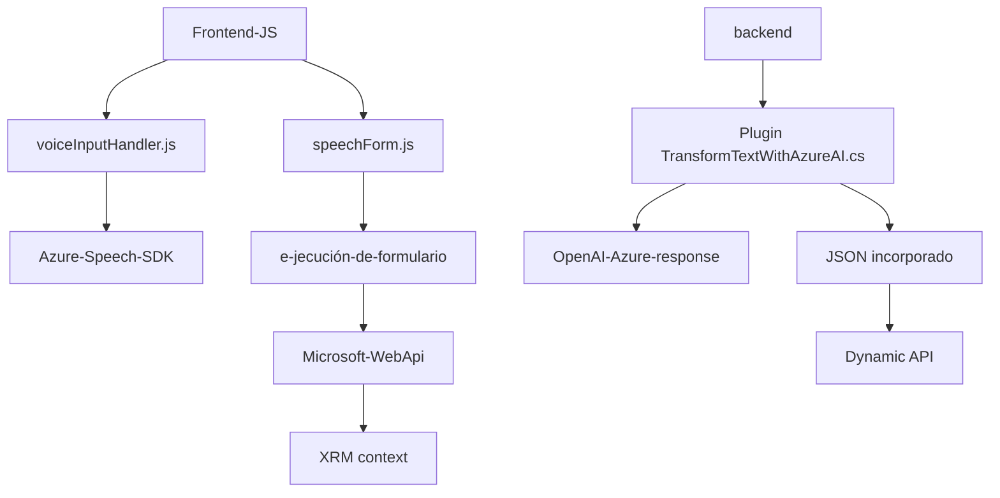

### Breve resumen técnico
El repositorio contiene tres componentes principales integrados en un sistema que combina **frontend dinámico**, **repositorio de plugins para Microsoft Dynamics**, e **integraciones de servicios externos con Azure Speech y Azure OpenAI**. El objetivo del sistema es mejorar la interacción de usuarios mediante comandos de voz y síntesis, gestionando datos en formularios dinámicos de Dynamics CRM mientras aplica inteligencia artificial para asistir en el procesamiento.

---

### Descripción de arquitectura
La arquitectura del sistema es híbrida, trabajando bajo un patrón **n capas** que aprovecha integración con SDKs externos y extensibilidad de plugins. El backend utiliza Microsoft Dynamics CRM como base para manipular datos en formularios usando plugins personalizados (TransformTextWithAzureAI), mientras que el frontend implementa lógica para detectar, generar y transcribir comandos hablados. Además, la comunicación con APIs externas como Azure Speech y OpenAI refuerza la capacidad de reconocimiento de voz e inteligencia artificial en tiempo de ejecución.

**Componentes principales:**
1. **Frontend (JavaScript):** Módulos dinámicos como `voiceInputHandler.js` y `speechForm.js` manejan interacción y transcripción de datos de voz, cargando dependencias como Azure Speech SDK en tiempo de ejecución.
   - Comunica con Dynamics a través de WebApi y realiza búsquedas dentro del contexto de formularios.
   - Modularidad clara pero dependiente de SDK y contexto del cliente.

2. **Backend Plugins (C#):** `TransformTextWithAzureAI` extiende la funcionalidad de Dynamics CRM usando `IPlugin`. Este diseño permite integración directa con servicios de Azure GPT-4 para sostener procesos más robustos de transformación de texto.

---

### Tecnologías usadas
1. **Frontend:**
   - **Azure Speech SDK:** Manejo de síntesis y transcripción de voz.
   - **Microsoft Dynamics WebApi:** Gestión de datos del formulario.
   - **JavaScript:** Modularidad en procesos funcionales (ej. transcripción, síntesis).
   - Integración con APIs externas de IA.

2. **Backend Plugins:**
   - **C#** para implementar lógica extensible dentro de Dynamics CRM.
   - **Azure OpenAI Services (GPT-4):** Procesamiento de texto mediante HTTP.
   - **Microsoft.Xrm.Sdk:** Framework para extensibilidad CRM.
   - **JSON Serialización:** Via ejemplares como `Newtonsoft.Json` y `System.Text.Json`.

3. **Patrones de diseño utilizados:**
   - **Cargador Dinámico:** Para incluir componentes en tiempo de ejecución (Azure Speech SDK en frontend).
   - **Microservicios de AI:** Dividiendo procesamiento en servicios externos y operando de forma independiente mediante API HTTP.
   - **Mapper de datos:** Mapa entre clave interna y campos visuales en formularios.
   - **Factory Pattern:** En el backend para crear instancias organizadas de servicios.

---

### Diagrama Mermaid **100 % compatible con GitHub**

---

### Conclusión final
El repositorio se define como una solución **híbrida** orientada a mejoras dentro de formularios dinámicos de Microsoft Dynamics CRM. Utiliza una arquitectura modular combinada con integraciones de SDKs externos (Azure Speech y OpenAI) para habilitar la interacción avanzada con usuarios mediante comandos y síntesis de voz. Las tecnologías y los patrones usados aportan flexibilidad al diseño, escalabilidad basada en servicios externos, y una experiencia optimizada de colaboración entre componentes frontend y backend. Sin embargo, su dependencia de servicios externos podría ser una limitación en entornos con restricciones de acceso a dichos servicios.