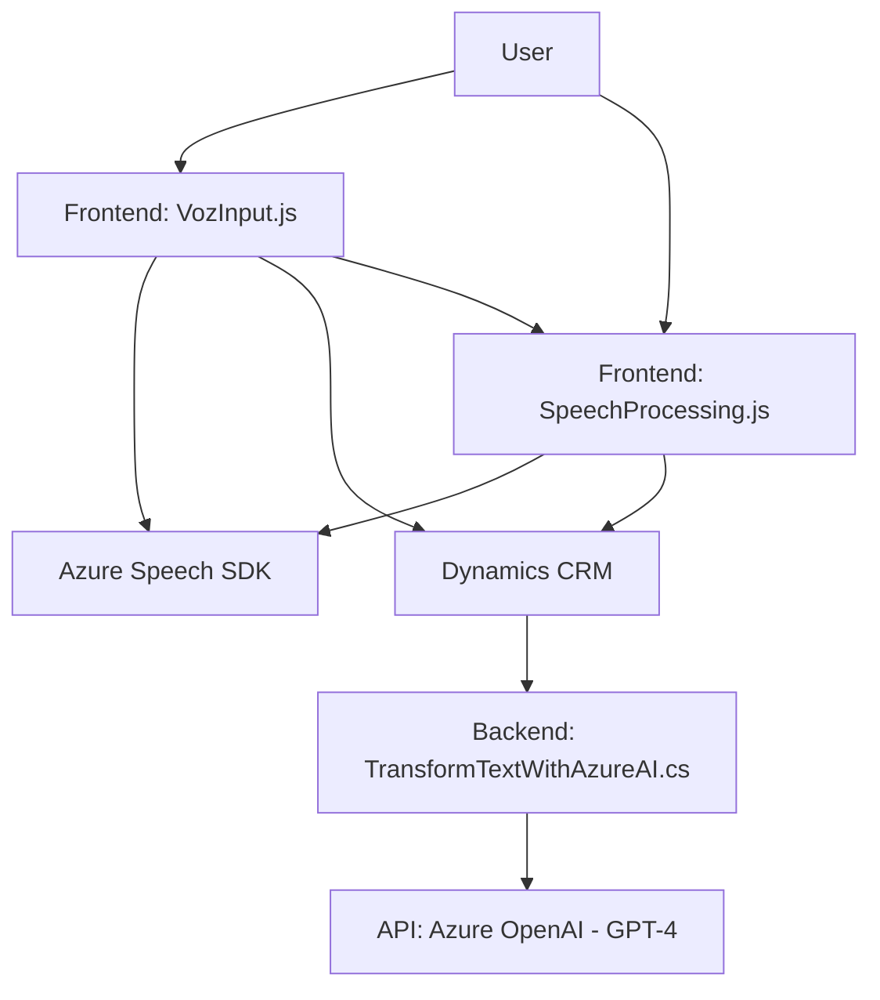

### Breve resumen técnico

El repositorio muestra integración de funcionalidades avanzadas para aplicaciones basadas en formularios, principalmente mediante entrada de voz y procesamiento de texto con inteligencia artificial (Azure AI). Incluye dos archivos orientados al frontend para la interacción directa con SDK, y otro archivo backend que actúa como un plugin para integrarse con Dynamics CRM y utilizar GPT-4 de Azure OpenAI.

---

### Descripción de arquitectura

La estructura evidencia:
1. **Frontend**: Modularidad orientada a la integración con servicios de entrada de voz de Azure Speech SDK y procesamiento de datos para su asignación en formularios dinámicos.
2. **Plugin backend**: Diseño del lado servidor (Dynamics CRM) con lógica de interceptación usando patrones de plugin, integrando transformación de texto con servicios de GPT-4 de OpenAI Azure.
3. **Arquitectura de capas**: Se combina lógica de presentación, procesamiento de datos y acceso mediante servicios externos/API.

En conjunto, se puede clasificar dentro de una arquitectura **híbrida de n capas + servicios externos**, que combina varias tecnologías para ofrecer una solución de entrada y procesamiento de datos. 

---

### Tecnologías usadas

1. **Frontend (JavaScript)**:
    - **Azure Speech SDK**: Manejo de entrada y síntesis de voz.
    - **Dynamics CRM Web API** (`Xrm.WebApi`): Acceso y actualización de datos en formularios de CRM.
    - **Vanilla JavaScript**: Para la manipulación del DOM y lógica.

2. **Backend (C#)**:
    - **Dynamics CRM SDK (`Microsoft.Xrm.Sdk`)**: Intercepción de eventos y acceso a datos en la plataforma CRM.
    - **Azure OpenAI GPT-4**: Procesamiento de lenguaje natural mediante peticiones HTTP.
    - **Newtonsoft.Json**: Manejo y creación de objetos JSON.
    - **HttpClient**: Para integración API externa.

---

### Diagrama Mermaid válido para GitHub

---

### Conclusión final

La solución representa una integración moderna de procesamiento de datos mediante reconocimiento de voz y transformación de texto respaldada por servicios de inteligencia artificial. La arquitectura híbrida de n capas con extensión a servicios externos es ideal para sistemas CRM que buscan ofrecer una capa de interacción avanzada y rica para el usuario final. 

La combinación de dinámicos SDK de Azure (Speech, OpenAI), la lógica precisa para formularios de CRM, y la estructura modular de los componentes, hacen del proyecto una solución escalable, adaptada para plataformas empresariales modernas.