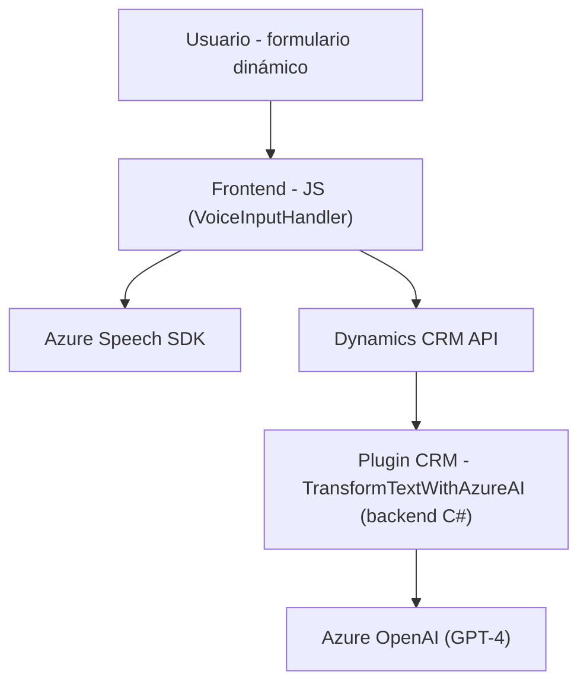

### Breve resumen técnico
El repositorio parece ser parte de una solución avanzada para integrar Microsoft Dynamics CRM con servicios de inteligencia artificial (IA), mediante el uso de Microsoft Azure Speech SDK para interactuar con formularios dinámicos, y Azure OpenAI para procesamiento avanzado de texto. Los archivos indicados forman parte de un frontend basado en JavaScript para interacción con formularios y un plugin backend desarrollado en C# para extender la funcionalidad del CRM.

---

### Descripción de arquitectura

#### Modelo de arquitectura:
La solución sigue una arquitectura **n-capas** y **plugin-based**, típicamente utilizada en sistemas de Microsoft Dynamics. Se observa una separación clara de:
1. **Frontend**: Archivos `readForm.js` y `speechForm.js` implementan la interfaz de usuario (UI) y la lógica cliente utilizando una arquitectura modular, que interactúa directamente con Dynamics 365 y servicios de Azure (Speech SDK y APIs personalizadas).
2. **Backend**: El archivo `TransformTextWithAzureAI.cs` implementa un plugin en Dynamics CRM. Actúa como proxy entre el usuario final y las APIs de inteligencia artificial de Azure para transformar datos dinámicos y estructurados.

En términos estructurales, el frontend está muy modular y delega responsabilidades en APIs externas (como Azure Speech y OpenAI), mientras que el plugin backend utiliza patrones de extensión propios de Dynamics CRM, junto con principios de modularidad y single responsibility.

#### Componentes principales:
1. Frontend: Procesamiento de entrada y narración por voz, interacción con formularios dinámicos, procesamiento de texto con APIs de Dynamics y Azure.
2. Backend: Plugin dinámico de CRM que realiza transformación de texto a JSON estructurado basado en reglas específicas mediante Azure OpenAI.

---

### Tecnologías usadas
1. **Frontend:**
   - **JavaScript**: Utilizado para la lógica cliente, implementación modular y procesamiento de datos.
   - **Microsoft Azure Speech SDK**: Cargado dinámicamente para reconocimiento y síntesis de voz.
   - **Dynamics 365 SDK**: Gestión de formularios dinámicos y sus atributos mediante `formContext` y `Xrm.WebApi`.

2. **Backend:**
   - **C# y .NET Framework**: Manejo del plugin y lógica backend.
   - **Azure OpenAI**: Servicios de GPT-4 en la nube para procesamiento avanzado de texto.
   - **Microsoft Dynamics CRM SDK**: Extensión y personalización del sistema CRM.
   - **Newtonsoft.Json / System.Text.Json**: Serialización y manipulación de datos estructurados.

3. **Patrones utilizados:**
   - **Carga dinámica:** SDK y dependencias externas son cargadas solo cuando se necesitan.
   - **Modularidad:** Separación de responsabilidades en funciones/métodos individuales en ambos lados (frontend y backend).
   - **Delegación:** Uso de funciones para incorporar SDK y servicios externos.
   - **CRM Plugin Pattern:** Expansión del comportamiento CRM mediante plugins.
   - **API Gateway Pattern:** Comunicación eficaz con APIs de Azure.

---

### Diagrama Mermaid válido para GitHub

---

### Conclusión final
La solución presentada representa una integración robusta entre Azure y Dynamics CRM para el manejo de aplicaciones empresariales dinámicas. La capa **frontend** se enfoca en mejorar la experiencia del usuario utilizando entrada y narración de voz con Azure Speech SDK. Por su parte, el **backend** extiende la funcionalidad de Dynamics CRM mediante el uso de plugins que interactúan con Azure OpenAI para generar estructuras JSON avanzadas, facilitando el procesamiento automatizado de texto.

Esta solución sigue una arquitectura **n-capas híbrida** que combina una interfaz modular con una extensión dinámica del sistema CRM, ideal para entornos empresariales modernos y altamente integrados.