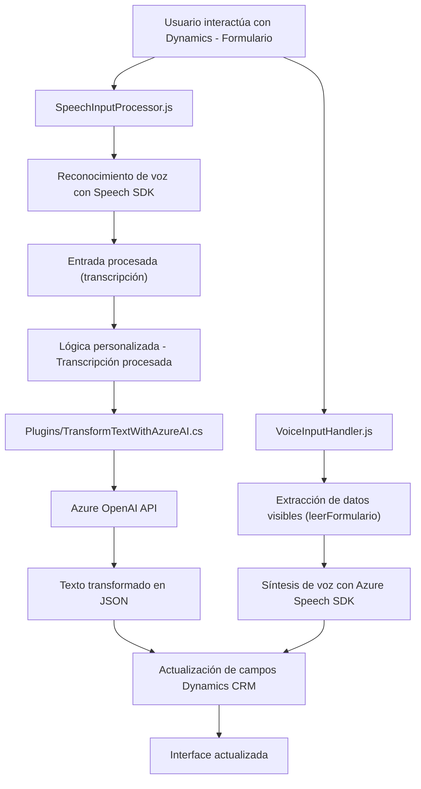

### Breve resumen técnico
La solución parece reunir componentes para gestionar voz y texto como entrada y salida mediante integraciones con **Azure Speech SDK**, **Azure OpenAI** y **Microsoft Dynamics CRM**. Está orientada a la mejora de experiencias de usuario mediante sistemas de reconocimiento de voz y generación de voz con procesamiento adicional de texto para Dynamics 365.

---

### Descripción de arquitectura
La solución tiene una arquitectura **n-capas**:
1. **Frontend**: Manejo de interfaz de usuario, donde el usuario interactúa con los formularios y es capaz de utilizar entrada basada en voz (implementado en JavaScript).
2. **Backend**: Plug-in en Dynamics CRM que procesa datos con inteligencia artificial (utilizando Azure OpenAI) y maneja reglas personalizadas para generación de resultados JSON estructurados.
3. **Servicios externos**: Azure Speech SDK y Azure OpenAI se integran como servicios externos para brindar las capacidades de reconocimiento y generación de texto o voz.

La modularidad en el código (funciones independientes) y las dependencias externas indican que se sigue un patrón de arquitectura basado en **integración de servicios**. Cada componente realiza una tarea bien definida y comunica resultados entre sí mediante funciones controladas.

---

### Tecnologías usadas
1. **Frontend (JavaScript)**:
   - **Azure Speech SDK** para síntesis y reconocimiento de voz.
   - Extensiones del DOM para manejo dinámico de scripts.
   - **Microsoft Dynamics JavaScript SDK** para manipulación de formulario/contexto del CRM.
   
2. **Backend (C#)**:
   - **Azure OpenAI** para transformación de texto utilizando GPT.
   - **Microsoft Dynamics CRM SDK** para integración con el sistema.
   - **Newtonsoft.Json** y **System.Text.Json** para manejo de JSON.
   - **System.Net.Http** para realizar solicitudes HTTP hacia servicios externos.

3. **Integración**:
   - REST API para comunicación entre servicios como Azure Speech SDK/OpenAI API.
   - Modificación condicional de atributos utilizando lógica basada en contexto y reglas.

4. **Patrones de diseño**:
   - **Pipeline funcional**: Los datos pasan por etapas secuenciales que los procesan sistemáticamente.
   - **Cargado condicional de dependencias**: Asegura que servicios como Speech SDK se carguen dinámicamente sin bloquear la ejecución del resto del entorno.
   - **Modularidad**: Cada componente del código define funcionalidades específicas, facilitando el mantenimiento y prueba.

---

### Diagrama Mermaid válido para GitHub

---

### Conclusión final
La solución conecta el manejo de voz y texto con Dynamics 365 mediante la integración de tecnologías basadas en IA de Azure (Speech SDK y OpenAI). Su arquitectura modular en **n-capas**, con componentes bien definidos y separados, facilita el despliegue y mantenimiento en entornos empresariales. La integración con REST APIs y el uso de plugins asegura extensibilidad con componentes externos robustos.

Esta solución es ideal para enriquecer formularios y sistemas CRM con capacidades inteligentes como entrada basada en voz y generación dinámica de voz o respuestas procesadas.