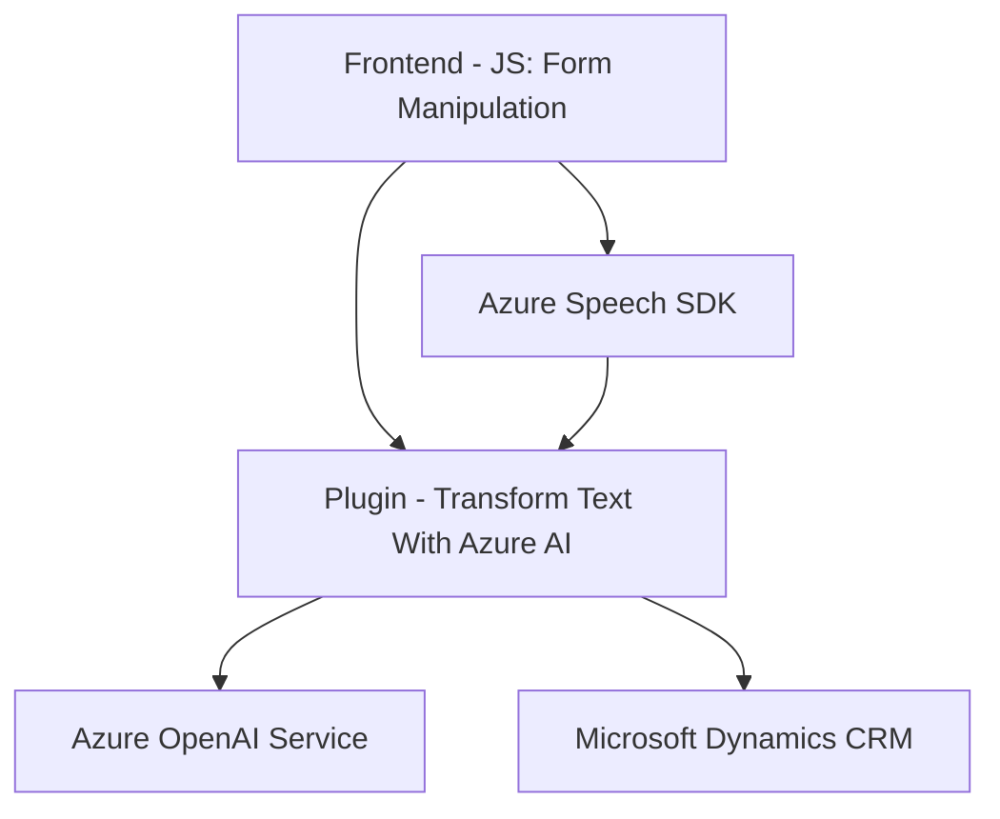

### **Breve Resumen Técnico**
El repositorio implementa una solución interactiva que utiliza el Azure Speech SDK y Azure OpenAI para procesar formularios y realizar transformación de texto con integración directa en Microsoft Dynamics CRM. Los scripts en lenguaje JavaScript fortalecen las funciones frontend mediante reconocimiento y síntesis de voz, mientras que el plugin implementado en C# actúa sobre el backend para manipular datos en Dynamics CRM.

---

### **Descripción de Arquitectura**
1. **Tipo de solución**: La solución representa una mezcla entre un frontend interactivo (modificación y manejo de formularios en tiempo real) y servicios backend integrados mediante plugins CRM. Los plugins actúan como intermediarios entre el sistema principal y las capacidades externas proporcionadas por Azure OpenAI.

2. **Arquitectura empleada**:
   - El frontend parece seguir una arquitectura **modular** en la que cada funcionalidad está bien separada (por ejemplo, reconocimiento de voz, síntesis de voz y manejo de formularios).
   - El plugin de backend sigue el patrón estándar de **plugin architecture** en Microsoft Dynamics CRM.
   - Uso del concepto de **acoplamiento débil** mediante la carga dinámica de SDKs (Azure Speech).
   - Implementación de un patrón **microservicios** para integrarse con servicios de IA externos (Azure Speech y Azure OpenAI).

---

### **Tecnologías Usadas**
1. **Frontend**:
   - **JavaScript**: Desarrollo modular para manipulación DOM y llamadas a servicios externos.
   - **Azure Speech SDK**: Implementación de síntesis y reconocimiento de voz.
   - **HTML Forms API**: Para manipular elementos visibles en los formularios.
   - **DOM Manipulation**: Para acceso a datos de formularios y configuración dinámica.

2. **Backend**:
   - **Microsoft Dynamics CRM**: Implementa plugins mediante el patrón IPlugin de Dynamics.
   - **C#**: Utilizado para escribir el plugin en .NET Framework.
   - **Azure OpenAI**: Interacción externa para generación de texto procesado basado en IA.
   - **HTTP**: Comunicación con servicios REST.
   - **JSON**: Manipulación de estructura de datos en el plugin.

3. **Dependencias externas**:
   - Azure Speech SDK y Azure AI.
   - Sistema de APIs externas en las funciones del frontend.
   - Manejo integral de interfases de Dynamics CRM, usando IPlugin y otros servicios relacionados.

---

### **Diagrama Mermaid**

---

### **Conclusión Final**
Este repositorio establece una arquitectura modular y extensible adecuada para soluciones integradas con Microsoft Dynamics CRM. A través de dos componentes principales (frontend y backend), permite la interacción entre usuarios y formularios mediante reconocimiento/síntesis de voz en tiempo real, incluyendo capacidades avanzadas de IA para transformación inteligente de datos.

Los patrones eficaces incluídos (gateway, delegación, defensa de errores y microservicios) mejoran la flexibilidad y la escalabilidad, mientras que el uso de tecnologías modernas como Azure Speech SDK y OpenAI garantiza una implementación robusta y basada en servicios cloud. Sin embargo, sería positivo añadir pruebas unitarias y documentación más detallada para facilitar su mantenimiento y ampliaciones futuras.