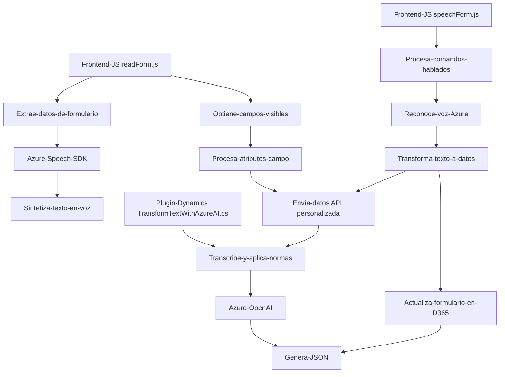

### Breve resumen técnico
El repositorio implementa una solución que integra funcionalidades de reconocimiento y síntesis de voz utilizando **Azure Speech SDK**, combinando estos servicios con un plugin para **Dynamics 365**. Su propósito es extraer información de un formulario, procesar comandos de voz, y realizar actualizaciones dinámicas en un sistema CRM, mientras permite transformar texto mediante Azure OpenAI.

---

### Descripción de la arquitectura
La arquitectura general es **n-capas con integración de servicios externos**. Se observa una separación de responsabilidades:
1. **Frontend:** Implementado en archivos JavaScript (e.g., `readForm.js`, `speechForm.js`) para interactuar con formularios del cliente y procesar datos mediante reconocimiento y síntesis de voz (usando Azure Speech SDK). Además, funciones como `callCustomApi` interactúan con APIs o Backend.
2. **Backend:** Un **plugin para Dynamics CRM** (`TransformTextWithAzureAI.cs`) que actúa como un servicio para recibir datos desde la UI y realizar transformaciones de texto mediante **Azure OpenAI**.
   
Los componentes están diseñados para interactuar en un contexto de **Dynamics 365**, con una integración modular de SDKs y APIs externas.

---

### Tecnologías usadas
1. **Frontend (JavaScript):**
   - **Azure Speech SDK**: Para reconocimiento de voz y síntesis de voz.
   - **Dynamics 365 Form Context**: Para manipulación dinámica de campos y datos.
2. **Backend (C#):**
   - **Microsoft.Xrm.Sdk**: Para compatibilidad con Dynamics CRM y manipulación de contexto plugin.
   - **Azure OpenAI Services**: Para ejecutar llamadas API usando prompts personalizados.
   - **Newtonsoft.Json/System.Text.Json**: Para operaciones JSON.
   - **System.Net.Http**: Para comunicación con Azure OpenAI API.

---

### Diagrama Mermaid

---

### Conclusión final
La solución propuesta es una implementación modular que combina una **UI dinámica en JavaScript** con una sistematización de procesos de voz y transformación de texto mediante **Azure Speech SDK** y **Azure OpenAI Services**. La arquitectura es de tipo **n-capas**, con una integración clave hacia un **backend basado en plugins de Dynamics CRM**.  

El uso de patrones como la **carga dinámica de SDK**, funciones orientadas a tareas específicas, y el procesamiento condicional según el contexto (uso de IA vs comandos simples), asegura que el sistema sea extensible, adaptable y adecuado para entornos empresariales avanzados.