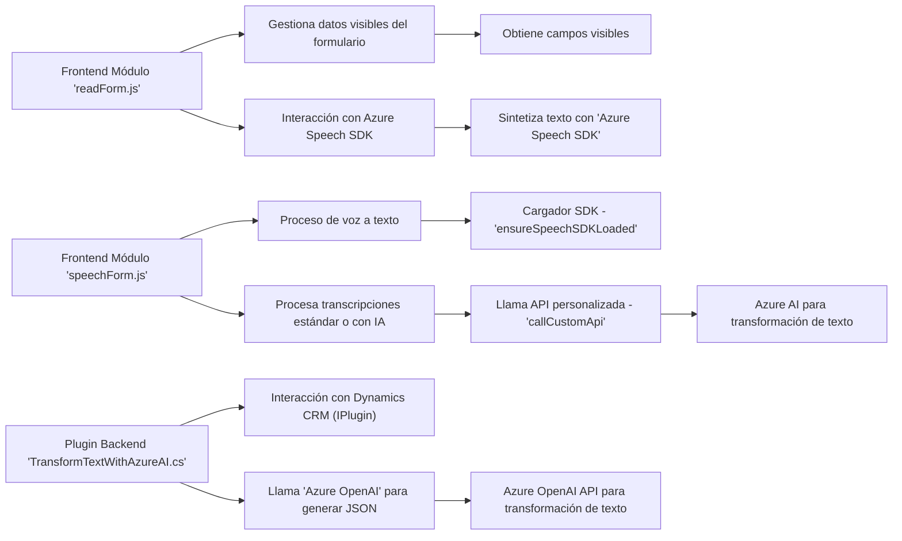

### Breve resumen técnico
El repositorio parece ser parte de un sistema CRM que extiende la funcionalidad del software para interactuar con Azure Speech SDK, Azure OpenAI API y un formulario dinámico (posiblemente de Microsoft Dynamics CRM). Está compuesto por dos archivos frontend en JavaScript y un archivo backend en C# como plugin, creando un entorno que combina interacción con servicios de inteligencia artificial y capacidades de síntesis y reconocimiento de voz.

---

### Descripción de la arquitectura
La solución adoptada tiene una arquitectura **"N-Capas"** y componentes complementarios que conforman la solución. Los módulos frontend facilitan la interacción con usuarios en el navegador, gestionando la síntesis y el reconocimiento de voz para capturar y poblar una UI basada en un formulario, mientras que el plugin backend en C# actúa como parte de la lógica del negocio en el servicio de Microsoft Dynamics CRM. Este plugin es invocado desde el servidor de CRM cuando ciertos eventos del sistema ocurren y comunica datos con Azure OpenAI para transformar información según reglas específicas.

La arquitectura de integración con servicios cloud (Azure Speech SDK y Azure OpenAI) también aporta ciertas características de patrones **Client-Server** y **Plug-in Architecture** en su diseño.

---

### Tecnologías usadas
#### Frontend (JavaScript)
1. **Azure Speech SDK**:
   - Servicio de síntesis de texto a voz y transcripción de voz a texto mediante APIs.
   - Dinámicamente cargado desde la web (`https://aka.ms/csspeech/jsbrowserpackageraw`).

2. **Microsoft Dynamics CRM**: 
   - Mediante objetos como `formContext` y `Xrm.WebApi`, los módulos se integran con la UI dinámica del CRM.

3. Patrones aplicados:
   - **Facades** para simplificar la entrada al sistema (métodos centrales como `startVoiceInput`).
   - **Single Responsibility Principle (SRP)**: Cada función tiene un propósito definido claro.
   
#### Backend (C#)
1. Framework y SDKs:
   - **Microsoft.Xrm.Sdk**: Para gestionar eventos y datos desde el CRM.
   - **System.Net.Http**: Usado para interactuar con la API externa de Azure OpenAI mediante solicitudes HTTP.
   - **Azure OpenAI API**: Llama servicios AI para transformar texto.

2. Librerías:
   - **System.Text.Json** y **Newtonsoft.Json.Linq** para manipular JSON estructurado.
   - **System.Text** para la manipulación del contenido como texto.

3. Patrones aplicados:
   - **Plugin Pattern**: Integración directa con Microsoft CRM para responder a eventos del sistema.
   - **Gateway/API Client**: Abstracción del acceso a la API de Azure OpenAI.

---

### Dependencias externas y componentes
1. **Azure Speech SDK**: Usado en el frontend JS para la síntesis de voz y reconocimiento de voz.
2. **Azure OpenAI API**: Usado en el backend para transformar texto a JSON estructurado.
3. **Microsoft Dynamics CRM Objects**: `formContext` y `Xrm.WebApi` permiten el procesamiento dinámico de formularios.
4. **HTTP Client Libraries**: `System.Net.Http` facilita la integración del plugin con servicios externos.

---

### Diagrama Mermaid (compatibilidad 100%) 

---

### Conclusión Final
Este sistema es una solución para integrar capacidades de voz y texto inteligentes en un flujo CRM. Se emplea una arquitectura de **N-Capas**, con un frontend que extiende funcionalidades de formularios mediante Azure Speech SDK para síntesis y reconocimiento de voz, y un backend que utiliza un plugin para integrar Azure OpenAI a las operaciones del CRM.

La integración de servicios externos como el SDK de Azure y la API Azure OpenAI aporta flexibilidad y la posibilidad de utilizar inteligencia artificial para tareas avanzadas. Sin embargo, la arquitectura presenta algunos desafíos en cuanto a seguridad y configurabilidad de las credenciales. Por otro lado, el rigor técnico demuestra la capacidad del sistema para ser ampliado y mantener una estructura bien definida por principios como SRP y modularidad.