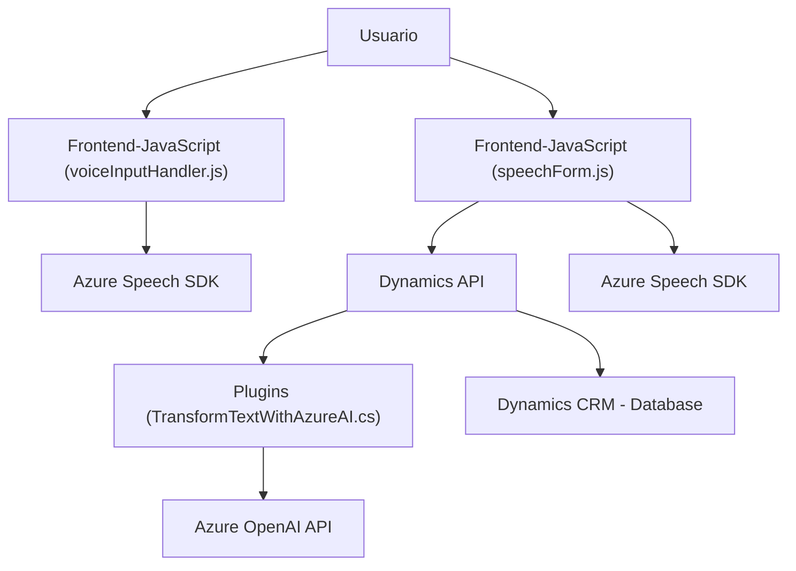

### Breve resumen técnico:

Esta solución representa una **integración híbrida** entre varios componentes diseñados para interactuar con Microsoft Dynamics CRM utilizando funcionalidades de inteligencia artificial del **Azure OpenAI API** y el **Azure Speech SDK**. Es un conjunto de archivos que forma un sistema orientado al reconocimiento y síntesis de voz, análisis de datos de formularios y transformación avanzada de texto a través de inteligencia artificial.

---

### Descripción de la arquitectura:

La arquitectura parece estar basada en una combinación de **n capas** y **componentes integrados**, con comunicación entre:
1. **Front-end con JavaScript**: provee funcionalidad para interactuar con el usuario mediante voz (reconocimiento y síntesis de texto).
2. **Backend en C#**: un plugin en Dynamics CRM que ejecuta lógica basada en eventos específicos y realiza solicitudes a servicios externos como Azure OpenAI.
3. **Servicios externos (Azure)**: interacción con servicios avanzados de IA proporcionados por Microsoft via APIs.

El diseño sugiere modularidad con separación de responsabilidades:
- **Front-end modular**: dos archivos JavaScript (`voiceInputHandler.js` y `speechForm.js`) manejan funciones específicas para procesamiento local y comunicación con el backend o servicios externos.
- **Backend plugin en C#:** lógica enfocada en transformar texto mediante procesamiento avanzado usando Azure OpenAI.

La presencia de **callbacks y eventos**, junto con la interacción directa entre distintas capas del sistema, apoya una arquitectura **event-driven** con múltiples puntos de integración.

---

### Tecnologías usadas:

1. **Front-end**:
   - **JavaScript** para crear la lógica del reconocimiento/síntesis de voz y la interacción con Microsoft Dynamics CRM.
   - **Azure Speech SDK** para reconocimiento de voz y síntesis de texto.
   - **Dynamics Web API (`Xrm.WebApi`)**.

2. **Backend**:
   - **C#** para implementar el plugin de Dynamics CRM, usando:
     - Interfaces y clases estándar del SDK de Dynamics CRM (`IPlugin`, `IPluginExecutionContext`, etc.).
     - Manipulación de JSON con `System.Text.Json` y `Newtonsoft.Json.Linq`.
     - Llamadas HTTP con `System.Net.Http`.
   - **Azure OpenAI API**: procesamiento avanzado de texto.

3. **Patrones**:
   - **Integración con servicios externos** mediante SDKs y APIs (Azure Speech y OpenAI).
   - **Event-driven architecture**: dependiente de eventos en Dynamics CRM para ejecutar el plugin.
   - **Single Responsibility Principle (SRP)**: Modularidad en ambos JavaScript y código C#, con cada método enfocado en una tarea específica.

---

### Diagrama Mermaid (válido para **GitHub Markdown**):

---

### Conclusión final:

La solución puede describirse como un sistema **integrado y modular**, compuesto por:
- **Frontend en JavaScript**: Para interactuar con el usuario mediante entrada de voz, salida de texto hablado, y manipulación directa de formularios en Dynamics.
- **Plugins en C#**: Para ejecutar lógica empresarial sobre texto procesado, además de delegar tareas complejas al servicio Azure OpenAI API como router de procesamiento avanzado.
- **Servicios externos**: Interacción con Azure Speech SDK y Azure OpenAI para proporcionar capacidades avanzadas de inteligencia artificial y voz.

La arquitectura combina **n capas** con características de sistema extensible orientado a microservicios mediante la separación de concerns y las dependencias desacopladas con SDK/APIs externas (Azure Speech y Azure OpenAI API). Proporciona un alto grado de **escalabilidad y flexibilidad** y combina un enfoque moderno event-driven y API-driven.