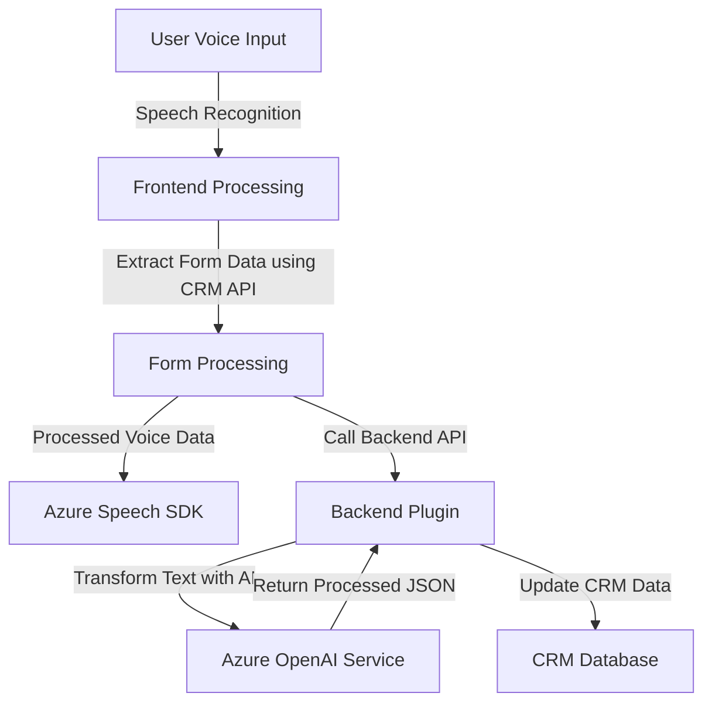

### Análisis exhaustivo del repositorio

#### Breve resumen técnico
La solución presentada en el repositorio responde a la implementación de un sistema que combina un frontend para captura de voz, manipulación de formularios vinculados a un CRM, y un backend que utiliza servicios de inteligencia artificial (Azure OpenAI) para transformar datos textuales en formato estructurado. Está construido con componentes que abarcan tanto la interfaz de usuario como la integración directa con APIs externas y servicios de plataforma en la nube de Azure.

---

#### **Descripción de arquitectura**
La arquitectura es una combinación de **cliente-servidor** con integración en n capas y servicio externo (Azure OpenAI y Speech SDK). El frontend sigue un enfoque modular con funciones que interactúan con la UI para captura y manipulación de datos del CRM. Por otro lado, el backend utiliza un **Plugin-based Architecture**, típica en Microsoft Dynamics CRM, para transformar texto mediante llamadas a Azure OpenAI GPT-4. La comunicación entre frontend y backend se realiza mediante APIs.

---

#### **Tecnologías usadas**
1. **Frontend:**
   - **Tecnologías y frameworks:**
     - JavaScript para la implementación de lógica.
     - Azure Speech SDK para síntesis y reconocimiento de voz.
     - CRM Form API para interacción con campos y datos de formularios.
   - **Patrones de diseño:**
     - Modular: funciones separadas con una responsabilidad única.
     - SDK Wrapper: abstracción para simplificar y desacoplar el uso de Azure Speech SDK.
     - Dynamic Loading: carga de la librería Speech SDK únicamente cuando es necesaria.

2. **Backend:**
   - **Tecnologías:**
     - Microsoft Dynamics SDK (`IPlugin`, `IPluginExecutionContext`) para desarrollo de plugins en CRM.
     - Azure OpenAI para procesamiento de texto adaptado y estilizado.
     - .NET Framework y C# como lenguaje base.
     - `HttpClient` para conexión con servicios externos (REST API de OpenAI).
   - **Patrones de diseño:**
     - **Plugin-based Architecture:** Lógica encapsulada en un evento disparado con interfaz predefinida.
     - **Service-Oriented Architecture:** Delegación de procesamiento pesado a un servicio (Azure OpenAI) externo.
     - Encapsulación mediante métodos especializados.

---

#### **Dependencias o componentes externos**
1. **Azure Speech SDK:** Para reconocimiento de voz y síntesis de texto a voz en el frontend.
2. **CRM Form API:** Métodos integrados en Dynamics CRM para manipulación de campos y formularios directamente desde la interfaz.
3. **Azure OpenAI GPT-4 API:** En el backend, para procesamiento avanzado de texto.
4. **External CRM API:** Llamadas personalizadas al sistema CRM para transformación y validación de datos. 
5. **Librerías de JavaScript:** Uso de funciones autónomas para garantizar integración eficiente.

---

#### **Diagrama Mermaid válido para GitHub Markdown**

---

### Conclusión final
El repositorio utiliza una solución híbrida que combina frontend y backend para interactuar con un CRM. En arquitectura, aplica un *n capas* en la integración entre frontend y backend mediante APIs y un diseño orientado a servicios basado en eventos en el entorno de Microsoft Dynamics CRM. Además, la implementación sugiere un enfoque modular y extensible que depende de herramientas modernas como Azure Speech SDK y OpenAI. Esto refleja una solución robusta y altamente personalizable orientada a la automatización de interacción natural mediante voz y procesamiento de datos dinámicos.