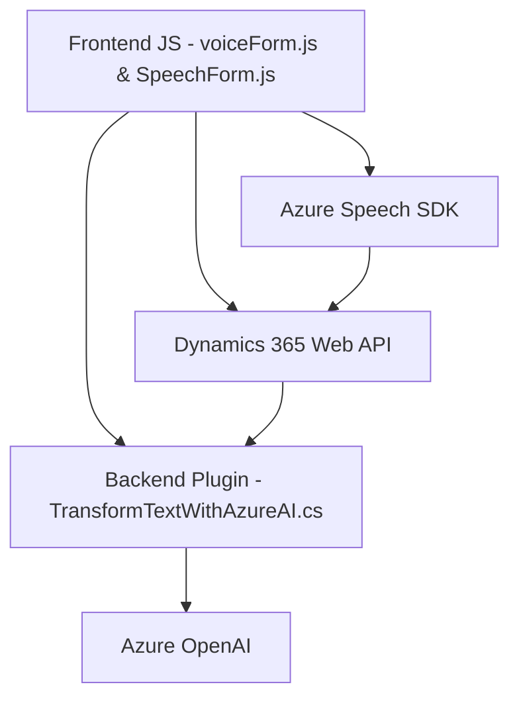

### Breve Resumen Técnico

El código y su estructura indican que es una solución híbrida que habilita la **introducción de voz, síntesis de texto, y procesamiento avanzado de datos** en formularios de **Microsoft Dynamics 365**, utilizando tecnologías como **Azure Speech SDK** y **Azure OpenAI**. 

### Descripción de Arquitectura

La arquitectura general puede definirse como **multicapa** dirigida por diferentes elementos:
1. **Frontend**: Implementado con archivos de JavaScript para interactuar con los datos de los formularios.
2. **Backend**: Un plugin en .NET amplía la funcionalidad de Dynamics 365 utilizando la arquitectura de Microsoft CRM para eventos y lógica del lado del servidor.
3. **APIs externas**: Dependencia directa en Azure Speech SDK y Azure OpenAI para sintetizar voz y transformar texto.

La interacción se distribuye entre los siguientes componentes:
1. **Estilo modular** en el manejo de la lógica frontend (JavaScript).
2. **Plugin Pattern** en la gestión de eventos y procesamiento backend.
3. **Uso de SDK y APIs externas** con flujos distribuidos entre Azure Speech y OpenAI.

### Tecnologías Usadas
1. **Frontend**:
   - **JavaScript**: Para la lógica basada en formularios y la manipulación de SDK.
   - **Azure Speech SDK**: Sintetización de voz desde texto y entrada de voz para transcripción.
   - **Dynamics 365 Web API (`Xrm.WebApi`)**: Para búsqueda y asignación de datos.

2. **Backend**:
   - **C#**: Desarrollo del plugin para extender Dynamics 365.
   - **Microsoft Dynamics CRM SDK (`Microsoft.Xrm.Sdk`)**: Lógica orientada a formularios CRM.
   - **Azure OpenAI**: Transformación de texto en el plugin.
   - **JSON Libraries**: Manejo avanzado de objetos JSON.

### Diagrama Mermaid

### Conclusión Final

La solución es una integración enriquecida de múltiples capas:
1. **Frontend:** Procesos de entrada y salida (voz, texto, datos del formulario) mediante Azure Speech SDK y funciones JavaScript modulares.
2. **Backend:** Enriquecido por un plugin de Dynamics CRM (C#), que expande la funcionalidad utilizando Azure OpenAI para procesos avanzados de texto.
3. **APIs Externas:** Comunicación distribuida con servicios como Azure.

Se observa una arquitectura claramente **dirigida por eventos**, que interactúa con servicios micros distribuidos en la nube (Azure). Funciona como una solución **multicapa híbrida** entre flujo frontend y backend, con fuerte dependencia a APIs de terceros como Azure.