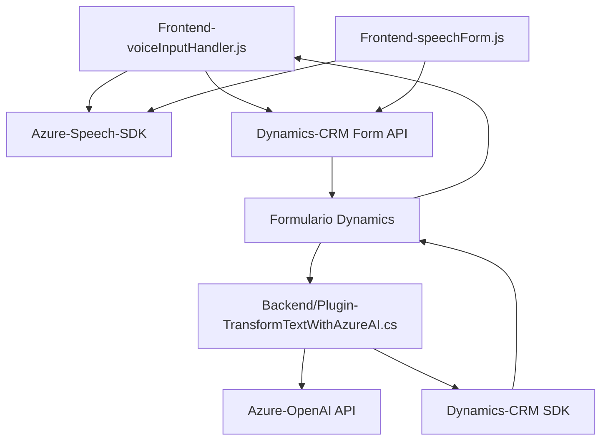

## Breve resumen técnico
El repositorio contiene una solución basada en tres componentes principales que juntos integran una arquitectura híbrida. Combina un frontend con procesamiento de voz, manejo de formularios, y plugins asociados a Dynamics 365 CRM. Todo esto está diseñado para interactuar con servicios externos como **Azure Speech SDK** y **Azure OpenAI**. Las funcionalidades están orientadas hacia la automatización y optimización tanto de procesos de entrada de datos como de transformación de contenido estructurado.

---

## Descripción de arquitectura
La solución sigue una **arquitectura en capas** aplicando patrones como **SOA (Service-Oriented Architecture)** y separación modular de responsabilidades. Posee tres aspectos principales:
1. El **frontend** gestiona la interacción del usuario con formularios mediante entrada de voz. Se conecta directamente a **Azure Speech SDK** y APIs personalizadas.
2. El **plugin backend** desarrollado en C# actúa como un componente enriquecedor que utiliza **Azure OpenAI** para procesar texto avanzado.
3. **Integración estricta con Dynamics CRM**: Las dependencias internas en los formularios (formContext) y API personalizada amplían las capacidades de la solución.

Cada componente cumple un propósito claro: procesamiento de voz, manipulación dinámica de datos en formularios y transformación mediante inteligencia artificial.

---

## Tecnologías usadas
1. **Frontend**:
   - Lenguaje: **JavaScript**.
   - Librerías: **Azure Speech SDK**.
   - Frameworks: Inexistentes (código personalizado en JavaScript).
   - API: Manejo de formularios de **Dynamics CRM** (`Xrm.WebApi`).
2. **Backend (plugin)**:
   - Lenguaje: **C#**.
   - Framework: **Dynamics CRM SDK**.
   - APIs externas: 
     - **Azure OpenAI Service** para integrar GPT.
     - **System.Net.Http** para realizar solicitudes API.
   - Librería de deserialización: **Newtonsoft.Json**.

### Patrones destacados:
1. **Cargador dinámico**: En frontend, `ensureSpeechSDKLoaded` utiliza un cargador de scripts.
2. **SOA**: En el plugin, la comunicación con **Azure OpenAI** está claramente diseñada como servicio externo.
3. **Facade**: Ambos componentes abstraen la implementación de tecnologías externas (SDK o API) mediante funciones encapsuladas.
4. **MVC-like**: La separación de lógica y datos en el frontend sigue principios cercanos al patrón MVC.

---

## Dependencias o componentes externos
### Frontend:
- **Azure Speech SDK**: Usado para reconocimiento de voz y síntesis de audio.
- **APIs de Dynamics CRM**:
  - Lectura y actualización dinámica de campos de formularios.
  - Acceso a proyectos Lookup.
### Backend (plugin):
- **Azure OpenAI**:
  - Modelos GPT para transformación avanzada de texto.
- **Microsoft Dynamics SDK API**:
  - `IPlugin` para incorporar lógica personalizada en el contexto CRM.
- **Newtonsoft.Json y System.Text.Json**: Lectura/escritura JSON.

---

## Diagrama Mermaid

---

## Conclusión final
La solución es claramente diseñada para operar como un **ecosistema híbrido**, donde un frontend interactúa dinámicamente con tecnologías de reconocimiento de voz y un backend en Dynamics CRM profundiza en el procesamiento de datos utilizando IA. Los elementos aquí integrados promueven reutilización y separación de responsabilidades, aumentando la flexibilidad y escalabilidad de la solución. Es una arquitectura sólida, centrada en el manejo de datos mediante interfaces modernas y servicios en la nube.