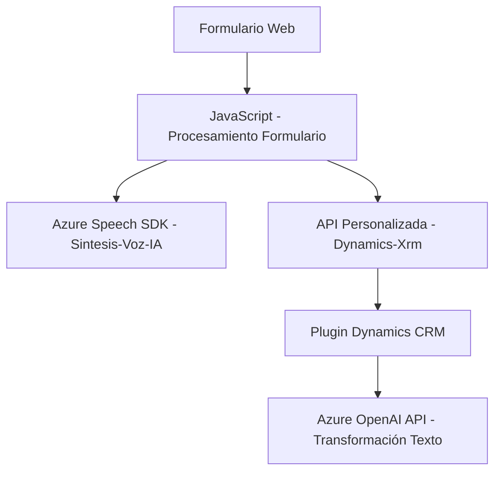

### Breve resumen técnico
El repositorio refleja una solución basada en **integración entre tecnología de reconocimiento y síntesis de voz con Microsoft Dynamics CRM**, usando servicios externos (Azure Speech SDK, Azure OpenAI) para enriquecer formularios. La funcionalidad principal está orientada a proporcionar interacciones avanzadas con el usuario mediante comandos de voz y procesamiento de texto con capacidades de inteligencia artificial.

---

### Descripción de arquitectura
La solución usa una arquitectura **multicapa (n-capas)**, que combina lógica cliente (frontend en JavaScript), lógica de negocio (Google Open AI en el plugin de Dynamics CRM) y servicios externos (Azure Speech SDK, Azure OpenAI). Esta integración se asemeja a **Service-Oriented Architecture (SOA)**, ya que depende fuertemente de servicios externos para el procesamiento de voz y texto. Además, los archivos están modularizados para que los componentes queden organizados por funciones claras: interfaz gráfica, procesamiento de entrada/salida, y lógica de transformación de datos.

### Tecnologías utilizadas
1. **Frontend**: 
   - **JavaScript** para la implementación de la lógica; organiza funciones para manejar datos del formulario y realizar síntesis y reconocimiento de audio.
2. **Backend**:
   - **C#** para el desarrollo del plugin, que interactúa con Dynamics CRM mediante la implementación de la interfaz estándar `IPlugin`.
   - **Dynamics CRM SDK** para la organización del flujo de datos y comunicación entre formulario y el backend.
   - **Azure Speech SDK** y **Azure OpenAI API** para la integración de servicios en la nube.
3. **APIs y librerías**:
   - `Newtonsoft.Json` para el manejo avanzado de la serialización JSON.
   - `HttpClient` de .NET para el envío de peticiones web.
   - `Xrm.WebApi` para comunicación directa con la API REST de Dynamics CRM.

### Diagrama Mermaid válido para GitHub Markdown

---

### Conclusión final
La solución se basa en un diseño robusto para interfaces de voz y procesamiento de texto, manteniendo una integración eficiente entre frontend, backend y servicios externos en la nube (Azure). Sin embargo, se observa dependencia elevada de servicios externos (Azure Speech SDK y OpenAI) para garantizar funcionalidades avanzadas, lo cual puede generar limitaciones ante escenarios sin conexión. Su arquitectura modular, enfoque en SOA, y uso de tecnologías líderes lo hacen escalable si se necesita extender con nuevas funcionalidades. Sin embargo, podría beneficiarse de una capa adicional para gestionar excepciones y la validación avanzada de datos en caso de fallos en servicios externos.