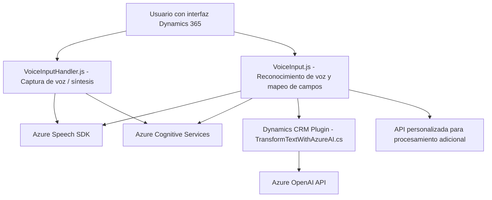

### Breve resumen técnico:
El repositorio describe componentes funcionales de un sistema que integra un frontend basado en JavaScript y Dynamics 365, interacción por voz con Microsoft Azure Cognitive Services (VoiceInputHandler.js y VoiceInput.js), y un backend que consiste en un custom plugin de Dynamics CRM que interactúa con el Azure OpenAI Service (TransformTextWithAzureAI.cs). Este solución permite una interacción avanzada mediante voz y procesamiento de datos en tiempo real utilizando APIs de terceros y recursos de inteligencia artificial.

---

### Descripción de arquitectura:
La arquitectura de esta solución parece ser **n-capas**, donde:
1. **Frontend:** Responsabilidad de interactuar con el usuario mediante interfaces en Dynamics 365 y procesar comandos de voz y texto.
2. **Backend:** Plugin instalado en Dynamics 365 que actúa como capa de manejo de datos y como servicio de procesamiento utilizando Azure OpenAI.
3. **External Services:** Uso de APIs externas (Azure Cognitive Services para entrada/salida de voz y Azure OpenAI para procesamiento avanzado).

La definición de clases y funciones en el código muestra una clara división de responsabilidades en cada capa. Además, la implementación de eventos (event-driven programming) refuerza una comunicación fluida entre las capas y los servicios externos.

---

### Tecnologías y frameworks usados:
1. **Frontend (JavaScript):**
   - **Microsoft Dynamics 365 SDK** para la integración con formularios y datos de la plataforma.
   - **Azure Speech SDK** para entrada y síntesis de voz.
   - **Event-driven programming pattern** para manejar procesos asincrónicos y validar carga de servicios.
   - **Microsoft JS SDK** para conexión con Dynamics 365.

2. **Backend (C#):**
   - **Microsoft Dynamics SDK** y sus clases/constructos (`IPlugin`, `Microsoft.Xrm.Sdk`).
   - **Azure OpenAI Service** para el procesamiento de texto.
   - `.NET Core` y `System.Text.Json` para manipulación de datos JSON.
   - **RESTful API Integration** para comunicación con Azure APIs.

3. **External Services:**
   - **Azure Cognitive Services, Speech SDK:** Reconocimiento de voz y síntesis de texto a voz.
   - **Azure OpenAI Service:** Transformación del texto mediante inteligencia artificial.

4. **Patrones identificados**:
   - **Event-driven architecture:** Comunicación y ejecución por eventos (especialmente en los componentes de frontend).
   - **Plugin Design:** Código backend implementado como plugin para Dynamics CRM.
   - **Service-orientation:** Servicios REST externos (Azure APIs).
   - **Encapsulation & modular design:** Uso de funciones y clases que dividen responsabilidades.

---

### Diagrama Mermaid:

---

### Conclusión final:
La solución presentada es una implementación modular de una arquitectura **n-capas**, donde el frontend interactúa con el usuario mediante Dynamics 365, aprovecha el reconocimiento y síntesis de voz mediante Azure Speech SDK, y se comunica con el backend (plugin en Dynamics) para procesar texto no estructurado mediante el servicio Azure OpenAI. La combinación de eventos, integración de APIs externas y separación funcional en módulos indica un diseño eficiente y representativo de soluciones modernas orientadas a servicios inteligentes.