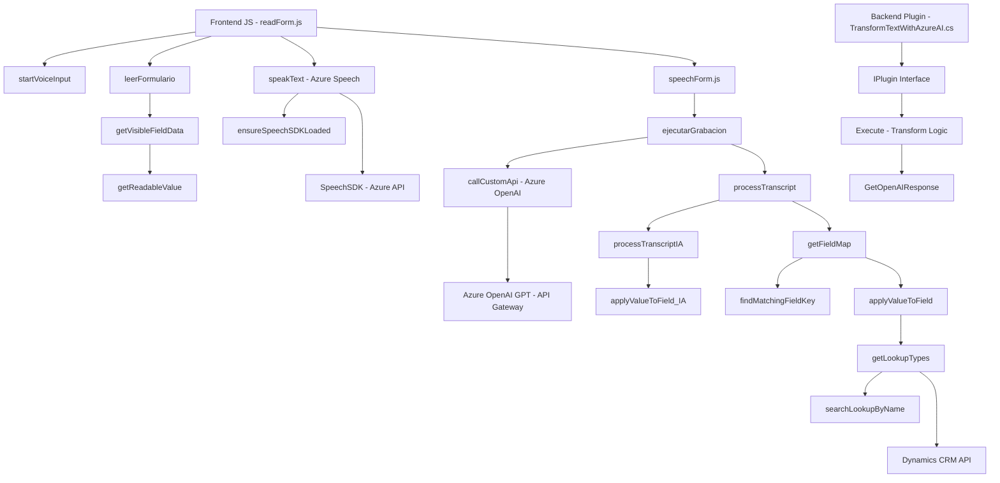

### Breve resumen técnico

El proyecto analiza y transforma textos mediante integración con APIs de Microsoft Azure, específicamente Azure Speech SDK y Azure OpenAI. Existen dos componentes principales:
1. **Frontend**: Habilita la interactividad con formularios de Dynamics 365 mediante la transcripción y síntesis de voz.
2. **Backend**: Un plugin de Dynamics CRM que aplica transformaciones de texto utilizando Azure OpenAI.

La solución implementa capacidades de reconocimiento, transcripción y síntesis de voz, además de procesamiento avanzado de comandos hablados y uso de IA generativa.

---

### Descripción de arquitectura

#### Estilo y tipo de arquitectura:
- **Frontend**:
  - Modelo de arquitectura de capa funcional donde un conjunto de funciones y elementos trabaja de forma modular para interactuar con datos de formularios y APIs de terceros.
- **Backend**:
  - Plugin basado en el patrón **n-capas**, típico de aplicaciones Dynamics CRM.
  - Delegación para procesamiento externo vía integración con Azure OpenAI, funcionando como servicio externo bajo un **API Gateway**.
  
#### Modularización:
- Frontend: Utiliza funciones especializadas que separan la recuperación de datos, la síntesis de voz y el manejo de eventos de usuario.
- Backend: Emplea una lógica de transformación y comunicación externa a otras capas de Dynamics CRM.

---

### Tecnologías usadas
1. **Frontend**:
   - Lenguaje: JavaScript.
   - Frameworks/Librerías:
     - Azure Speech SDK para funcionalidades de voz (texto-a-voz y transcripción).
   - APIs:
     - Contexto de Dynamics 365 (`executionContext`, `formContext`).
2. **Backend**:
   - Lenguaje: C# (.NET Framework).
   - Frameworks/Librerías:
     - Dynamics CRM SDK (`Microsoft.Xrm.Sdk` y otros módulos relacionados).
     - Integración HTTP con Azure OpenAI API.
   - APIs:
     - Azure OpenAI API para transformación de texto.
     - Dynamics CRM Plugin Service.

---

### Dependencias o componentes externos
1. **Externas**:
   - **Azure Speech SDK**: Reconocimiento y síntesis de voz.
   - **Azure OpenAI GPT**: Procesamiento y transformación avanzada de textos.
2. **Internas**:
   - `Xrm.WebAPI`: API de Dynamics 365 para manipular datos.
   - Framework/plugin estándar para Dynamics CRM.

---

### Diagrama Mermaid

---

### Conclusión final

La solución presentada combina funcionalidades avanzadas de inteligencia artificial y voz mediante servicios externos (Azure SDK y Azure OpenAI). La arquitectura se centra en la modularidad funcional (en el frontend) y el enfoque de extensibilidad mediante plugins (en el backend). 

Los principales retos del diseño incluyen la integración estrecha de SDK/servicios externos y la correcta gestión de claves y configuraciones para mantener la seguridad, especialmente en el backend.