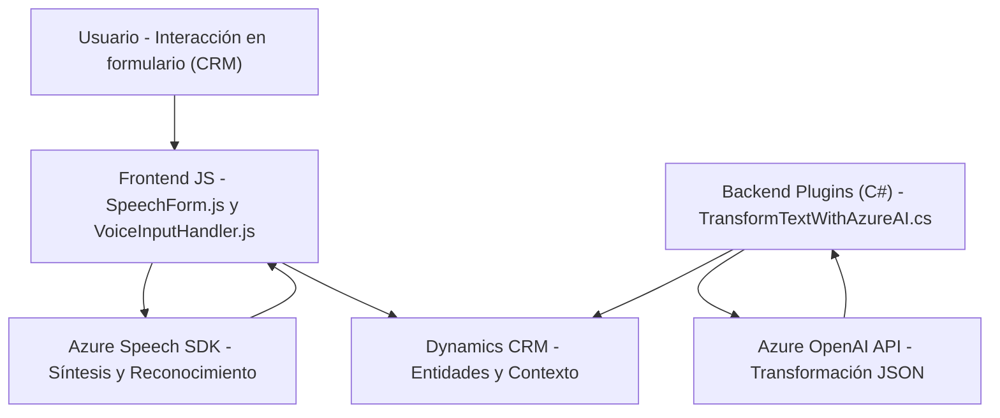

### Breve resumen técnico:
El repositorio agrega funcionalidades avanzadas de voz y procesamiento de texto en un contexto de formularios de Dynamics CRM mediante integración con servicios de Microsoft Azure Speech y OpenAI. Los tres archivos analizados se enfocan en la interacción con formularios, reconocimiento y síntesis de voz, y conversión de texto en un entorno CRM. El código presenta características de integración orientada a servicios y utiliza múltiples SDK externos.

---

### Descripción de arquitectura:
La solución adopta una arquitectura híbrida, combinando:
1. **N-Capas**: Separación lógica entre presentación, lógica de negocio y datos dentro del diseño de Dynamics CRM.
2. **Orientación a servicios (SoA)**: Integración con servicios externos (Azure Speech SDK y Azure OpenAI) para reconocimiento de voz, síntesis y transformación de texto.
3. **Microservicio ligero**: El archivo `TransformTextWithAzureAI.cs` actúa como microservicio al interactuar con la API de OpenAI para transformar datos externos.
4. **Estructura Modular**: Identificable en la separación de funciones del frontend.

---

### Tecnologías utilizadas:
1. **Frontend (JavaScript)**:
   - Azure Speech SDK (Reconocimiento, síntesis de voz y APIs de IA).
   - Manipulación DOM para interacción con formularios.
   - Mapas y transformaciones de datos tabulares en CRM.
2. **Backend (C#)**:
   - Dynamics CRM SDK (Integración de plugins personalizados).
   - Azure OpenAI para procesamiento de texto.
   - Librerías .NET: `HttpClient`, `Newtonsoft.Json`, `System.Text.Json`.

---

### Dependencias o componentes externos presentes:
1. **Dependencias externas**:
   - **Azure Speech SDK**: Reconocimiento de voz en frontend y síntesis de audio.
   - **Azure OpenAI API**: Procesamiento avanzado de texto en backend para generación de JSON estructurado.
   - **Dynamics CRM SDK**: Interacción directa con entidades de CRM y servicios Web API.
2. **Dependencias internas**:
   - Las funciones secundarias estructuran el procesamiento y la interacción lógica con el formulario existente.

---

### Diagrama Mermaid
El siguiente diagrama representa las principales interacciones entre los componentes del sistema, tecnologías utilizadas y flujo general:

---

### Conclusión final:
La solución está diseñada para extender la funcionalidad de formularios de Dynamics CRM, permitiendo interacciones avanzadas mediante voz y procesamiento de texto. Mediante un enfoque modular, la integración con servicios de Azure potencia la experiencia del usuario en un entorno de trabajo CRM basado en datos dinámicos. Sin embargo, hay oportunidades de mejora en la aplicación de prácticas de seguridad para claves sensibles y manejo de errores en API externas. La arquitectura es adecuada para entornos empresariales que buscan centralizar operaciones con voz y lenguaje natural.