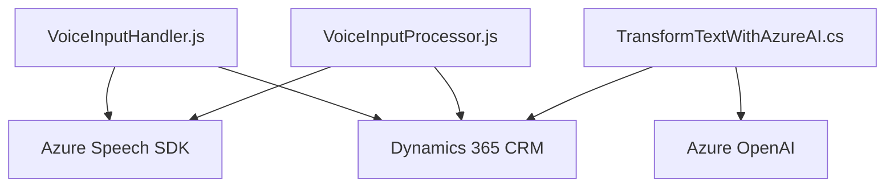

### Breve resumen técnico
El repositorio parece centrarse en soluciones relacionadas con la accesibilidad y manipulación dinámica de datos a través de tecnologías avanzadas como Azure Speech SDK y Azure OpenAI. Cuenta con dos archivos principales en el frontend y un plugin en el backend de Dynamics 365. Los archivos del frontend implementan lógica tanto para síntesis como para reconocimiento de voz (desde datos en formularios), mientras el plugin usa inteligencia artificial de Azure OpenAI para estructurar texto en formato JSON dentro de un ecosistema Dynamics CRM.

---

### Descripción de arquitectura
La arquitectura es **modular**, con integraciones externas a plataformas como Azure Speech (SDK de voz) y Azure OpenAI. La solución toma características de una **arquitectura híbrida**, combinando capas frontend (manipulación de formularios con voz), backend (Dynamics CRM y plugins), y servicios externos (Azure). Tiene patrones orientados al servicio, basado en *APIs externas* (Service-Oriented Architecture).

- El frontend presenta interacción directa con formularios utilizando patrones como cargadores dinámicos (Lazy Load para Azure Speech SDK) y transformaciones de datos.
- El backend en Dynamics CRM sigue el **Plugin Pattern**, implementando extensiones de funcionalidades mediante clases específicas.

Aunque no es propiamente una arquitectura desacoplada como hexagonal o microservicios, utiliza buenas prácticas para la separación modular del backend y el frontend.

---

### Tecnologías usadas
1. **Frontend:**
   - JavaScript (vanilla para manipular DOM y lógica de voz).
   - SDK de Azure Speech: Para síntesis y reconocimiento de voz.
   - APIs DOM: Manipulación dinámica de formularios.
   - Contextos de Dynamics 365: Interacción con los formularios de CRM.

2. **Backend:**
   - Dynamics 365 SDK (Microsoft.Xrm.Sdk): Para el desarrollo de plugins específicos.
   - Azure OpenAI API: Procesamiento de texto con IA.
   - System.Net.Http: Para invocaciones HTTP al servicio de OpenAI.
   - System.Text.Json y Newtonsoft.Json: Para operaciones de JSON en .NET.

---

### Componentes o dependencias externas
1. **Azure Services**
   - Azure Speech SDK (JS).
   - Azure OpenAI API: Utilizado desde el plugin para transformar texto en JSON estructurado.

2. **Dynamics 365 SDK**
   - Manipulación de formularios y datos dentro del ecosistema CRM.
   - Uso de APIs como `Xrm.WebApi` en frontend y `IServiceProvider` en backend.

3. **Browser APIs**
   - Manipulación DOM.
   - Carga dinámica de scripts.

---

### Diagrama Mermaid

---

### Conclusión final
El repositorio representa una solución integral para mejorar la accesibilidad en formularios dentro de Dynamics CRM mediante reconocimiento y síntesis de voz (frontend) y transformación de texto en el backend. La arquitectura mezcla capas de servicios frontend y backend, alineada a principios de Service-Oriented Architecture y buen uso de integraciones de Azure y Dynamics. Aunque modular, podría mejorarse desacoplando aún más las dependencias estáticas como la configuración de APIs para favorecer una integración basada en configuración centralizada y seguridad mejorada.