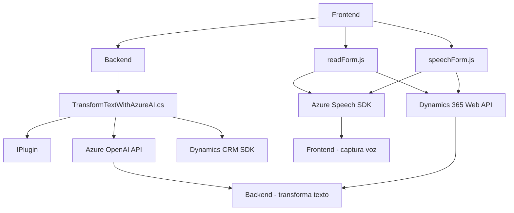

### Breve Resumen Técnico

El repositorio muestra una solución híbrida que interactúa con frontend, backend, y cloud services para realizar operaciones de voz a texto y transformación de datos en formularios de Dynamics 365. Está compuesto por tres partes principales:

1. **Frontend:** (`readForm.js`, `speechForm.js`) Implementa la interfaz para captura de datos vía reconocimiento de voz o síntesis de voz, usando Azure Speech SDK y la API de Dynamics 365.
2. **Backend Plugin (C#):** (`TransformTextWithAzureAI.cs`) Un componente de la arquitectura de Dynamics CRM que integra la API de Azure OpenAI para procesar texto según reglas específicas y devolver información estructurada.
3. **External Cloud Components:** Azure services (Speech SDK y OpenAI API) para reconocimiento de voz, síntesis de voz y procesamiento avanzado con IA.

---

### Descripción de Arquitectura

La solución parece adoptar una **mezcla de arquitectura en capas** y **orientada a servicios**. Posee una clara diferenciación entre su capa de presentación (Frontend en JavaScript) y su capa de lógica y procesamiento empresarial (Plugins en C#). Además, se integra con servicios externos como Azure, demostrando una filosofía que favorece la separación de responsabilidades y utiliza patrones de diseño como **event-driven** y **facade pattern** en el frontend para facilitar la interacción entre el cliente y los servicios. El backend sigue un **plugin architecture pattern** característico de Dynamics CRM.

---

### Tecnologías y Frameworks Usados

- **JavaScript:** Para el desarrollo de módulos frontend.
- **Azure Speech SDK:** Para captura de voz y síntesis de texto en el frontend.
- **Azure OpenAI API:** Usada para aplicar procesamiento basado en inteligencia artificial al texto ingresado.
- **Dynamics CRM SDK:** Interacciones con datos y servicios en la plataforma Dynamics CRM.
- **C#/.NET Framework:** Implementación del plugin en el backend.
- **Newtonsoft.Json.Linq & System.Text.Json:** JSON manipuladores para trabajar con datos estructurados en API.
- **Event-driven programming:** Uso de callbacks y promesas en el frontend para manejos asíncronos.
- **Facade design pattern:** Simplificación del flujo mediante puntos controlados de entrada en el código.
- **Interactor pattern:** Usado en el backend para realizar transformaciones específicas de datos.

---

### Dependencias y Componentes Externos

1. **Azure Speech SDK:** Permite sintesis de texto a voz y reconocimiento de voz.
2. **Azure OpenAI API:** Procesamiento avanzado de texto basado en inteligencia artificial.
3. **Dynamics 365 Web API:** Para integración y manipulación de datos y entidades desde formularios CRM.
4. **Newtonsoft.Json / System.Net.Http:** Lidiar con JSON y comunicaciones HTTP.

---

### Diagrama Mermaid

---

### Conclusión Final

La solución es un sistema orientado a servicios que implementa módulos de frontend y backend de manera descentralizada. Su arquitectura utiliza múltiples capas que interactúan mediante protocolos bien definidos (Dynamics Web API, SDK y Azure APIs). Los patrones de diseño aplicados (event-driven, facade y plugin architecture) muestran una clara separación de responsabilidades y favor por modularidad. Esto facilita futuros mantenimientos, actualizaciones y la integración con otros sistemas.