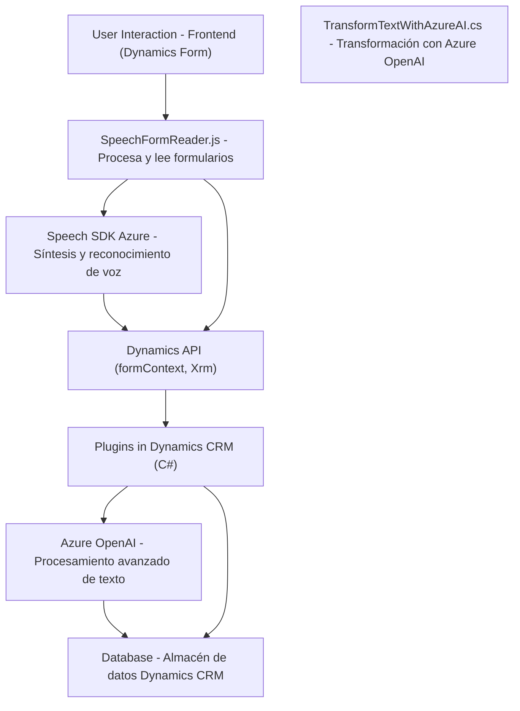

## Resumen técnico
El repositorio analiza varias implementaciones de funcionalidades asociadas a formularios y entrada/salida por voz en aplicaciones integradas con **Dynamics 365**, utilizando servicios de **Azure Speech SDK** y **Azure OpenAI**. Está compuesto por componentes que gestionan interacción por voz con formularios (lectura, escritura, transformación y reconocimiento) mediante integración con servicios externos. También destaca el uso de plugins de Dynamics CRM para extender la funcionalidad del sistema.

---

## Descripción de arquitectura
La arquitectura es una solución de **n capas** con entidades claras:
1. **Capa de presentación:** Implementaciones frontend en JavaScript que interactúan con el usuario mediante formularios en Dynamics 365 y servicios de Azure.
2. **Capa de servicios y lógica:** Plugins en C# para ejecutar transformaciones específicas de datos mediante Azure OpenAI.
3. **Capa de datos:** Utilización del modelo entidad-datos de Dynamics CRM y conexión directa a **Azure Speech SDK** y **OpenAI** para servicios externos.

La solución sigue un enfoque modular y utiliza una combinación de patrones: 
- **Modularidad de servicios externos:** El Azure SDK y Dynamics API son los responsables de ofrecer funcionalidades adicionales sin acoplar excesivamente la lógica al sistema base.
- **Patrones de plugin:** Los plugins en C# extienden capacidades en Dynamics CRM mediante integración directa con servicios de Azure.

---

## Tecnologías usadas
1. **Frontend:**
   - **JavaScript:** Manejo de DOM, funciones asincrónicas (`async/await`), y eventos del usuario.
   - **Azure Speech SDK:** Para síntesis y reconocimiento de voz.
   - **Dynamics 365 API:** Manejo de formularios y datos.
   - Framework: Ninguno explícito usado (vanilla JS).

2. **Backend/Plugins:**
   - **C#:** Desarrollo de extensiones en forma de `IPlugin` para Dynamics CRM.
   - **Azure OpenAI:** Transformación avanzada de texto según reglas predefinidas.
   - Dependencias como `Newtonsoft.Json` y `System.Net.Http` para manejo de datos.

3. **Servicios externos:**
   - Azure Speech y OpenAI en Microsoft Azure.
   - API personalizada de Dynamics 365 integrando datos procesados con formularios.

---

## Diagrama Mermaid

---

## Conclusión final
El repositorio representa un sistema **n capas** centrado en Dynamics 365 con extensiones avanzadas de servicios de Azure (Speech SDK, OpenAI), orientado a mejorar la interacción y procesamiento de datos en formularios. La solución es modular con una mezcla de frontend para la interacción y backend basado en plugins para transformar datos en tiempo real. Su arquitectura es eficiente al separar responsabilidades, utilizando servicios externos desacoplados como el Azure SDK y soluciones dentro de Dynamics. Es adecuada para sistemas empresariales que requieran inteligencia artificial avanzada y gestión de voz.