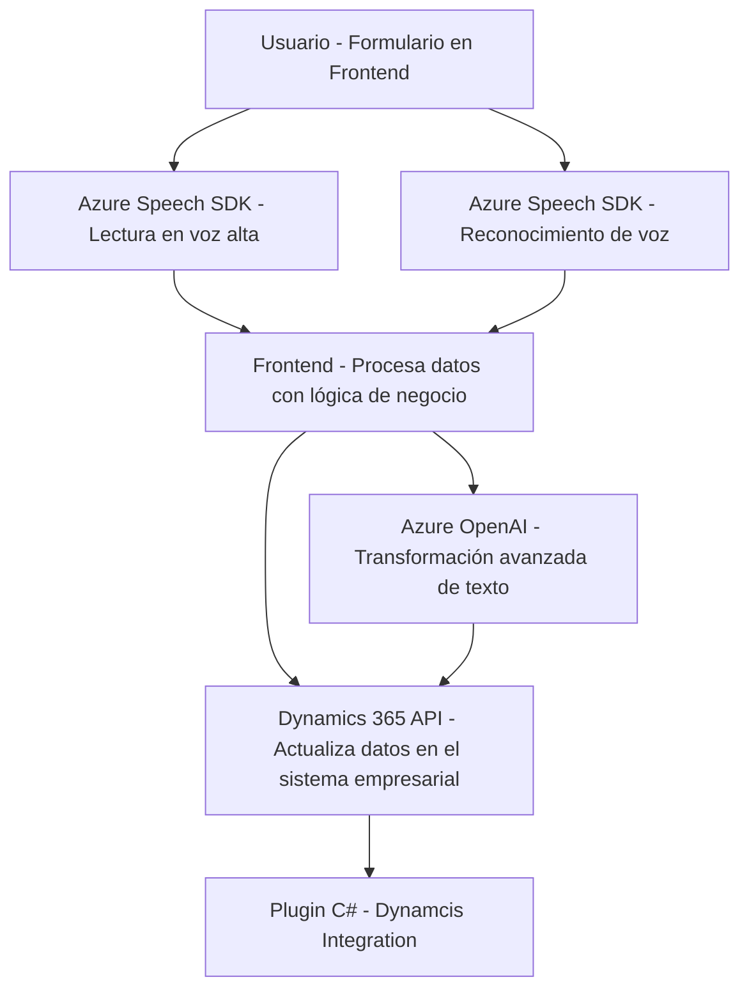

### Breve resumen técnico
El repositorio contiene varios archivos relacionados con la integración de **Azure Speech SDK** y Azure OpenAI en una solución que parece emplear un enfoque híbrido. Combina frontend en JavaScript (procesamiento basado en SDKs para reconocimiento de voz y síntesis de texto en voz) y lógica empresarial/Dynamics 365 usando un plugin C# para procesamiento avanzado de texto con **Azure OpenAI**.

### Descripción de arquitectura
La solución representa un sistema distribuido orientado a servicios que utiliza una arquitectura de **integración en capas**. Las capas incluyen:
1. **Frontend**: Para interacción directa con usuarios y manipulación de formularios.
2. **Servicios/SDKs en cliente**: Integraciones vía Azure Speech SDK.
3. **Backend de Dynamics 365**: Con un plugin basado en C# que se conecta al ecosistema empresarial.
4. **Azure OpenAI**: Procesamiento avanzado y normalización textual.

Cada componente está diseñado de manera modular y cumple un rol especializado (Frontend para captura de datos y voz; Backend para lógica avanzada y normalización).

### Tecnologías usadas
1. **JavaScript**: Implementa la lógica en cliente (`VoiceInputHandler.js`, `SpeechInputHandler.js`), empleando programación asincrónica (`Promises`, `async/await`).
2. **Azure Speech SDK**: Para síntesis de voz y reconocimiento de voz basado en IA.
3. **Dynamics 365 API (Xrm.WebApi)**: Actualización dinámica de formularios e integración con bases de datos internas.
4. **C# Plugin Framework (Microsoft.Xrm.Sdk)**: Usado para implementar el procesamiento avanzado en el backend empresarial.
5. **Azure OpenAI**: Servicios de IA para transformar texto en estructuras JSON enriquecidas.
6. **HTTP & JSON APIs**: Acceso a servicios remotos y manipulación de datos estructurados.

### Diagrama Mermaid válido para GitHub Markdown

### Conclusión final
La solución presente en el repositorio exhibe un diseño híbrido basado en capas con una clara separación entre frontend y lógica backend. Se enfoca en cubrir necesidades de procesamiento complejo de datos en sistemas empresariales usando herramientas como Azure Speech SDK y Azure OpenAI. Su diseño refleja patrones comunes de **modularidad**, **observer**, y **plug-in architecture**, destacando elegancia en la integración de servicios externos con plataformas empresariales. 

**Recomendaciones**:
- Introducir configuraciones externas para manejar credenciales y URLs sensibles.
- Optimizar la reusabilidad y la documentación para simplificar su integración a otros sistemas Dynamics.
- Evaluar la introducción de pruebas unitarias tanto en frontend como backend para garantizar seguridad y calidad del código.