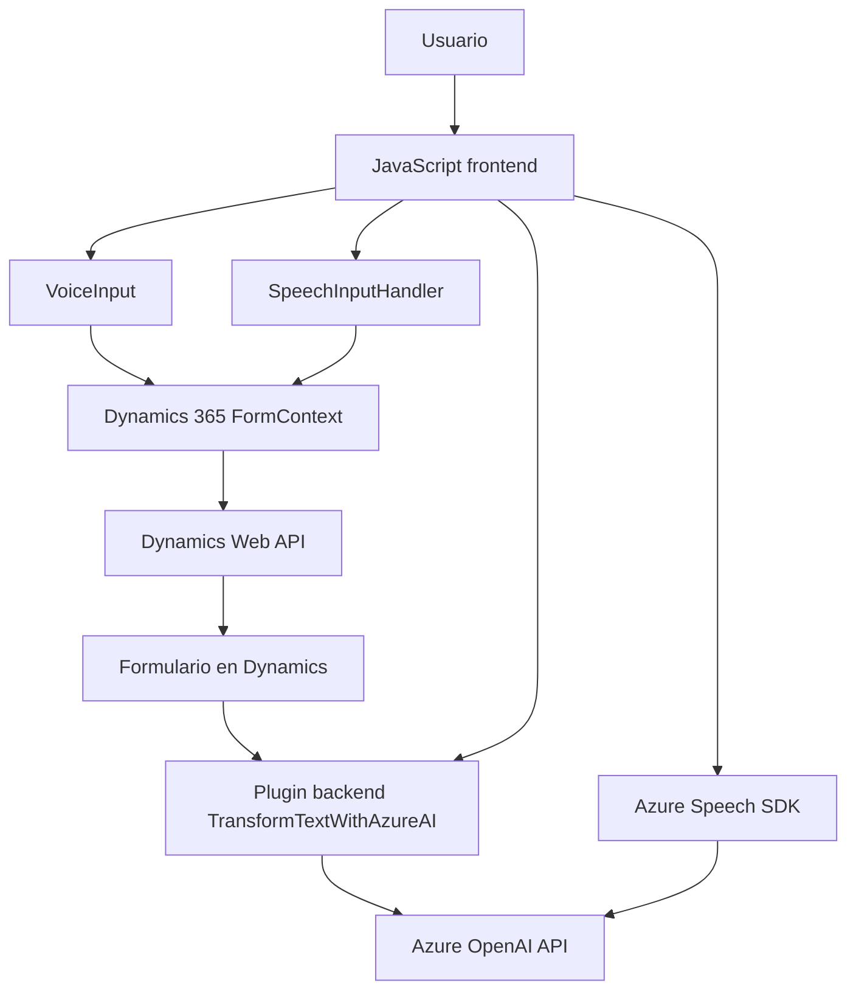

### Breve resumen técnico

El repositorio tiene una mezcla de componentes para frontend, integración de APIs y plugins en un entorno Dynamics CRM, mayoritariamente enfocado en interacción con servicios externos (Azure Speech SDK, Azure OpenAI API). La solución permite reconocimiento de voz, síntesis de voz, manipulación de datos de formularios y transformación mediante inteligencia artificial, presentada como una integración entre frontend y backend.

---

### Descripción de arquitectura

1. **Tipo de solución**:
   - **Principal:** Soporte para formularios enriquecidos con voz (input/output) en Dynamics CRM.
   - **Estructura modular:** Frontend basado en JavaScript para Dynamics 365 y backend como un plugin en C# para procesamiento avanzado.

2. **Arquitectura**:
   - **Frontend:** Arquitectura en capas con división de responsabilidades (obtener datos del formulario, procesarlos y enviar a APIs externas).
   - **Plugins:** Basado en arquitectura Dynamics (usando el patrón Plugin Framework).
   - La solución tiene características de un *n-capas* en general, pero el backend también utiliza una arquitectura orientada a servicios que integra APIs externas (Azure OpenAI).

---

### Tecnologías usadas

1. **Frontend:**
   - **JavaScript:** Manejo de lógica en formularios y SDK Azure Speech.
   - **Azure Speech SDK:** Para síntesis y reconocimiento de voz.
   - **Dynamics 365 Web API:** Manipulación de formularios y datos CRM.

2. **Backend Plugin:**
   - **C#:** Desarrollo de lógica empresarial y procesamiento de datos.
   - **Newtonsoft.Json / System.Text.Json:** Manejo de objetos JSON.
   - **System.Net.Http:** Solicitudes HTTP a Azure OpenAI.
   - **API Azure OpenAI:** Para procesamiento avanzado y transformación de texto.

---

### Patrones empleados en el código

1. **Frontend:**
   - **Modularidad:** Cada función tiene un propósito claro (responsabilidad única).
   - **Carga dinámica de dependencias:** Uso de `ensureSpeechSDKLoaded` en JavaScript.
   - **Integración por eventos:** El flujo principal ocurre como respuesta a la interacción de los usuarios.
   - **Facade:** Exposición simplificada de entorno SDK para el usuario.

2. **Backend Plugin:**
   - **Plugin Framework:** Dinámica de ejecución basada en contexto CRM.
   - **Client-Server Pattern:** Uso de servicios externos (Azure OpenAI).
   - **Request-Response:** Interacción directa con la API mediante HTTP.

---

### Dependencias o componentes externos

1. **Azure Speech SDK:**
   - Usado desde JavaScript para síntesis de voz y reconocimiento de voz en formularios.

2. **Azure OpenAI API:**
   - Procesamiento de texto enviado desde Dynamics CRM plugin.

3. **Dynamics 365 Web API:**
   - Manipulación de formularios y mapeo de datos.

4. **Newtonsoft.Json / System.Text.Json:** 
   - Manejo de contenido JSON en el plugin backend.

---

### Diagrama Mermaid válido para GitHub

---

### Conclusión final

El repositorio implementa una solución integrada entre frontend y backend para enriquecer la interacción de formularios en Dynamics 365 usando voz e inteligencia artificial. Usando patrones modulares y altamente especializados, facilita el reconocimiento de voz, síntesis, y manejo avanzado de transformación y mapeo de datos utilizando Azure Speech SDK y Azure OpenAI API.

Aunque la arquitectura tiende hacia un modelo n-capas, también aprovecha servicios desacoplados (APIs externas) para mayor escalabilidad. Esto hace que la solución sea flexible y se alinee con principios de diseño moderno como **SOA (Service-Oriented Architecture)**.