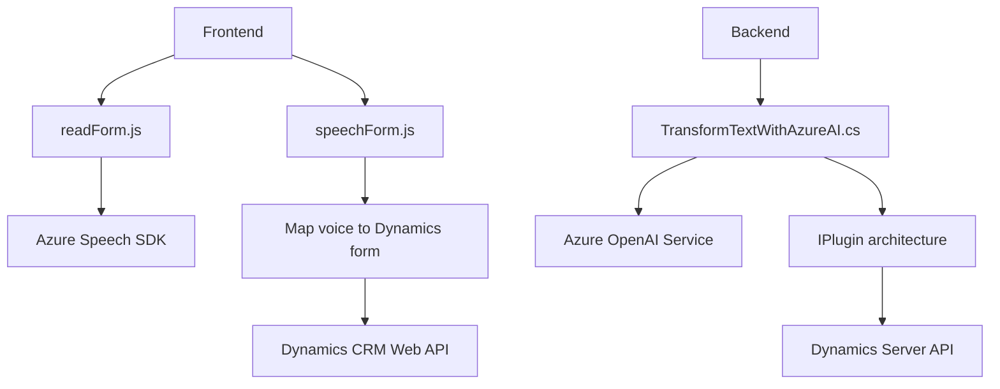

**Resumen técnico:**
El repositorio combina componentes frontend (JavaScript) y backend (C# plugin) para proporcionar funcionalidades avanzadas de interacción entre formularios de Dynamics 365 CRM y servicios externos de inteligencia artificial. El sistema realiza procesamiento de voz, manipulación de datos en formularios, y formateo avanzado de texto mediante Azure AI.

---

**Descripción de la arquitectura:**
La arquitectura es **modular**, basada en una combinación de un frontend orientado a eventos y un backend basado en plugins. Los componentes del frontend interactúan con servicios externos como Azure Speech SDK para sintetización y procesamiento de texto, mientras que el plugin en C# invoca Azure OpenAI para realizar transformaciones de texto. Toda la solución está diseñada como una extensión de Dynamics 365 CRM, integrándose con APIs de primera y terceros mediante un modelo n-capas.

1. **Frontend:** Funciona como una capa de integración visual y operativa con formularios, aplicando lógica de negocio y utilizando componentes externos para tareas específicas (como procesamiento de voz).
2. **Backend:** Funciona como una capa de procesamiento profundo de datos, ejecutando tareas sobre el servidor de Dynamics mediante el modelo de plugins (IPlugin) y servicios externos como Azure OpenAI.

---

**Tecnologías utilizadas:**
1. **Frontend:**
   - Lenguaje de programación: JavaScript.
   - SDK: Azure Speech SDK (`window.SpeechSDK`) para procesamiento y síntesis de voz.
   - Frameworks/Servicios:
     - Integración con Dynamics 365 CRM API (`Xrm.WebApi`).
     - Dinámica de carga de dependencias (librerías externas a través de enlaces HTTP dinámicos).
   - Patrones usados:
     - **Patrón Adaptador:** Modifica estructura de datos del formulario para servicios externos.
     - **Modular:** Cada función tiene un rol específico y se reutiliza en varios escenarios.
     - **Cargador dinámico:** Verifica y carga recursos externos como el Azure Speech SDK.

2. **Backend:**
   - Lenguaje de programación: C# .NET.
   - Frameworks, APIs y servicios:
     - Dynamics CRM SDK (`Microsoft.Xrm.Sdk` y `Microsoft.Xrm.Sdk.Query`) para gestionar datos organizativos de CRM.
     - Azure OpenAI Service para procesamiento avanzado de texto.
     - JSON manipulation libraries (`System.Text.Json` y `Newtonsoft.Json`).
   - Patrones usados:
     - **Interfaz-plugin:** Uso de la interfaz `IPlugin` para integrar reglas específicas en Dynamics CRM.
     - **Cliente-servidor:** Manejo de HTTP para consultar servicios externos (Azure OpenAI).

---

**Dependencias y componentes externos:**
1. **Frontend:**
   - Azure Speech SDK (Cargado dinámicamente).
   - Microsoft Dynamics 365 CRM API.
2. **Backend:**
   - Azure OpenAI API ("GPT-model" servicio de texto a nivel cloud).
   - Microsoft Dynamics 365 CRM APIs (`IPluginExecutionContext`, `IOrganizationService`).
   - JSON APIs (`System.Text.Json` y `Newtonsoft.Json`).

---

**Diagrama Mermaid válido para GitHub:**

---

**Conclusión final:**
Este repositorio implementa una solución basada en arquitectura n-capas para extender la funcionalidad de Microsoft Dynamics 365 CRM con capacidades avanzadas de inteligencia artificial y procesamiento de voz. Destaca la integración eficiente de servicios externos como Azure Speech SDK y Azure OpenAI, y la modularidad del código. La combinación de frontend y backend muestra una clara organización orientada a micro-tareas especializadas, con soporte para datos dinámicos y plugins para extender la lógica empresarial en distintos flujos. La arquitectura es sólida, moderna y escalable, ideal para entornos corporativos que hacen heavy use de CRM con capacidades extendidas.