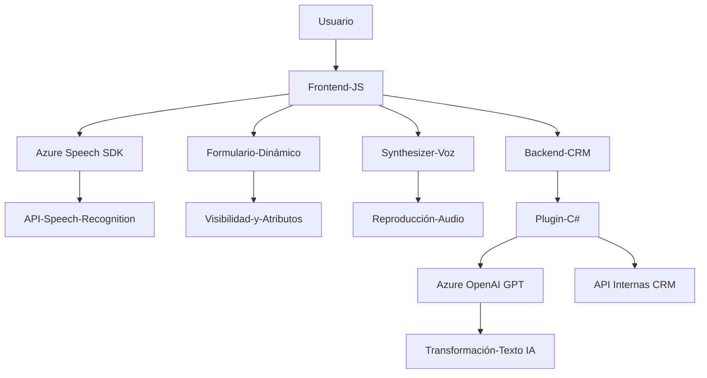

### Análisis técnico del repositorio

#### Breve resumen técnico
El repositorio contiene archivos mezclando **frontend JavaScript** y **backend en C#** para integrar formularios dinámicos, APIs externas y servicios basados en tecnología de reconocimiento de voz, síntesis de texto, e inteligencia artificial. Destaca la integración directa con **Azure** (Speech SDK y OpenAI GPT) y un enfoque en sistemas CRM probablemente relacionado con **Microsoft Dynamics 365**.

---

#### Descripción de arquitectura
La solución está orientada al desarrollo de una capa de **interacción híbrida**:
1. **Frontend**: Se enfoca en la captura y procesamiento de voz utilizando lógica modular (JS) y SDK de **Azure Speech** para sintetizar audio y transcribir voz.
2. **Backend**: Usa plugins en **Dynamics CRM** escritos en C#, diseñados para transformar texto mediante el servicio **Azure OpenAI GPT**. El backend sirve como complemento adaptable.
3. **Integración dinámica**: Comunicación entre modulos y servicios externos (API, SDK de Azure, CRM).

En esencia, la arquitectura sigue un enfoque modular con integración de múltiples tecnologías:
- **Frontend**: Funciona como una capa interactiva con el usuario, orientada a la ejecución en navegadores.
- **Backend/Desktop plugins**: Operaciones dentro de Dynamics CRM, enriquecidas por inteligencia artificial.

La estructura del sistema apunta a un **arquitectura de capas** discreta donde el frontend, el backend y los servicios externos (Azure) interactúan en distintos niveles.

---

#### Tecnologías usadas
1. **Frontend (JS)**:
   - **SDK Azure Speech**: Reconocimiento, síntesis de voz.
   - **DOM Manipulation**: Para acceso dinámico a formularios y datos visibles.
   - **Promise y Loader condicional**: Asegura asincronía y gestión dinámica de recursos (SDK).

2. **Backend (C#)**:
   - Framework **.NET** (probablemente .NET Framework para compatibilidad con Dynamics CRM).
   - **Dynamics CRM SDK**:
     - Métodos para manipulación de formularios dinámicos y servicios CRM.
     - **IPlugin** para extensibilidad en sistema CRM.
   - **Azure OpenAI GPT Services**:
     - Comunicación API mediante HTTP requests (`System.Net.Http`).
     - Serialización JSON (`Newtonsoft.Json.Linq`).

3. **Servicios externos**:
   - **Azure Speech SDK**: Para procesamiento de voz.
   - **Azure OpenAI GPT**: Transformación de texto.

---

#### Dependencias y componentes externos
1. **Servicios Azure**:
   - Reconocimiento de voz y síntesis mediante Speech SDK.
   - Procesamiento avanzado de texto mediante OpenAI GPT.

2. **Microsoft Dynamics SDK**:
   - Gestión de formularios dinámicos dentro del modelo extensible CRM.

3. **Librerías JS y C#:**
   - Frontend: Promesas, AJAX, control de formularios.
   - Backend: HTTP Client para APIs, herramientas de serialización JSON.

---

### Diagrama **Mermaid** compatible con GitHub Markdown

---

#### Conclusión Final
Este repositorio implementa un sistema híbrido combinado entre frontend JS interactivo y backend extensible dentro de un CRM. La solución utiliza tecnología actualizada de **Azure Speech SDK** para interactuar con el usuario a través de voz y ejecutar transformaciones avanzadas de texto mediante **Azure OpenAI GPT**.

Los patrones arquitectónicos están centrados en una estructura modular de capas con clara segmentación de tareas (frontend, backend y APIs). Aunque funcionalmente poderoso, hay espacio para más adherencia a buenas prácticas, como la separación de responsabilidades más estricta, mejor gestión de las claves API, y mayor abstracción en el manejo de dependencias externas.