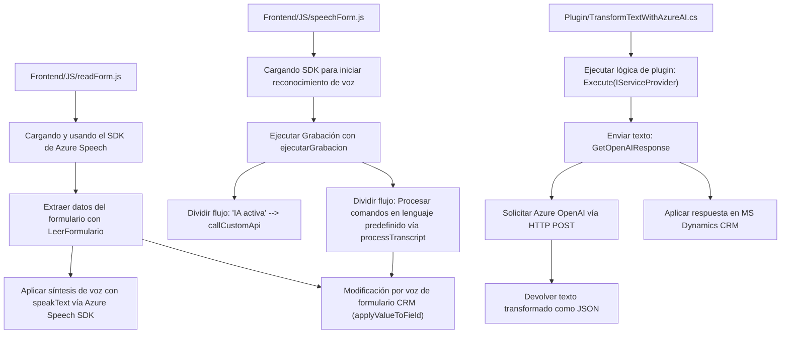

# Análisis detallado del repositorio

## Breve resumen técnico
El repositorio contiene tres componentes principales:
1. **Frontend**: Dos archivos JavaScript que interactúan con formularios dinámicos y emplean el **Azure Speech SDK** para transformar texto en voz (`readForm.js`) y texto hablado en texto (`speechForm.js`).  
2. **Plugin**: Un archivo C# (`TransformTextWithAzureAI.cs`) que implementa un plugin para Microsoft Dynamics CRM utilizando **Azure OpenAI** para realizar transformaciones avanzadas de texto.  

Estos tres archivos reflejan un solución distribuida enfocada en interacción de usuario y conectividad con servicios en la nube.

---

## Descripción de Arquitectura
1. **Tipo de solución**:
   - La solución es una integración que combina una **frontend (JavaScript)** para trabajar con formularios y un **backend (C# plugin)** que se conecta con Dynamics CRM y consume servicios de IA de Azure OpenAI.

2. **Patrones empleados**:
   - **Encadenamiento de funciones modular**: Cada archivo divide la lógica en funciones específicas altamente granulares, facilitando la legibilidad y mantenibilidad.
   - **Carga dinámica**: Las dependencias como **Azure Speech SDK** se cargan bajo demanda para optimizar el rendimiento y reducir el tamaño inicial.
   - **Middleware Plugin**: El plugin usa el patrón de `IPlugin` para procesar texto en Dynamics CRM.
   - **Tecnologías y frameworks**:
     - **Frontend**:
       - **JavaScript** ejecutado en el navegador (asociado a formularios).
       - **Azure Speech SDK** para voz y reconocimiento de texto.
     - **Backend/Plugin**:
       - **Microsoft Dynamics CRM SDK** para la integración directa con la plataforma CRM.
       - **Azure OpenAI** para procesamiento automático de texto.
       - **JSON manipulation libraries** (`System.Text.Json` y `Newtonsoft.Json`).
       - **HTTP client** (`System.Net.Http`) para enviar solicitudes POST al servicio Azure.

3. **Arquitectura**:
   - La solución es híbrida. La arquitectura principal oscila entre:
     - **Microfrontend** para JavaScript: Componente modular que interactúa solo con formularios.
     - **Plugin basada en eventos**: Modelo en el que los procesos del backend en Dynamics CRM son desencadenados por eventos específicos y gestionados por el marco `IPlugin`.
     - **Conexión a External Service**: Interacción con dos servicios externos, **Azure Speech SDK** y **Azure OpenAI**, siguiendo un enfoque de arquitectura de integración de servicios.

4. **Dependencias o componentes externos**:
   - **Azure Speech SDK**:
     - Dinámicamente cargado desde la web para síntesis y reconocimiento de voz.
   - **Azure OpenAI Service**:
     - Usado exclusivamente por el plugin en C# para transformar texto.
   - Otras dependencias:
     - **Microsoft Dynamics CRM SDK**.
     - **JSON manipulators**: `Newtonsoft.Json` y `System.Text.Json`.
     - **HTTP Client library** para realizar solicitudes API.

---

## Diagrama Mermaid

---

## Conclusión Final
La solución representa un caso de integración avanzada entre frontend y backend con servicios de nube de Microsoft Azure, específicamente:
- El **Frontend**, siendo parte de un posible **microfrontend**, facilita interacciones de entrada/salida con el usuario final mediante el reconocimiento y generación de voz.
- El **Plugin de Dynamics CRM** trabaja como middleware encargado de transformar texto (potencialmente mediante IA) y de operar sobre objetos del CRM.
- La arquitectura refleja un ejemplo de **componentes nCapa distribuidos**, acoplados mediante el consumo de servicios externos y patrones de comunicación en eventos. Misma basada en microfrontends combinada con un backend orientado a servicios.  

Esto muestra que el diseño sostiene modularidad, escalabilidad y facilidad para extender funcionalidad futura.