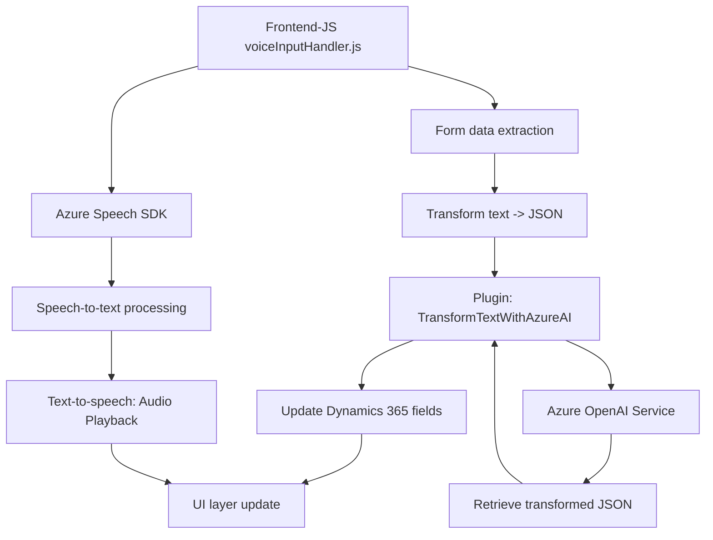

### Breve resumen técnico:
El repositorio integra capacidades de texto a voz, reconocimiento de voz, y procesamiento avanzado de texto, combinando servicios de **Azure Speech SDK** y **Azure OpenAI Service** con formularios de **Dynamics 365 CRM**. Se observan tres componentes principales:
1. **Frontend/JavaScript**: Scripts interactivos que sincronizan reconocimiento de voz y texto a voz con formularios web dinámicos.
2. **API personalizada**: Plugins en Dynamics CRM que interactúan con Azure para transformar texto mediante inteligencia artificial.
3. **Integración de servicios en la nube (Azure)**: Los servicios externos desempeñan roles clave en la funcionalidad.

---

### Descripción de arquitectura:
La arquitectura del sistema parece orientada hacia un enfoque **modular** basado en múltiples capas. Cada capa tiene una responsabilidad claramente definida: 
- **Frontend/UI Layer**: Scripts JavaScript para capturar datos, reconvertir texto a voz, e invocar métodos API.
- **Business Logic Layer**: Plugins de Dynamics CRM que ejecutan reglas de transformación de texto y contacto directo con la nube.
- **Service-Oriented Architecture (SOA)**: Interacción con servicios de Azure (Speech SDK y OpenAI) para procesar datos externamente.

---

### Tecnologías usadas:
1. **Frontend**: JavaScript.
   - Frameworks/librerías: Azure Speech SDK.
   - Enfoque: Procesamiento de formularios y síntesis de voz.
2. **Backend/API personalizada**: C#.
   - Frameworks/librerías: Dynamics CRM SDK (Microsoft.Xrm.Sdk), Newtonsoft.Json.
   - Enfoque: Plugins que interactúan con Azure OpenAI para texto avanzado procesado.
3. **Servicios externos**:
   - Azure Speech SDK: Reconocimiento de voz y síntesis de texto a voz.
   - Azure OpenAI Service: Procesamiento de datos con modelos como GPT.
   - Dynamics CRM Web API: Comunicación con formularios y datos del sistema.

---

### Dependencias y componentes externos:
1. **Integración de servicios de Azure**:
   - Speech SDK: Para reconocimiento de voz y texto a voz.
   - OpenAI Service: Para generación de texto inteligente y análisis avanzado.
2. **Microsoft Dynamics 365**:
   - API para interacción directa con formularios.
   - Plugins basados en eventos específicos y contextos de ejecución.
3. **Librerías C#**:
   - Newtonsoft.Json: Para manipulaciones de datos en JSON.
   - System.Net.Http: Comunicaciones REST con Azure services.

---

### Diagrama Mermaid:

---

### Conclusión final:
Este repositorio refleja una solución en capas con fuertes dependencias hacia servicios externos de Azure y Dynamics CRM. Los scripts JavaScript forman una **frontend orientada a eventos**, mientras que los plugins implementan una **backend transparente** con lógica de negocio delegada a servicios en la nube. La arquitectura sigue principios de **SOA** y **modularidad**, logrando un buen nivel de separación de responsabilidades y extensibilidad mediante la integración con API externas como Speech SDK y OpenAI Service. Sin embargo, podría beneficiarse del uso de patrones como **Hexagonal Architecture** para mejorar la flexibilidad frente a cambios en servicios externos.