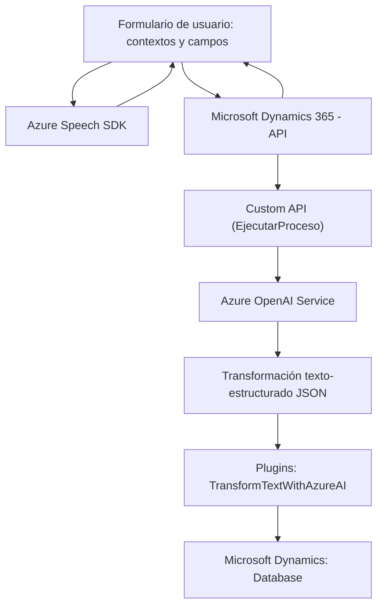

### Breve resumen técnico

El repositorio implementa una solución destinada a la integración de funcionalidades avanzadas en un sistema de gestión cliente-relación (CRM), específicamente Microsoft Dynamics 365. Se enfoca en mejorar la interacción usuario-máquina mediante reconocimiento de voz, síntesis de voz y procesamiento de texto a través de servicios externos como **Azure Speech SDK** y **Azure OpenAI**. El código presente utiliza patrones modulares y la integración con APIs externas para realizar tareas avanzadas de reconocimiento de voz, síntesis y transformación de información.

---

### Descripción de arquitectura

La arquitectura general se puede clasificar como **modular basada en capas**, con una combinación de **servicios distribuidos/microservicios** cuando utiliza servicios externos como Azure Speech SDK y Azure OpenAI. La comunicación entre el frontend y el backend se realiza en un modelo cliente-servidor, con una separación clara entre presentación (frontend en JavaScript) y lógica de negocio (backend con plugins en .NET). 

#### Componentes principales:
1. **Frontend**:
   - Contiene scripts que interactúan con el usuario y procesan formularios en el contexto de Microsoft Dynamics CRM.
   - Proporciona funcionalidades como reconocimiento y síntesis de voz, vinculado a servicios externos (Azure Speech SDK).

2. **Backend (Plugins)**:
   - Plugins implementados para extender las capacidades de Dynamics CRM.
   - Utilizan Azure OpenAI para transformar texto y generar resultados legibles o estructurados.

#### Patrones:
- **Integración de servicios externos**: Uso de APIs para capacidades avanzadas (Azure Speech y Azure OpenAI).
- **Modularidad**: Cada responsabilidad está definida en una función/clase separada, facilitando su reuso y mantenimiento.
- **Patrón Plug-in de Dynamics CRM**: Extiende funcionalidades del sistema mediante la interfaz oficial `IPlugin`.

---

### Tecnologías usadas

1. **Frontend**:
   - **JavaScript**:
     - Scripts: `speechForm.js`, `readForm.js`.
     - Uso de funciones y organización modular orientada a tareas específicas.
   - **Azure Speech SDK**:
     - Dinámicamente cargado usando `<script>` etiquetado a través de la URL "https://aka.ms/csspeech/jsbrowserpackageraw".
     - Syntetización de texto a voz y reconocimiento de voz.

2. **Backend**:
   - **C#**:
     - Plugins para Dynamics CRM (e.g., `TransformTextWithAzureAI.cs`).
     - Uso de la biblioteca `Microsoft.Xrm.Sdk` para interactuar con Dynamics 365.
     - Integración con servicios como Azure OpenAI API y uso de librerías de manejo JSON (`Newtonsoft.Json` y `System.Text.Json`).

3. **Servicios externos**:
   - **Azure Speech SDK**: Para habilitar el procesamiento de voz.
   - **Azure OpenAI Service**: API para transformar texto en JSON estructurado según reglas específicas.

4. **CRM**:
   - Dinámicos 365 CRM: Sistema utilizado para la gestión de formularios y entidades.

---

### Diagrama Mermaid válido para GitHub

---

### Conclusión final

El repositorio combina tecnologías modernas de frontend (JavaScript) con servicios de reconocimiento y síntesis de voz (Azure Speech SDK) para mejorar la interacción con un sistema CRM (Dynamics 365). Por otro lado, los plugins en C# integrados en Dynamics CRM aprovechan el servicio Azure OpenAI para transformar texto en estructuras JSON, lo que permite una automatización avanzada en formularios dinámicos. 

La arquitectura es una solución híbrida que combina **modularidad**, **n capas** para el frontend y backend separado, y un enfoque de **microservicios** mediante integración con APIs externas. Esta solución sería ideal para organizaciones que buscan integrar capacidades avanzadas de inteligencia artificial y interfaces basadas en voz en sus sistemas CRM.