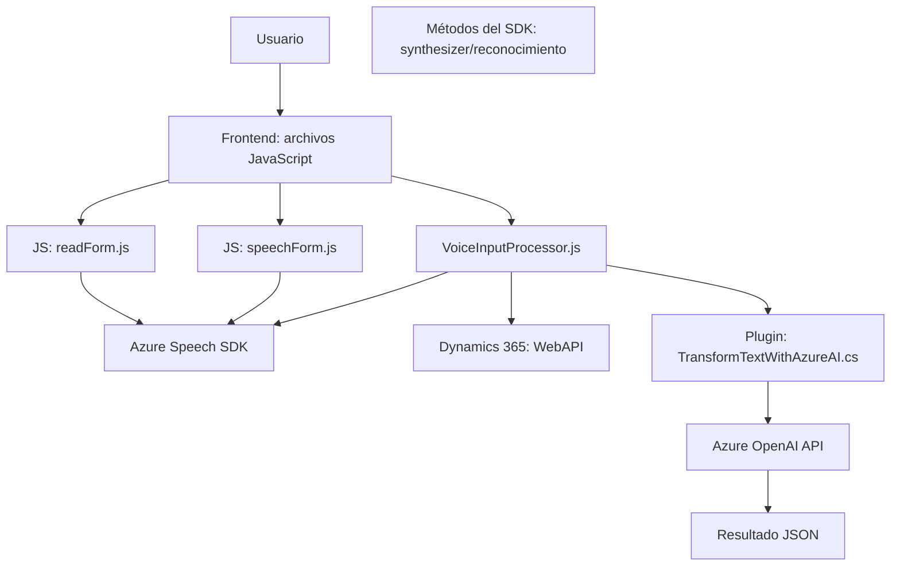

### Breve Resumen Técnico
El repositorio contiene archivos relacionados con la funcionalidad de interacción mediante reconocimiento y síntesis de voz, además de un complemento que utiliza inteligencia artificial para transformar texto. Las funciones se centran en la integración con servicios de Microsoft (Azure Speech SDK, Azure OpenAI y Dynamics 365).

### Descripción de Arquitectura
La arquitectura del sistema sigue el modelo de **n capas**, aunque con elementos que permiten ejecutar ciertas operaciones de procesamiento distribuidas en servicios externos. Se encuentran tres capas principales:
1. **Frontend**:
   - Implementado con scripts JavaScript que interactúan directamente con los usuarios finales (lectura del formulario y entrada visual por voz).
   - Consume servicios de Azure Speech SDK y APIs internas o externas (Dynamics 365 y específicamente plugins con Azure OpenAI).
   
2. **Backoffice**:
   - Complemento en C# conectado a Dynamics 365 que extiende la funcionalidad del sistema usando Azure OpenAI para transformar texto basado en reglas predefinidas.

3. **Integraciones Externas**:
   - Utiliza patrones Cliente-Servidor para conectarse a servicios externos como Azure OpenAI y Azure Speech SDK.
   - Carga dinámica de librerías (Azure Speech SDK).

### Tecnologías Usadas
1. **Frontend:**
   - **Lenguaje:** JavaScript.
   - **Frameworks/SDKs:** Azure Speech SDK.
   - **APIs:** Web API de Dynamics 365.
   
2. **Backend:**
   - **Lenguaje:** C#.
   - **Frameworks/SDKs:** Dynamics 365 SDK (`Microsoft.Xrm.Sdk`), Azure OpenAI Service.
   - **Bibliotecas de soporte:** `Newtonsoft.Json`, `System.Net.Http`, `System.Text.Json`.

3. **Infraestructura:** 
   - Servicios de Azure: Speech, OpenAI.
   - Dynamics 365: CRM personalizado con plugins y API Web.

4. **Patrones de diseño:**
   - En el frontend, se emplea un modelo basado en funciones para modularidad y simplicidad. Por ejemplo, cada función tiene un propósito específico: lectura, síntesis, integración.
   - El backend utiliza patrones estándar del plugin de Dynamics 365 (implementación de `IPlugin`), con una separación sencilla entre responsabilidades de entrada/salida y acceso al cliente de OpenAI.

### Diagrama Mermaid 100% compatible con GitHub Markdown

### Conclusión Final
Esta solución es una plataforma híbrida **n capas** que se integra con servicios externos como Azure Speech SDK y Azure OpenAI para proporcionar funcionalidad avanzada en reconocimiento de voz, síntesis de texto y procesamiento de datos por inteligencia artificial. Los archivos del repositorio siguen un enfoque modular, organizado y compatible con sistemas empresariales como Dynamics 365. Además, se utilizan patrones estándar para asegurar la reutilización de código y la interacción eficiente entre componentes internos y servicios externos.