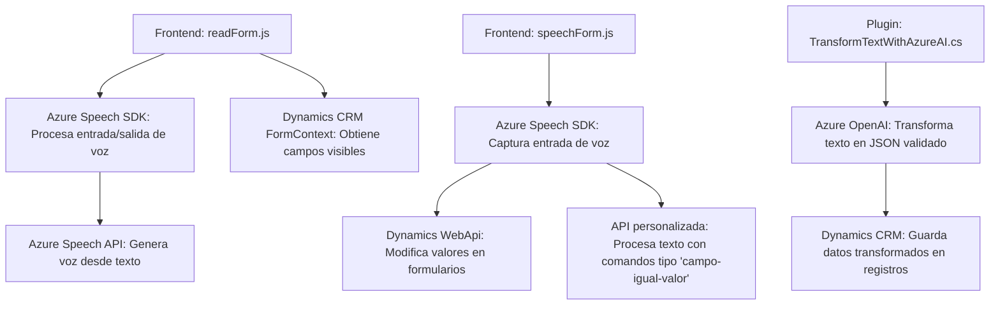

## Breve resumen técnico
El repositorio contiene código de aplicaciones relacionadas con la entrada de voz y procesamiento de datos mediante Azure Speech SDK y Azure OpenAI. Se encuentra organizado en dos grupos principales:
1. **Frontend**: Scripts de JavaScript para interacción con el cliente (formularios, entrada/salida de voz).
2. **Plugin**: Código C# para extender Dynamics CRM con un plugin que transforma texto mediante Azure OpenAI.

Las soluciones son modulares, orientadas a servicios externos, y diseñadas para integrarse con plataformas basadas en Microsoft Dynamics.

---

## Descripción de arquitectura
- **Tipo de solución**: Es una solución híbrida que incluye funcionalidad de frontend para interacción con el usuario (procesar formularios, entrada/salida de voz) y lógica backend para comunicaciones con APIs externas (Azure Speech SDK, Azure OpenAI). Además, extiende Dynamics CRM mediante un plugin.
  
- **Arquitectura**: Es una arquitectura **modular distribuida** que sigue principios de:
  - **N capas**: Separación entre lógica de usuario (captura y salida de voz en frontend) y lógica backend (transformación de datos vía plugin).
  - **Modelo cliente-servidor**: Los scripts del frontend interactúan directamente con servicios externos y el servidor Dynamics.
  - **Microservicio plugin**: El plugin actúa como un servicio especializado para una tarea específica en Dynamics CRM.

---

## Tecnologías usadas
- **Frontend**:
  - **JavaScript**: Lenguaje principal para los scripts.
  - **Azure Speech SDK**: Para entrada y salida de voz.
  - **Dynamics WebApi (`Xrm.WebApi`)**: Usado para manipular datos en formularios CRM.
  - **JSON**: Formato de datos para interacción y procesamiento entre APIs.

- **Backend/Plugin**:
  - **C#**: Lenguaje principal para el plugin.
  - **Azure OpenAI**: API para transformación de texto con reglas personalizadas.
  - **Microsoft Dynamics SDK**: Framework y librerías específicas para desarrollar plugins en Microsoft Dynamics CRM.
  - **System.Net.Http**: Para realizar llamadas HTTP hacia servicios externos (OpenAI).

- **Patrones**:
  - **Single Responsibility Principle (SRP)**: Cada módulo/función tiene una tarea específica (gestión de voz, transformación de texto, etc.).
  - **Modularidad**: Separación de componentes por responsabilidades específicas (voz, procesamiento de formularios, transformación de texto).
  - **Uso de APIs SaaS**: Lógica delegada a servicios externos como Azure Speech y Azure OpenAI.
  
---

## Diagrama Mermaid válido para GitHub

---

## Conclusión final
La solución presentada en este repositorio es una integración avanzada de funcionalidades de procesamiento de voz y transformación de texto con capacidades de Microsoft Dynamics CRM. Utiliza tecnologías modernas como Azure Speech SDK y Azure OpenAI para ofrecer servicios SaaS en la nube. La arquitectura modular y orientada a servicios facilita una separación clara de responsabilidades y garantiza que los componentes trabajen de manera eficiente y escalable. Sin embargo, la seguridad de las API Keys debe revisarse y protegerse de exposición.