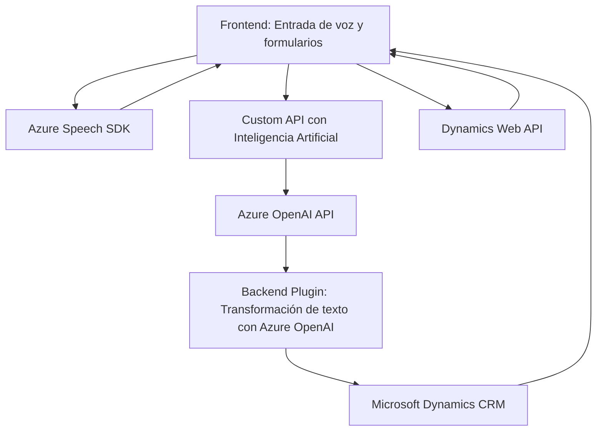

### Resumen Técnico
El repositorio contiene múltiples archivos que incluyen código para un **frontend** basado en JavaScript y un **plugin backend** para Dynamics CRM. Ambas soluciones integran funcionalidades de procesamiento de voz y texto usando Azure Speech SDK y Azure OpenAI API.

---

### Descripción de Arquitectura
La arquitectura es híbrida:
1. **Frontend Modular**:
   - Estructurado con funciones independientes en archivos JavaScript para procesar la entrada de voz, manipular formularios, y sintetizar texto.
   - Utiliza el patrón **API Gateway** para conectar entrada de voz con APIs externas (Azure Speech SDK y una Custom API basada en IA).

2. **Backend Plugin**:
   - Implementado como un plugin para Dynamics CRM, empleando la interfaz estándar `IPlugin`.
   - Estructurado para interacción asincrónica con Azure OpenAI mediante llamadas API REST.

Por su diseño, la solución no es estrictamente monolítica ni basada en microservicios, pero emplea patrones orientados a separabilidad funcional como **modularización**, **callbacks**, y **CQRS** en distintas capas.

---

### Tecnologías Usadas
1. **Frontend**:
   - **JavaScript**: Base de la lógica del frontend.
   - **Azure Speech SDK**: Para reconocimiento y síntesis de voz.
   - Clasificación de entidades (probable integración con Dynamics API).

2. **Backend Plugin**:
   - **C#**: Lenguaje principal para el plugin.
   - **Microsoft Dynamics SDK**: Interacción con CRM.
   - **Azure OpenAI API**: Procesamiento textual utilizando GPT modelos.
   - **HttpClient**: Para llamadas REST al servicio OpenAI.

3. **APIs y Servicios**:
   - Azure Speech Services.
   - Custom API para procesamiento IA (integrada en el frontend).

4. **Auxiliares**:
   - `System.Text.Json` y `Newtonsoft.Json` para manipulación de JSON.
   - Uso de DOM (`window` y `document`) en frontend.

---

### Diagrama Mermaid

---

### Conclusión Final
El repositorio presenta una solución **híbrida** para convertir texto a voz (frontend), reconocimiento de voz asistido por IA y gestión dinámica de formularios en **Microsoft Dynamics CRM** (backend). Incluye:
- **Frontend modular** con Azure Speech SDK que gestiona entrada por voz, manipulación de formularios, y síntesis de texto.
- **Backend plugin** que utiliza Azure OpenAI API para procesamiento semántico e integración con Dynamics CRM.

El diseño es eficiente, permite escalabilidad hacia un sistema más distribuido (como microservicios) gracias a su separación lógica y comunicación API, pero actualmente permanece como un híbrido entre **n-capas** y monolito. Requiere mejoras en seguridad, como externalizar las credenciales de API desde el código.