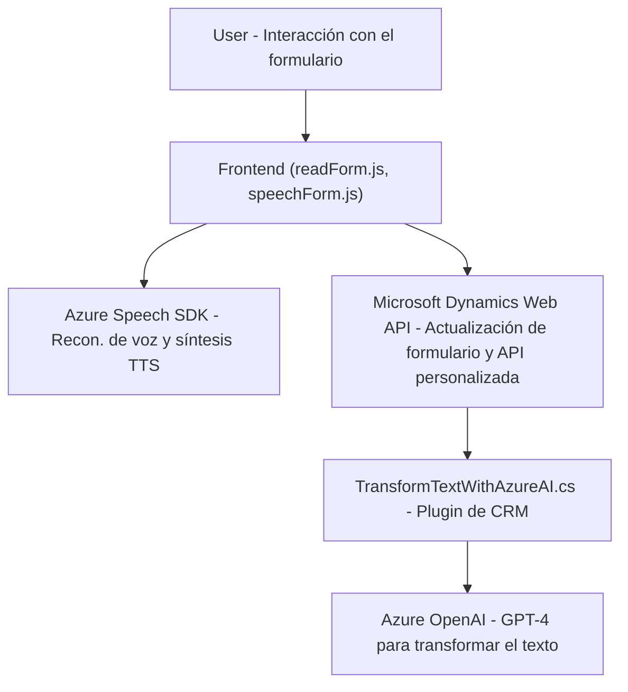

### Breve Resumen Técnico
El repositorio contiene los archivos de frontend (`readForm.js` y `speechForm.js`) y un plugin backend para Dynamics 365 (`TransformTextWithAzureAI.cs`). Estas soluciones trabajan juntas para implementar funcionalidades de reconocimiento de voz, síntesis de audio, actualización dinámica de formularios, y procesamiento de texto a JSON utilizando Azure OpenAI. La solución integra servicios externos como Azure Speech SDK, Dynamics Web API y Azure OpenAI.

---

### Descripción de Arquitectura
- **Arquitectura:** La solución sigue una **arquitectura de n capas**, donde el frontend maneja la interacción con los usuarios y las integraciones de reconocimiento de voz y síntesis de audio con Azure Speech SDK. El plugin en C# actúa como una capa de negocio en el backend integrada con el CRM. Aquí las capas principales son:
  - **Frontend:** Archivos JavaScript trabajan como capa de presentación y enriquecen la interacción del usuario con el sistema.
  - **Backend Plugin:** Desarrollado para trabajar en el entorno de Dynamics 365, interactuando con Azure OpenAI para tareas de manipulación e integración de datos.
  - **External APIs:** El uso de Azure Speech SDK y Azure OpenAI se realiza en diferentes capas, demostrando el uso de servicios de nube para funciones avanzadas como texto a voz y texto a JSON.

---

### Tecnologías Usadas
1. **Frontend:**
   - **Lenguaje:** JavaScript.
   - **Azure Speech SDK:** Utilizado para reconocimiento, síntesis de voz y carga dinámica.
   - **Microsoft Dynamics 365 Web API:** Modelo de datos del formulario se actualiza desde el frontend.
   - **ES6 JavaScript**: Modular y con orientación a métodos.

2. **Backend Plugin:**
   - **Lenguaje:** C# (.NET Framework).
   - **Microsoft Dynamics CRM SDK**: Para extender el modelo de datos de Dynamics, procesar datos y actualizar formularios.
   - **Azure OpenAI API (GPT-4):** Para la transformación de texto en un JSON estructurado según normas específicas.
   - **Newtonsoft.Json**: Manipulación del JSON generado por la API.
   - **System.Net.Http**: Realización de solicitudes HTTP para consumir la API.

3. **Frameworks y Patrones de Diseño:**
   - **Carga dinámica de recursos:** Azure Speech SDK es cargado dinámicamente en el frontend según la necesidad.
   - **Data Mapping:** En frontend se utiliza un mapa entre etiquetas visibles y nombres de atributos internos para actualizaciones del formulario.
   - **Manejo de errores:** Estructuras de validación y manejo de excepciones en backend para asegurar integridad y estabilidad.
   - **Plugin Pattern:** La funcionalidad en el backend se encapsula como un plugin para Dynamics CRM.
   - **Dependency Injection:** El contexto del servicio en el plugin está disponible mediante `IServiceProvider`.

---

### Dependencias o componentes externos
1. **Azure Speech SDK:** Utilizado en los archivos de frontend para reconocimiento de voz y síntesis de audio.
2. **Microsoft Dynamics Web API:** Necesario para las interacciones del frontend con el modelo de datos del formulario y las APIs personalizadas.
3. **Azure OpenAI API:** Utilizado por el plugin en C# para generar texto estructurado y procesado en formato JSON.
4. **Newtonsoft.Json:** Librería de manipulación JSON usada por el plugin.
5. **System.Net.Http:** Para realizar llamadas a las APIs de OpenAI.

---

### Diagrama Mermaid

---

### Conclusión Final
La solución muestra una integración inteligente entre un frontend basado en JavaScript con Azure Speech SDK, para entrada por voz y síntesis de texto, junto con un backend en .NET que opera como un plugin de Dynamics CRM para comunicación avanzada con APIs usando Azure OpenAI. Su arquitectura es modular y utiliza el patrón de múltiples capas. El diseño enfocado en la interacción con APIs externas y en la correcta separación de responsabilidades la hace altamente escalable y extensible para futuras mejoras. Sin embargo, la seguridad de las credenciales (Azure keys) debe ser revisada para garantizar la integridad de los servicios y datos.