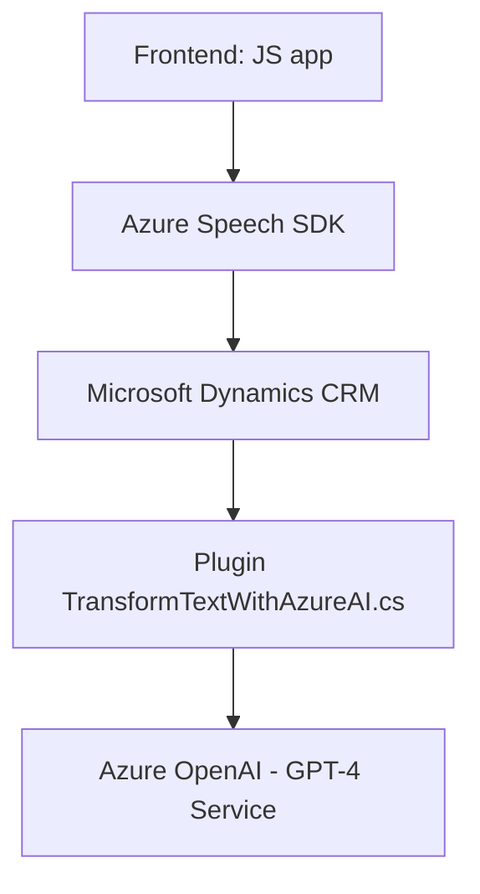

### Breve resumen técnico
El repositorio integra funcionalidad de interacción por voz con formularios en el front-end y procesamiento avanzado de datos en el back-end usando AI. Los elementos principales incluyen un sistema que permite transformar datos en sonido (texto a voz) y captura de datos mediante reconocimiento de voz. Además, contiene un plugin backend basado en Microsoft Dynamics CRM que utiliza Azure OpenAI para procesar texto siguiendo normas específicas.

---

### Descripción de arquitectura
#### Tipo de solución:
- **API + Frontend + Plugin CRM.**
El repositorio tiene tres componentes principales:
1. **Frontend**: Dos módulos para síntesis de voz y reconocimiento de voz mediante Azure Speech SDK.
2. **Backend/Plugin CRM**: Un plugin que interactúa con Microsoft Dynamics CRM y utiliza Azure OpenAI para estructuración de datos.
   
#### Arquitectura:
1. **Frontend**: Estructura basada en funciones independientes pero cohesivas (Arquitectura tipo **modular**). El frontend utiliza un modelo de integración de servicios (SDK Azure Speech).
2. **Plugin backend**: Sigue una **arquitectura monolítica** a nivel de Dynamics CRM, donde el plugin implementa una estructura básica basada en eventos, con interacción externa vía API REST (Azure OpenAI).
3. **Comunicación**: Componentes desacoplados mediante:
   - Integración de Azure Speech SDK en el frontend con APIs dinámicas.
   - Uso de API REST entre el plugin CRM y el servicio Azure OpenAI.

---

### Tecnologías usadas
- **Frontend**: 
  - **JavaScript** (para lógica de front-end).
  - **Azure Speech SDK**: API para síntesis y reconocimiento de voz.
  - **Microsoft Dynamics 365 FormContext API**: Gestión dinámica de formularios.
- **Backend/plugin**:
  - **C# (.NET Framework)**: Plugins en Dynamics 365.
  - **Microsoft Dynamics SDK**: Framework para desarrollo de plugins CRM.
  - **Azure OpenAI API (GPT-4)**: Para procesamiento de lenguaje natural y generación de JSON estructurado.
  - **Json.NET (Newtonsoft.Json)**: Procesamiento de respuestas JSON en el plugin.
- **External dependencies/components**:
  - Azure APIs: Speech-to-text, Text-to-Speech, and OpenAI (GPT-4).
  - Integración dinámica con Microsoft CRM.
   
General pattern classification:
- **Service Integration:** Backend integrates external services like Azure OpenAI via API calls.
- **Layered design:** Frontend interacts with backend plugins through CRM Web API.
- **Encapsulation:** Each module (voice synthesizer/recognition/plugin) has clear roles.

---

### Diagrama Mermaid

---

### Conclusión final
El repositorio es una combinación interesante de frontend applications focused on voice interaction and backend plugins in Dynamics CRM with AI integration. It is well-structured with modules that integrate external services (Azure APIs). The architecture is modular for the frontend but follows a monolithic approach for the backend plugin in Dynamics CRM. This design is suitable for enterprise-level solutions that leverage cloud services and AI for enhanced user interaction and data processing. 

Optimizable areas include tighter coupling between AI and CRM workflows and extending these capabilities into microservices for scalability.