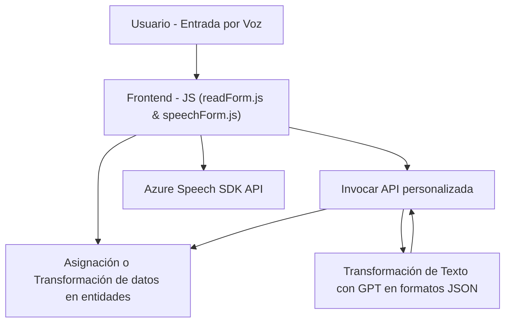

### Resumen técnico
El repositorio presenta una solución que combina funcionalidades de **frontend**, **lógica personalizada para backend**, e **integración con servicios externos** (Azure Speech SDK y Azure OpenAI). Esta solución está diseñada para interactuar con **Microsoft Dynamics 365** para procesar datos de formularios mediante voz y texto, transformarlos, y asignarlos dinámicamente a entidades del sistema.

---

### Descripción de arquitectura
El sistema parece tener una arquitectura **modular en capas** con una lógica distribuida:
1. **Frontend**:
   - Se realizan interacciones mediante JavaScript para capturar entrada por voz, sintetizar datos y procesarlos localmente antes de enviarlos al backend.
   - Utiliza **Azure Speech SDK** para convertir voz a texto y viceversa.
2. **Backend** (en Dynamics 365):
   - Usa plugins personalizados escritos en C# para procesar texto y aplicar normas de transformación mediante **Azure OpenAI GPT**.
   - Estos plugins interactúan con APIs externas y gestionan datos dentro del entorno Dynamics CRM.

Arquitectura inferida: **n capas**, con un enfoque modular. La interacción se divide en:
- Capa de presentación: Funciones de JavaScript para capturar datos en formularios y ejecutar comandos por voz.
- Capa de lógica de negocio: Plugins en Dynamics 365 que transforman datos con OpenAI y asignan valores en tiempo de ejecución.
- Fuente de datos externa: Servicios como Azure Speech SDK y Azure OpenAI GPT.

El proceso sugiere un híbrido entre **arquitectura cliente-servidor** y uso de **microservicios externos** (Azure OpenAI).

---

### Tecnologías usadas
1. **Frontend**:
   - **Azure Speech SDK**: Para captura de voz y síntesis de texto a voz.
   - **Dynamics 365 SDK**: Para manipulación de formularios.
   - **JavaScript**:
     - Modularización mediante funciones específicas.
     - Carga dinámica del SDK de Azure.

2. **Backend/Plugins**:
   - **Microsoft Dynamics 365**: Para lógica de negocio mediante plugins (C#) y servicios personalizados.
   - **Azure OpenAI GPT**: Transformación de texto y generación de JSON estructurado.
   - **Bibliotecas .NET**:
     - `System.Net.Http` y `System.Text.Json`: Para comunicación con APIs externas y manejo de JSON.
     - `Newtonsoft.Json.Linq`: Manejo adicional de JSON.

3. **Integraciones externas**:
   - **Azure Speech SDK API**.
   - **Azure OpenAI API (GPT)**.

---

### Diagrama Mermaid compatible con GitHub Markdown

---

### Conclusión final
La solución es una integración avanzada entre Dynamics 365, Azure Speech SDK, y Azure OpenAI GPT. Está diseñada para capturar datos mediante voz, procesarlos localmente en el frontend, transformarlos en el backend mediante IA, y asignarlos dinámicamente en formularios de Dynamics 365. Posee una arquitectura modular basada en capas, pero también se apoya en microservicios como Azure Speech y OpenAI GPT para tareas específicas. Es altamente versátil y extensible, adecuada para automatización en entornos empresariales que dependen de identificación por voz y lógica de negocio personalizada.