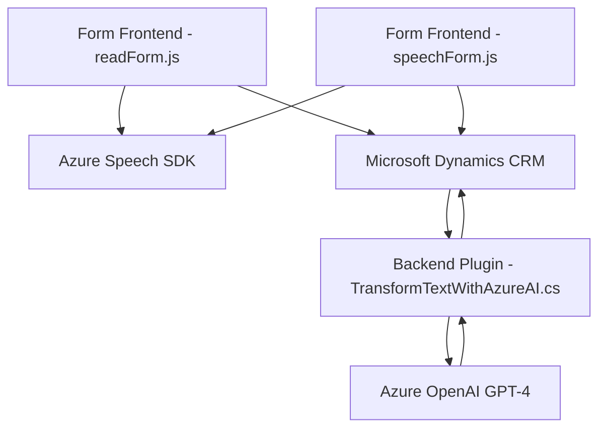

### Breve resumen técnico

El repositorio presenta una solución orientada a integrar funcionalidades de reconocimiento de voz y procesamiento de datos con Azure Speech SDK y Azure OpenAI en una plataforma Dynamics 365. La estructura utiliza archivos frontend (`readForm.js`, `speechForm.js`) para interactuar con formularios del CRM y un plugin backend (`TransformTextWithAzureAI.cs`) para procesar transformaciones de texto. Funciona como un **complemento funcional** hacia Dynamics CRM, habilitando la entrada y salida avanzada a nivel de UI, así como backend.

---

### Descripción de arquitectura

La arquitectura del repositorio es **n-capas con integración de servicios externos**, donde:
- **Frontend**: Ejecuta la lógica relacionada con el reconocimiento de voz, síntesis de texto hablado, y actualiza dinámicamente los formularios.
- **Backend (Microsoft Dynamics Plugin)**: Procesa los datos del formulario en tiempo de ejecución mientras interactúa con Azure OpenAI para estructurar texto.
- **Servicios externos**: Azure Speech SDK (frontend) y Azure OpenAI (backend) son puntos claves de soporte remoto para las operaciones.

Aspectos destacados de la arquitectura:
- Modularidad en frontend y backend.
- Orientación **hacia la nube** mediante servicios Azure.
- Patrón observable de **event-driven programming** para operaciones asíncronas en frontend y backend.

---

### Tecnologías usadas

#### Lenguajes y Frameworks:
1. **JavaScript**: Para la lógica del frontend integrando SDK dinámico.
2. **C# (.NET)**: En el plugin como parte del framework de Microsoft Dynamics 365.
3. **Dynamics SDK**: Facilita el acceso y manipulación de datos desde la plataforma CRM.
4. **Azure Speech SDK**: Para funcionalidades como texto a voz y reconocimiento de voz.
5. **Azure OpenAI GPT-4**: Servicio de IA para transformar texto en formato avanzado.

#### Patrones de diseño:
1. **Integración con API**: Llamadas desde frontend y backend hacia Azure Speech y OpenAI.
2. **Modularidad**: Separación clara de responsabilidades en frontend y backend.
3. **N-capas**: Procesamiento frontend vinculado con lógica de negocio backend en Dynamics CRM.
4. **Event-driven programming**: Uso de callbacks para cargas dinámicas de dependencias y ejecución asíncrona en tareas complejas.
5. **Plugin pattern**: Utilización del estándar de plugin en Dynamics 365.

---

### Dependencias o componentes externos
1. **Azure Speech SDK** (Frontend): Servicio de texto a voz y reconocimiento de voz.
2. **Azure OpenAI (GPT-4)** (Backend): Procesamiento de texto estructurado.
3. **Microsoft Dynamics SDK**: API para modificar atributos y lógica de CRM en el plugin.
4. **System.Net.Http**: Llamadas HTTP hacia Azure desde el plugin.
5. **System.Text.Json** / **Newtonsoft.Json**: Serialización y deserialización de datos estructurados (JSON).

---

### Diagrama **Mermaid** válido para GitHub

---

### Conclusión final

El repositorio está diseñado para extender las capacidades de Dynamics 365 con funcionalidades avanzadas basadas en voz y IA. La integración es **n-capas**, con una separación clara entre el frontend (gestionando interacción usuario-CRM) y el backend (procesamiento de texto con lógica empresarial). Se hace uso intensivo de servicios cloud como Azure Speech SDK y Azure OpenAI, reflejando una fuerte orientación hacia aplicaciones distribuidas y habilitadas por servicios externos. El enfoque modular y centrado en la integración garantiza flexibilidad y escalabilidad en futuros desarrollos.