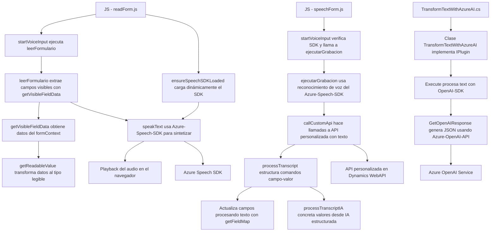

### Resumen técnico

El repositorio parece contener una solución orientada a la integración de servicios relacionados con Microsoft Dynamics 365 y Azure, centrada principalmente en la interacción con formularios y el procesamiento de voz y texto. Incluye una combinación de un frontend basado en JavaScript y un backend en .NET/C# para la ejecución de plugins de Dynamics CRM.

---

### Descripción de la arquitectura

La arquitectura es una combinación de **n-capas** y **orquestación de servicios** con comunicación directa con APIs externas y plugins internos. En el frontend, se detecta el uso de un modelo modular basado en funciones orientadas a tareas y en la comunicación con servicios externos, como Azure Speech SDK y APIs desarrolladas. El backend utiliza el patrón de plugins típico de Dynamics CRM y se configura para realizar transformaciones JSON estructuradas mediante la integración con Azure OpenAI API.

1. **N-Capas**:
   - **Frontend Layer**: Compuesto por scripts en JavaScript que interactúan directamente con el DOM de formularios en Dynamics 365.
   - **Backend Layer**: Implementado como un plugin en C# que extiende las capacidades de Dynamics CRM y dialoga con Azure OpenAI API.
   - **Service Integration Layer**: Comunicación con Azure Speech SDK y Azure OpenAI API actúa como una capa de servicio externa.

2. **Componentes principales**:
   - **Frontend**: Módulos relacionados con la interacción de voz (reconocimiento y síntesis), extracción de datos visibles, y transformación en datos procesables mediante APIs.
   - **Backend**: Plugin para el procesamiento avanzado con IA y comunicación directa con Azure OpenAI, soportando operaciones en tiempo real en formularios CRM.

3. **Patrones arquitectónicos utilizados**:
   - Modularidad funcional (Frontend).
   - API Gateway para comunicación con APIs externas.
   - ETL (Extract-Transform-Load) en el flujo de datos de formularios a voz.
   - Plugin pattern (Backend para Dynamics CRM).
   - Uso de SDK Wrapper para interactuar con el Azure Speech SDK en el frontend.

---

### Tecnologías usadas

1. **Frontend**:
   - **Azure Speech SDK**: Proporciona funcionalidades de reconocimiento (speech-to-text) y síntesis de texto a voz.  
   - **JavaScript**: Principal lenguaje para scripts cliente, incluyendo integración directa con Dynamics 365.

2. **Backend Plugin**:
   - **C#**: Lenguaje para la implementación del plugin en Dynamics CRM.
   - **Microsoft Dynamics SDK (`Microsoft.Xrm.Sdk`)**: Interacción con la plataforma CRM.
   - **Azure OpenAI (GPT)**: Llamadas al servicio API para transformar y procesar texto.
   - **Newtonsoft.JSON & System.Text.Json**: Para manejar JSON en las operaciones dentro del plugin.
   - **HTTP Client**: Comunicación directa con Azure OpenAI API.

3. **External APIs**:
   - Azure Speech SDK for Browser.
   - Azure OpenAI Services via HTTP requests.
   - Custom APIs in Dynamics 365, presumably built as server-side logic for specific business purposes.

---

### Diagrama Mermaid compatible con GitHub Markdown

---

### Conclusión final

Esta solución implementa una arquitectura híbrida, combinando un frontend orientado a la manipulación de formularios y voz con un backend basado en plugins de Dynamics CRM. Además, se integran servicios externos como **Azure Speech SDK** y **Azure OpenAI** para proporcionar funcionalidad avanzada de reconocimiento y generación de texto basado en el contexto del usuario. La elección de patrones como ETL, SDK Wrapper y API Gateway hace que el sistema sea extensible y modular.

Esta solución podría ser categorizada como **n-capas con integración de servicios externamente orquestados**, lo que la hace adecuada para aplicaciones empresariales como Dynamics CRM que requieren extensiones manejadas por IA y capacidades avanzadas de voz y procesamiento de texto. Es importante asegurar dependencias robustas, alta seguridad en las llamadas API y optimización en la carga de SDK para mantener un rendimiento adecuado.